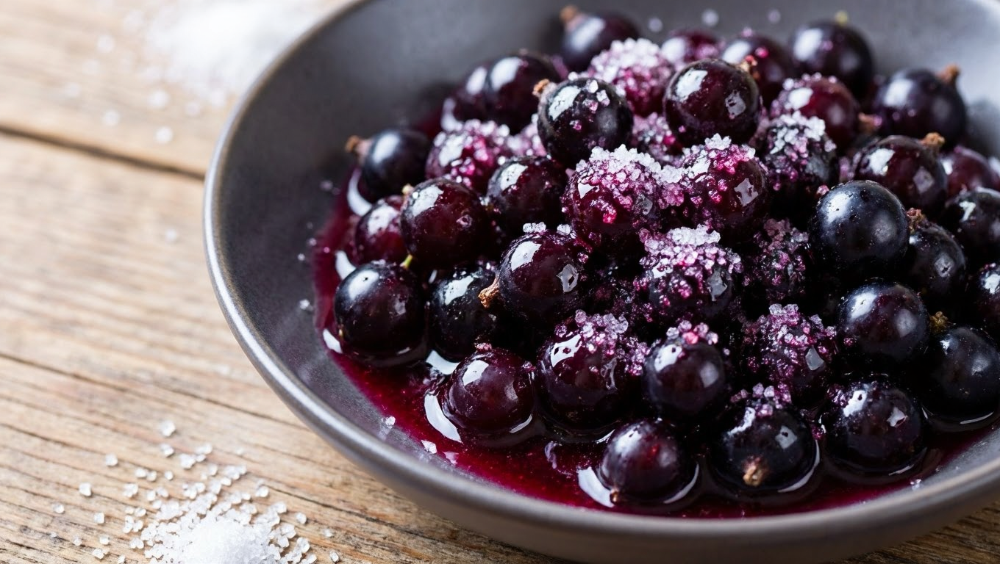
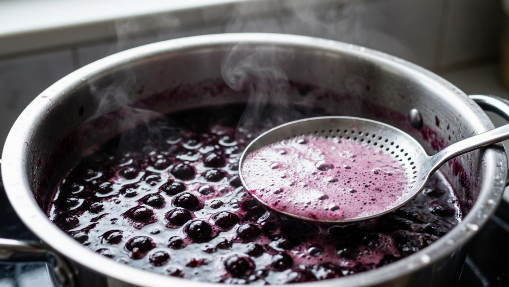
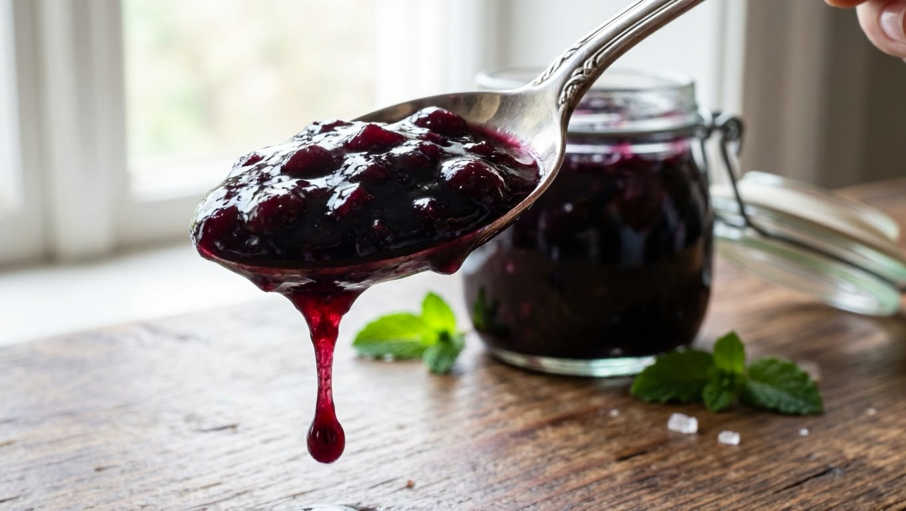
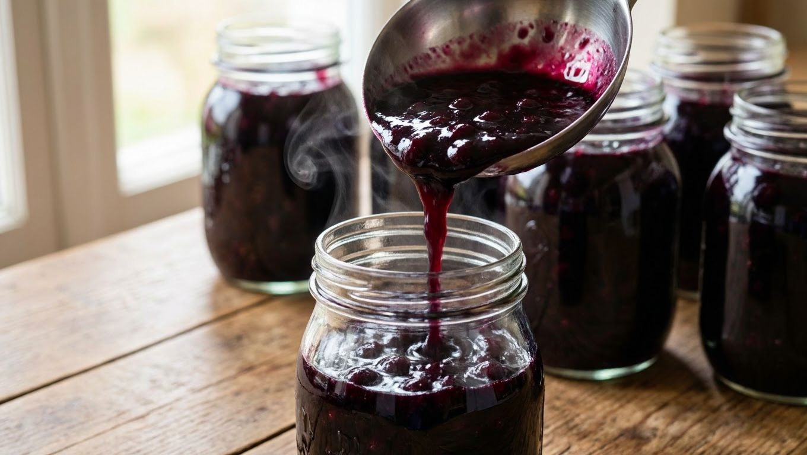
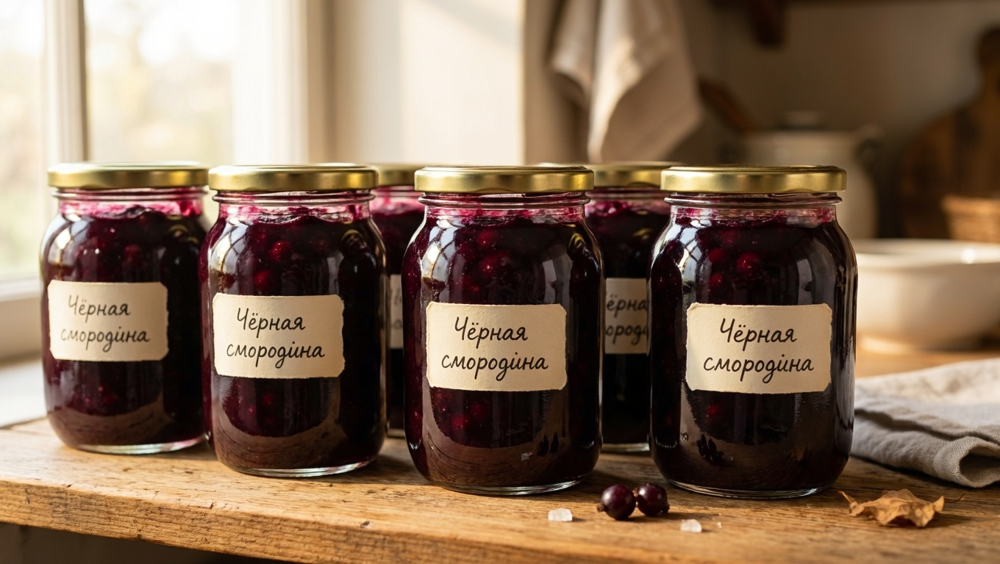

Пятиминутка — самый популярный способ заготовить чёрную смородину: пять минут кипения вместо часа варки, а в банке остаётся живой ягодный вкус, яркий цвет и большая часть витамина C, который при долгом нагреве просто разрушается. Весь рецепт держится на двух вещах — **правильных пропорциях сахара** и точном времени варки. Разберём и то, и другое, а заодно ответим на вопросы, которые возникают у плиты.

## ⚖️ Пропорции: сколько сахара на 1 кг смородины

Чёрная смородина кислая, и сахар здесь работает не только на вкус, но и как консервант — при короткой варке именно он отвечает за сохранность.

| Пропорция | Что получится |
|---|---|
| **1 кг ягод : 1 кг сахара** | Базовый вариант, оптимальный баланс. Хранится при комнатной температуре |
| 1 кг : 1,2–1,3 кг | Слаще и гуще, надёжнее в хранении, вкус менее кислый |
| 1 кг : 0,7–0,8 кг | Кислее и живее по вкусу, но **хранить только в холоде** |

**Рабочий ориентир — 1:1.** Если любите покислее, берите 800 г, но тогда банку отправляйте в погреб или холодильник. Меньше 700 г на килограмм — риск: варенье забродит.

**На объём:** из 1 кг ягод и 1 кг сахара выходит примерно 1,5 литра готового варенья — то есть три банки по 0,5 л.

## 🧺 Подготовка ягод

- **Перебрать** — убрать веточки, листья, мятые и подпорченные ягоды.
- **Промыть** в дуршлаге под холодной водой и дать стечь.
- **Обсушить** — лишняя вода сделает варенье жиже.
- **Хвостики (сухие соцветия) срезать не обязательно.** Это самый частый вопрос: в варенье они не чувствуются и никак не влияют на вкус и хранение. Если хочется идеальной текстуры — можно убрать, но на результат это почти не влияет.

## 🍯 Пошаговый рецепт

**Понадобится:** 1 кг чёрной смородины, 1 кг сахара, при желании 100 мл воды.

1. **Засыпать сахаром.** Подготовленные ягоды пересыпать сахаром и оставить на 3–4 часа (можно на ночь) — смородина пустит сок, и варить можно без воды.
   *Если ждать некогда* — влейте 100 мл воды, прогрейте на слабом огне до растворения сахара и дальше действуйте по рецепту.
2. **Нагреть медленно.** Поставить на слабый огонь и, помешивая, довести до полного растворения сахара. Важно не дать пригореть до появления сиропа.
3. **Проварить 5 минут.** Довести до кипения и кипятить **ровно 5 минут** с момента закипания, аккуратно помешивая.
4. **Снять пену.** Пену собирают в процессе — с ней варенье хранится лучше и выглядит чище.
5. **Разлить горячим.** Сразу разложить по стерилизованным банкам, закатать крышками, перевернуть и укутать до полного остывания.

Всё. Дольше варить не нужно: смысл пятиминутки именно в коротком нагреве.

## ⏱️ Почему именно 5 минут

Короткая варка — это компромисс между сохранностью и пользой:

- **витамин C разрушается при длительном нагреве** — за пять минут его теряется заметно меньше, чем за час варки;
- **сохраняется свежий вкус и аромат** ягоды, а не «варёный» привкус;
- **цвет остаётся ярким**, варенье не темнеет;
- пяти минут кипения достаточно, чтобы вместе с сахаром и стерильной тарой заготовка спокойно стояла всю зиму.

Обратная сторона — **пятиминутка жиже классического варенья**. Это нормально и не признак ошибки.

## 🥄 Как сделать пятиминутку гуще

Если хочется плотной консистенции, есть три честных способа:

1. **Дать настояться.** Смородина богата пектином, и варенье **густеет при остывании** — часто уже через сутки оно заметно плотнее, чем казалось в кастрюле.
2. **Добавить сахара** — до 1,2–1,3 кг на килограмм ягод.
3. **Сделать двойную пятиминутку** — проварить 5 минут, полностью остудить и проварить ещё 5 минут. Гуще, но витаминов останется меньше.

А вот **увеличивать время варки не стоит** — тогда это уже не пятиминутка, а обычное варенье, и весь смысл рецепта теряется. Общие принципы варки и точку готовности разбирали в статье про [варенье на зиму](https://mir-doma.pro/varene-na-zimu/).

## 🫙 Хранение

- **При пропорции 1:1 и выше**, в стерильных банках под закатку — до 2 лет в тёмном прохладном месте: погребе, подвале или кладовке.
- **При уменьшенном сахаре** (0,7–0,8 кг) — только в холоде: холодильник или холодный погреб.
- **Банки и крышки** стерилизуйте, а перед закаткой убедитесь, что крышки сухие: капля воды провоцирует плесень.
- **Вскрытую банку** держат в холодильнике.

Если погреб только обустраивается, обратите внимание на воздухообмен — без него в хранилище сыро и заготовки плесневеют: как это устроено, в статье про [вентиляцию в погребе](https://mir-doma.pro/ventilyaciya-v-pogrebe/).

## ❌ Частые ошибки

- **Мало сахара при хранении в тепле** — варенье забродит. Меньше 800 г на килограмм — только в холод.
- **Варили дольше пяти минут** — потеряли витамины и свежий вкус, ради которых всё затевалось.
- **Не сняли пену** — варенье мутнеет и хуже хранится.
- **Не обсушили ягоды** — лишняя вода делает варенье жидким.
- **Разлили в остывшем виде** — раскладывать нужно кипящим, сразу с плиты.
- **Влажные крышки или нестерильные банки** — плесень.
- **Ждали густоты прямо в кастрюле** — она приходит при остывании, дайте варенью сутки.

## ❓ Частые вопросы

**Сколько сахара на 1 кг смородины для пятиминутки?**
Базовая пропорция — 1 кг сахара на 1 кг ягод. Для более сладкого и густого варенья берут 1,2–1,3 кг, для кислого — 0,7–0,8 кг, но такое хранят только в холодильнике или погребе.

**Нужно ли срезать хвостики у смородины?**
Не обязательно. В варенье сухие соцветия не чувствуются и не влияют ни на вкус, ни на хранение. Убирают их только ради идеальной текстуры, если есть время и желание.

**Надо ли снимать пенку с варенья?**
Да, пену лучше собирать в процессе варки: с ней варенье получается мутнее и хранится хуже. На вкус она не влияет, но на прозрачность и срок хранения — да.

**Почему пятиминутка получилась жидкой?**
Так и должно быть: короткая варка не даёт густоты сразу. Смородина богата пектином, и варенье густеет при остывании — оцените результат через сутки. Если всё равно жидко, добавьте сахара или сделайте двойную пятиминутку.

**Сколько варить пятиминутку из смородины?**
Ровно 5 минут с момента закипания. Дольше варить не нужно — теряются витамины, цвет и свежий вкус, ради которых этот рецепт и существует.

**Сколько хранится пятиминутка?**
При пропорции 1:1 в стерильных закатанных банках — до 2 лет в прохладном тёмном месте. С уменьшенным количеством сахара — только в холодильнике или холодном погребе.

**Можно ли варить пятиминутку из замороженной смородины?**
Да, зимой это удобно: ягоды не размораживают, а сразу засыпают сахаром и прогревают. Вкус будет чуть менее ярким, чем из свежих.

---

Пятиминутка — тот случай, когда меньше усилий даёт больше пользы: пять минут вместо часа, живой вкус и витамины в банке. Запомните главное — **1:1 по сахару, ровно пять минут кипения и разливать кипящим** — остальное смородина сделает сама, включая густоту при остывании.

**Куда идти дальше:**

- Хотите попробовать другие варианты из того же ведра ягод — классическое варенье с целыми ягодами, желе или сырое без варки: всё собрано в статье про [варенье из смородины](https://mir-doma.pro/varene-iz-smorodiny/).
- Если ягод больше, чем банок, часть проще заморозить и варить порциями зимой — как сделать это правильно, чтобы ягоды не слиплись, в материале про [заморозку ягод](https://mir-doma.pro/kak-zamorozit-yagody/).
- А чтобы урожая смородины на следующий год было больше, кусты нужно вовремя проредить: [обрезка смородины](https://mir-doma.pro/obrezka-smorodiny/).
