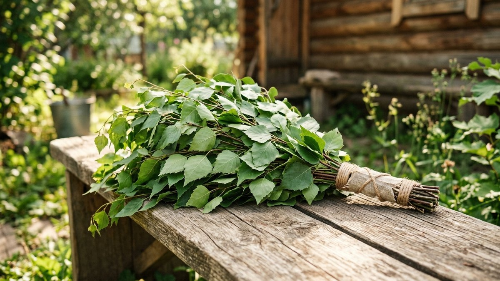
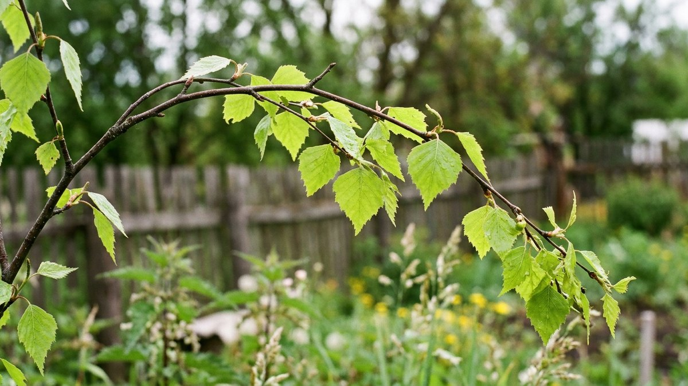
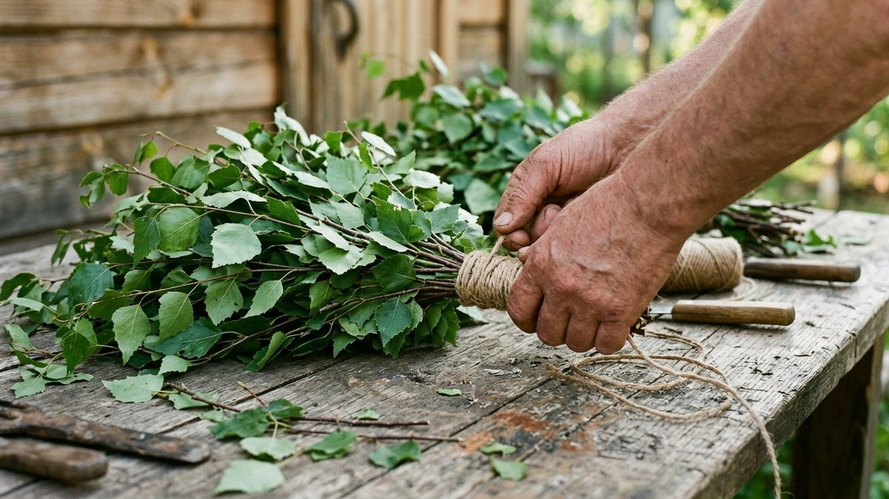
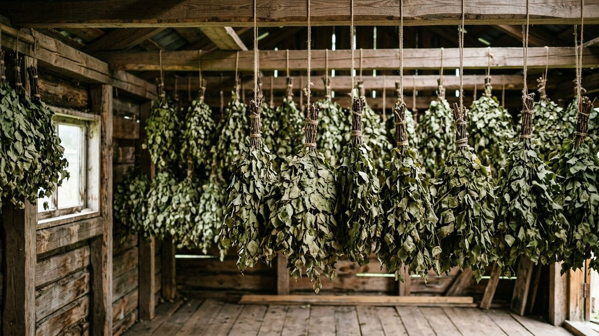
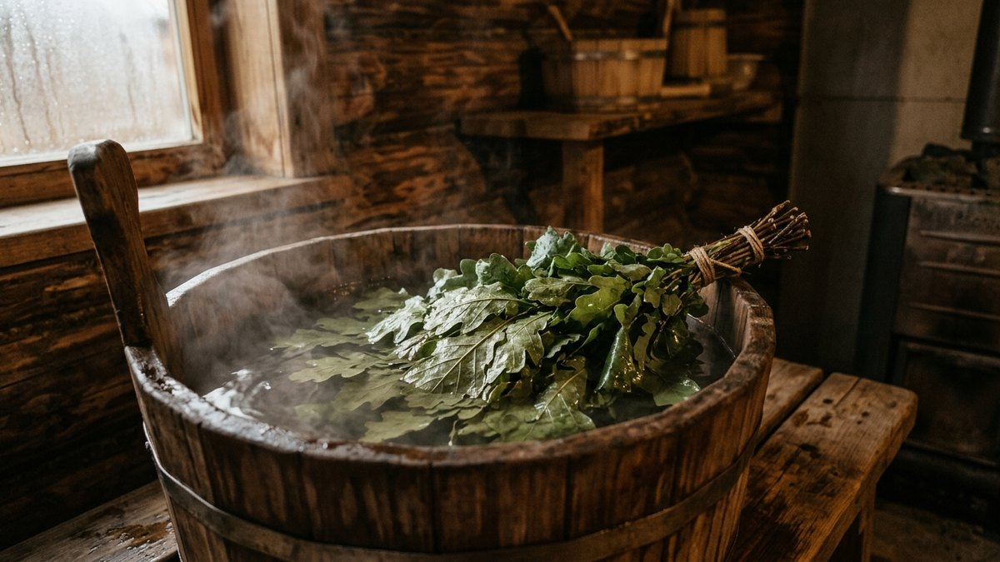
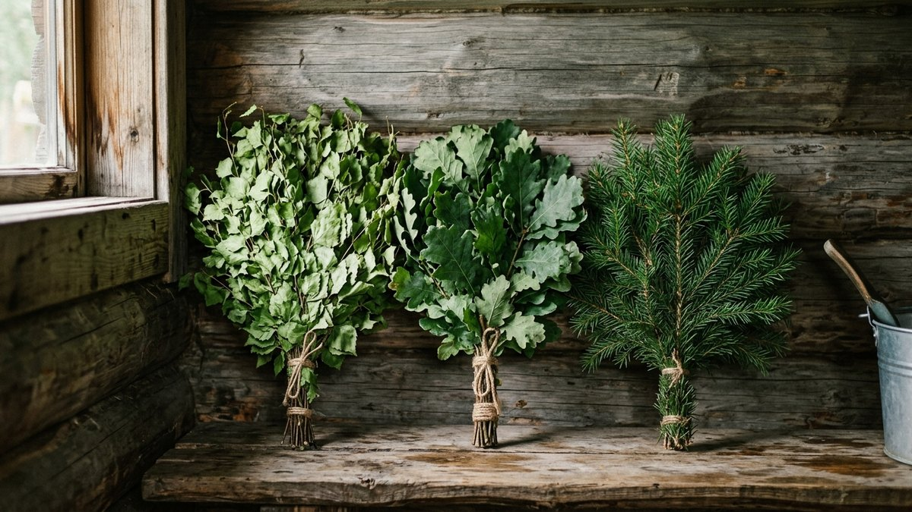

Хороший веник решает три отдельные задачи, и в каждой легко ошибиться: заготовить его в правильный момент, связать так, чтобы он не разваливался в руках, и запарить перед баней так, чтобы листья не облетели за первые пять минут. Разберём все три шага по порядку — от среза ветки до готового к парной веника.

## Когда заготавливать веники

Традиционный ориентир — «троицкая неделя», конец июня, но точнее ориентироваться не на календарь, а на состояние листа: заготавливают до цветения деревьев и до огрубения листвы, пока ветки гибкие, а лист мягкий и не пробит первыми насекомыми. Для средней полосы это обычно середина-конец июня.

- **Берёза** — сразу после того, как лист полностью развернулся, но ветки ещё гибкие, не одревесневшие.
- **Дуб** — на 2–3 недели позже берёзы, лист у дуба грубеет медленнее и переносит более позднюю заготовку.
- **Липа и эвкалипт** — в то же окно, что и берёза, пока молодые побеги мягкие.

Срезанные позже, в июле-августе, ветки дают веник с грубым, менее ароматным листом, который быстрее осыпается в парной.

## Из чего вяжут веники

- **Берёза** — самый распространённый вариант: гибкие ветки, мягкий лист, лёгкий узнаваемый аромат.
- **Дуб** — более плотный лист, который держится дольше в парной, и дубильные вещества, полезные для жирной кожи.
- **Липа** — мягкий лист с выраженным успокаивающим ароматом, но менее прочный, чем берёза или дуб.
- **Хвойный (пихта, можжевельник)** — не осыпается вообще, подходит для более интенсивного массажного эффекта, требует привычки из-за колкости.
- **Крапива** — используется реже и с осторожностью, для контрастных процедур, запаривается отдельно от остальных.

## Как срезать и вязать

Ветки срезают с молодых боковых побегов дерева, а не с самой верхушки, — старые нижние ветви дают жёсткий веник. Оптимальная длина ветки — 40–60 см. Срезают секатором, а не обрывают руками, чтобы не повредить дерево и не оставить рваных краёв на самих ветках.

Вяжут веник послойно: самые толстые и крепкие ветки укладывают внутрь, формируя рукоятку, более тонкие и облиственные — снаружи, веером. Черенок очищают от листьев на длину 12–15 см — это будущая рукоятка, за которую держат веник в парной, и на ней не должно быть листьев, иначе рука будет скользить. Перевязывают в двух местах — у основания рукоятки и чуть выше середины — прочным шпагатом или бечёвкой, не проволокой: она травмирует ветки при высыхании.

## Как сушить и хранить

Свежесвязанные веники сушат в тени, в хорошо проветриваемом помещении — чердак, сарай, навес. Прямые солнечные лучи — главный враг: лист желтеет, теряет аромат и осыпается уже при сушке. Два способа сушки:

- **подвесить** веером вниз, рядами, не вплотную друг к другу — так, чтобы воздух свободно проходил между вениками;
- **под прессом плашмя** — веники укладывают друг на друга и слегка придавливают, тогда веер получается плоским и компактным, удобным для хранения в мешках.

Полностью высыхают веники за 7–10 дней в сухую погоду. Хранят их в сухом тёмном месте, в холщовых мешках или подвешенными, — никогда в полиэтилене: без вентиляции веник преет и покрывается плесенью.

## Как запаривать веник перед баней

Свежесрезанный веник запаривать не нужно вообще — его сразу ополаскивают тёплой водой перед использованием. Сухой веник требует подготовки:

1. Ополосните веник в прохладной воде, стряхивая пыль.
2. Замочите на 10–15 минут в тёплой воде — это возвращает эластичность веткам постепенно, без резкого перепада температуры.
3. Переложите в горячую воду (не кипяток) ещё на 5–10 минут, накрыв тазик крышкой или другим веником, — пар размягчает лист изнутри.
4. Если веник сильно пересушен, можно на 20–30 секунд опустить его в кипяток перед самой парной, но не дольше — долгое кипячение разваривает лист, и он начинает облетать при первых же взмахах.

Воду, в которой запаривался веник, не выливают сразу — ею традиционно окатываются после парной или используют для последнего плеска на камни, добавляя аромата парной.

## Сколько служит веник

Один нормально заготовленный берёзовый или дубовый веник выдерживает от одного до трёх банных заходов, в зависимости от интенсивности использования, — после этого лист заметно редеет и веник теряет смысл. Хвойный веник служит дольше, поскольку не осыпается, — им пользуются несколько сезонов подряд, пока ветки не станут слишком сухими и ломкими.

## Частые ошибки

- **Заготавливать слишком поздно, в июле-августе.** Огрубевший лист хуже держится и почти не пахнет.
- **Сушить на солнце.** Прямые лучи сушат веник за часы, но лист желтеет и осыпается ещё до бани.
- **Держать в кипятке слишком долго.** Разваренный лист облетает при первых же взмахах вместо того, чтобы держаться до конца парной.
- **Хранить в полиэтиленовом пакете.** Без вентиляции веник преет и покрывается плесенью вместо того, чтобы просто высохнуть.
- **Перевязывать проволокой.** Она травмирует ветки при высыхании и неудобна в руке при использовании.

Веник — лишь часть банного ритуала: как выбрать печь, которая будет давать нужный пар, разобрано в статье [«Дровяная или электрическая печь для бани»](https://mir-doma.pro/drovyanaya-ili-elektricheskaya-pech-dlya-bani/), а какие камни в каменку дают мягкий пар — в статье [«Какие камни выбрать для банной печи»](https://mir-doma.pro/kakie-kamni-dlya-bannoy-pechi/). Без хорошей вентиляции даже лучший веник не спасёт душную парную — разбор устройства в статье [«Вентиляция бани своими руками»](https://mir-doma.pro/ventilyaciya-v-bane-svoimi-rukami/).

## Частые вопросы

### Когда заготавливают берёзовые веники для бани?

Традиционно в конце июня, ориентируясь не на календарную дату, а на состояние листа — заготавливают до цветения дерева, пока ветки гибкие, а лист мягкий и не огрубевший.

### Как правильно вязать веник для бани?

Толстые и крепкие ветки укладывают внутрь для рукоятки, тонкие облиственные — снаружи веером. Черенок очищают от листьев на 12–15 см и перевязывают шпагатом в двух местах, не проволокой.

### Как запаривать сухой веник для бани?

Сначала ополаскивают прохладной водой, затем замачивают 10–15 минут в тёплой воде, после — 5–10 минут в горячей воде под крышкой. Сильно пересушенный веник можно на 20–30 секунд опустить в кипяток, но не дольше.

### Сколько раз можно использовать один веник?

Берёзовый и дубовый веник обычно выдерживают от одного до трёх заходов в баню, после чего лист начинает осыпаться. Хвойный веник служит несколько сезонов, поскольку не теряет иголки так же быстро.

### Нужно ли запаривать свежесрезанный веник?

Нет, свежий веник запаривать не нужно — достаточно ополоснуть его тёплой водой перед использованием. Запаривание нужно только высушенным веникам, чтобы вернуть веткам эластичность.
