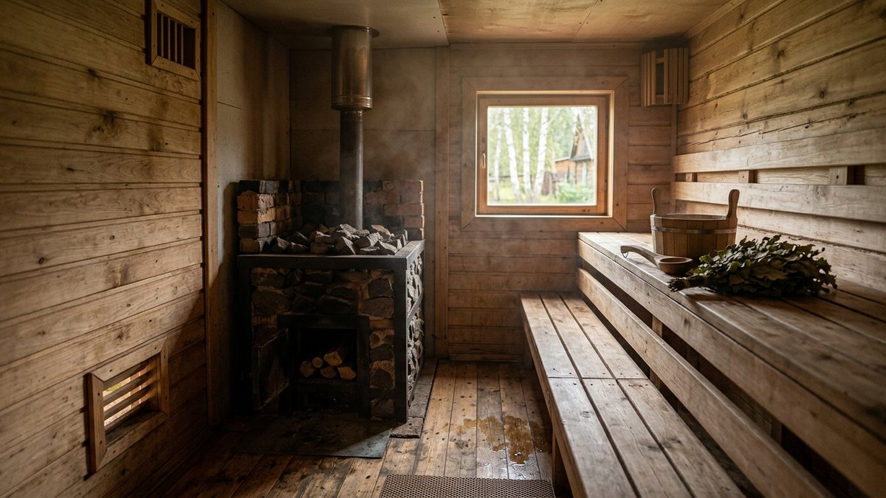
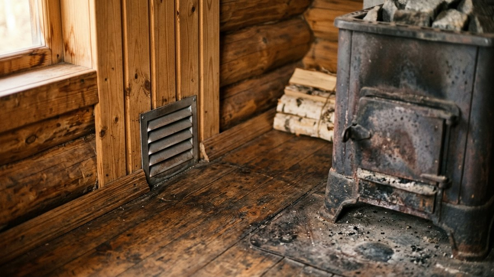
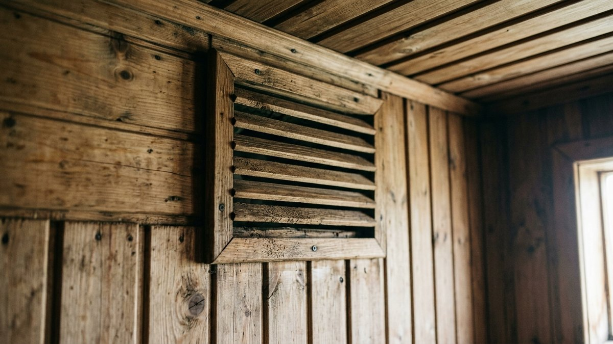
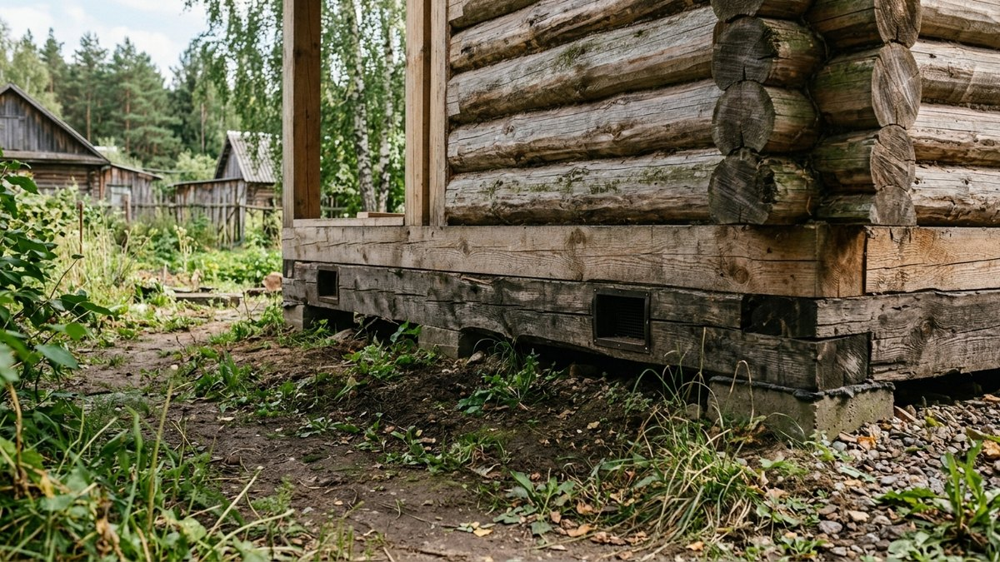
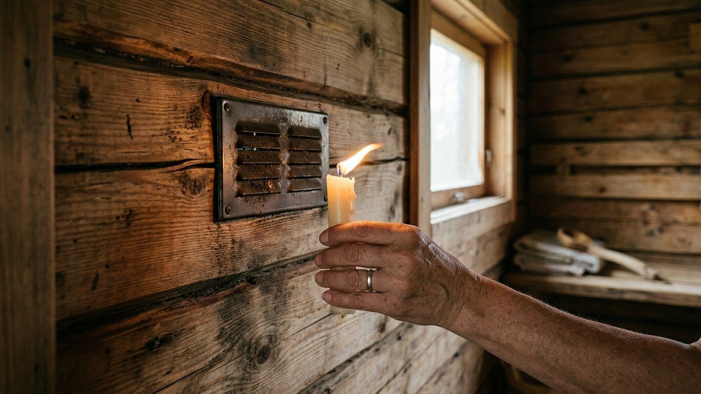
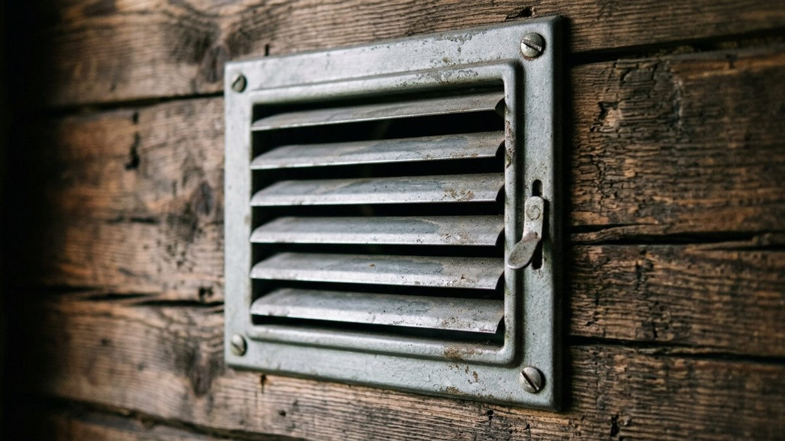

Баня — это не просто жарко натопленное помещение, а конструкция, которая
десятки раз за сезон проходит цикл «сухо-мокро-сухо». Без правильно
устроенного притока и вытяжки воздуха этот цикл заканчивается плохо: венцы
и обшивка чернеют от плесени за 2–3 сезона, а сама парилка после протопки
проветривается сутками вместо часа. Разбираем, где по правилам должны стоять
приточное и вытяжное отверстия, как посчитать их сечение под конкретную
печь и какие ошибки чаще всего портят вентиляцию бани ещё на этапе стройки.

## Зачем бане нужна вентиляция, если она и так топится печью

Печь нагревает воздух, но не обновляет его. Без притока свежего воздуха
в парилке за один заход выгорает кислород, а из-за отсутствия вытяжки
влажный горячий воздух после мытья не уходит наружу и оседает конденсатом
на потолке и стенах. Именно конденсат, а не сама влажность парения, —
причина большинства проблем: чернеющая обшивка, гниющий утеплитель,
неприятный затхлый запах, который держится в бане неделями.

Отдельная задача вентиляции — управлять температурой послойно. В парилке
без притока воздуха разница между полом и потолком может доходить до
40–50°C: у ног прохладно, а на верхнем полке́ нечем дышать. Правильная
схема подачи воздуха выравнивает этот перепад.

## Где располагать приточное отверстие

Приток делается низко — на высоте 20–30 см от пола, обычно рядом с печью
или прямо под ней (если печь на постаменте с зазором). Расчёт простой:
холодный воздух заходит снизу, проходит вдоль пола, нагревается у печи и
поднимается вверх естественной конвекцией, не создавая сквозняка на уровне
тела человека на полке́.

Сечение приточного отверстия считается по мощности печи:

- печь до 8 кВт — приток 100–120 см²;
- печь 8–12 кВт — приток 120–150 см²;
- печь от 12 кВт — приток от 150 см², часто с двух сторон парилки.

Отверстие обязательно закрывается регулируемой решёткой или задвижкой —
без регулировки зимой через приток будет задувать слишком холодный
воздух, и печи придётся работать с перегрузкой, чтобы компенсировать
потери.

## Где располагать вытяжное отверстие

Вытяжка ставится по диагонали от притока и на 20–30 см ниже потолка, а не
у самого конька — воздух должен пройти через всю парилку снизу вверх и по
диагонали, забирая влагу и отработанный воздух со всего объёма, а не
короткой дорогой мимо печи.

Частая ошибка — делать вытяжку прямо над печью. В этом случае горячий
воздух уходит на улицу, едва успев подняться, и не участвует в прогреве
всей парилки — печь топится дольше, а нижняя часть помещения остаётся
холодной.

Сечение вытяжного отверстия делается на 15–20% больше приточного — это
создаёт лёгкое разрежение, которое стабильно вытягивает воздух наружу, а не
позволяет ему застаиваться под потолком.

## Схема для разных типов бани

| Тип бани | Приток | Вытяжка | Особенность |
|---|---|---|---|
| Баня из бруса/бревна | Низ стены у печи | По диагонали, под потолком | Дополнительно нужны продухи в фундаменте под нижним венцом |
| Каркасная баня | Низ стены у печи | По диагонали, под потолком | Обязательна пароизоляция стен изнутри — без неё влага уходит в утеплитель |
| Баня с электропечью | Низ стены, можно без привязки к печи | По диагонали, под потолком | Электропечь не создаёт открытого пламени, требования к притоку кислорода мягче |
| Баня с общим предбанником и парилкой | Отдельный приток на каждое помещение | Общая вытяжка через парилку | Предбанник вентилируется отдельно, чтобы не тянуть влагу из парилки внутрь дома |

Общий принцип для сруба разбирается вместе с самим проектом бани — если
венцы и продухи в цоколе ещё не заложены, стоит свериться со статьёй
[баня из бруса своими руками](https://mir-doma.pro/banya-iz-brusa-svoimi-rukami/):
там же про то, как вентиляция подпола связана с вентиляцией самой парилки.

## Порядок устройства вентиляции своими руками

1. **Разметка отверстий.** Приток — на высоте 20–30 см от пола со стороны
   печи, вытяжка — по диагонали, на 20–30 см ниже потолка.
2. **Сверление или выпил проёма** по расчётному сечению с запасом 10–15%
   под короб и решётку.
3. **Установка короба** — оцинкованная или нержавеющая труба, дерево у
   самого отверстия обязательно защищается от прямого контакта с
   конденсатом металлическим или керамическим обрамлением.
4. **Монтаж регулируемых решёток** с обеих сторон — без регулировки
   вентиляция превращается либо в сквозняк зимой, либо в источник
   застоявшегося воздуха летом, когда решётку забывают открыть.
5. **Проверка тяги.** Зажжённая свеча или лист бумаги у вытяжного
   отверстия при растопленной печи должны показывать устойчивое движение
   воздуха наружу — если тяги нет, сечение или расположение отверстий
   пересчитываются.

Если печь для парилки ещё не выбрана, учитывайте: разные модели по-разному
влияют на конвекцию воздуха в помещении — сравнение по материалу корпуса
есть в статье [печь для бани из металла](https://mir-doma.pro/pech-dlya-bani-iz-metalla/).

## Как понять, что вентиляция сделана неправильно

- баня не просыхает сутками после протопки, полки́ остаются влажными на
  ощупь на следующий день;
- на потолке и в верхних углах появляется тёмный налёт плесени в первый
  же сезон;
- воздух в парилке ощущается «спёртым» уже через 10–15 минут после захода;
- пар от каменки быстро оседает, вместо того чтобы равномерно
  распределяться по парилке;
- зимой от притока ощутимо тянет холодом на уровне ног даже с закрытой
  решёткой — сечение или расположение отверстия рассчитаны неверно.

Хорошая вентиляция напрямую влияет и на срок службы полков — сырое дерево
темнеет и рассыхается быстрее, независимо от того, какая порода выбрана,
подробнее в статье [лавки и полки в бане своими руками](https://mir-doma.pro/lavki-v-bane-svoimi-rukami/).
Каменка тоже реагирует на застой воздуха — если камни в печи покрываются
влажным налётом быстрее обычного, причина часто именно в вентиляции, а не
в самих камнях, разбор в статье
[какие камни для банной печи](https://mir-doma.pro/kakie-kamni-dlya-bannoy-pechi/).

## Частые ошибки

- **Вытяжка прямо над печью.** Горячий воздух уходит наружу, не успев
  прогреть парилку целиком.
- **Отсутствие регулируемых заслонок.** Без них тяга неуправляема в любую
  погоду — либо задувает, либо воздух застаивается.
- **Один общий канал на приток и вытяжку.** Без разнесения по диагонали
  воздух идёт коротким путём, а дальние углы парилки не проветриваются.
- **Вентиляция без учёта продухов в фундаменте.** Подпол начинает гнить
  даже при правильно организованной вентиляции самой парилки — это две
  разные, но связанные системы, продухи закладываются ещё на этапе
  [фундамента под баню](https://mir-doma.pro/fundament-pod-banyu-svoimi-rukami/).
- **Занижение сечения из экономии на материале короба.** Малое сечение
  не справляется с объёмом воздуха, который выделяет печь нужной мощности,
  и вентиляция работает только частично.

## Частые вопросы

### Нужна ли вентиляция в бане, если есть окно

Окно даёт разовое проветривание, но не создаёт постоянную циркуляцию во
время топки и парения. Приточно-вытяжная система нужна отдельно от окна и
работает даже при закрытых дверях и окнах.

### На какой высоте делать вытяжку в бане

На 20–30 см ниже потолка, по диагонали от приточного отверстия. Прямо у
конька вытяжку не делают — воздух не успевает пройти через всю парилку.

### Почему в бане после мытья держится сырость несколько дней

Чаще всего это отсутствие или неправильное расположение вытяжного
отверстия — влажный воздух не покидает помещение, а оседает конденсатом на
стенах и потолке.

### Можно ли сделать вентиляцию в бане без трубы, только через дверь

Через дверь и щели вентиляция работает нестабильно и зависит от погоды на
улице. Постоянная приточно-вытяжная система с фиксированным сечением даёт
предсказуемый результат независимо от ветра и температуры снаружи.

### Как рассчитать размер вентиляционных отверстий в бане

По мощности печи: на 8 кВт — приток около 100–120 см², на 8–12 кВт —
120–150 см². Вытяжка делается на 15–20% больше приточного отверстия для
создания устойчивого разрежения.
