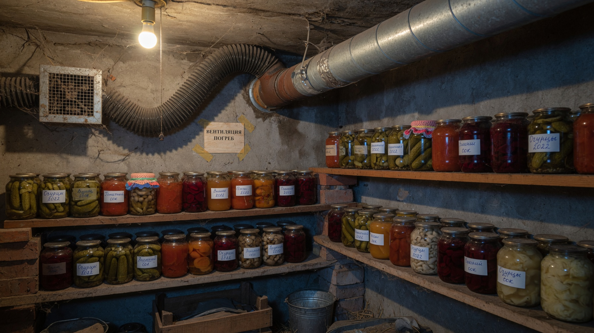
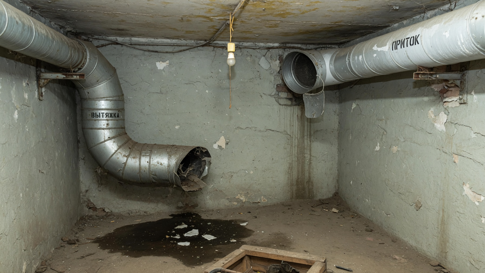
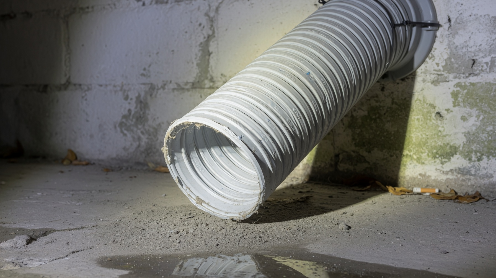
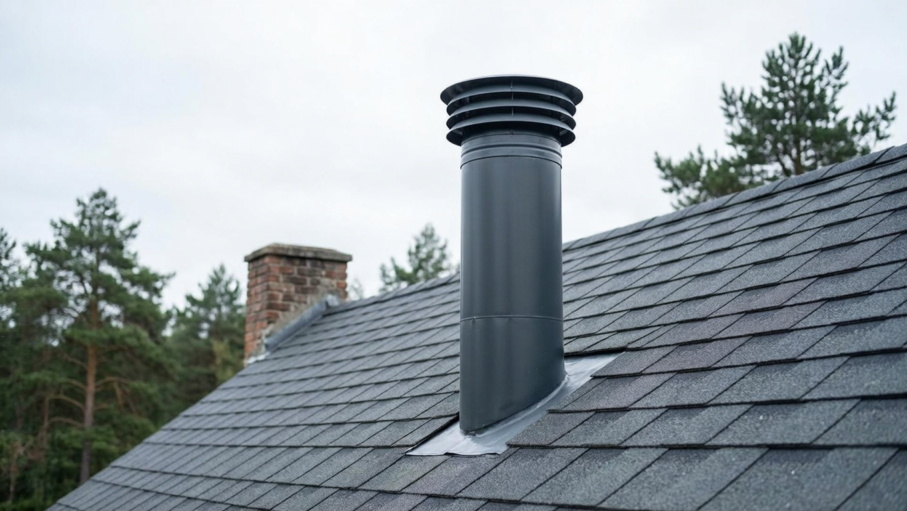
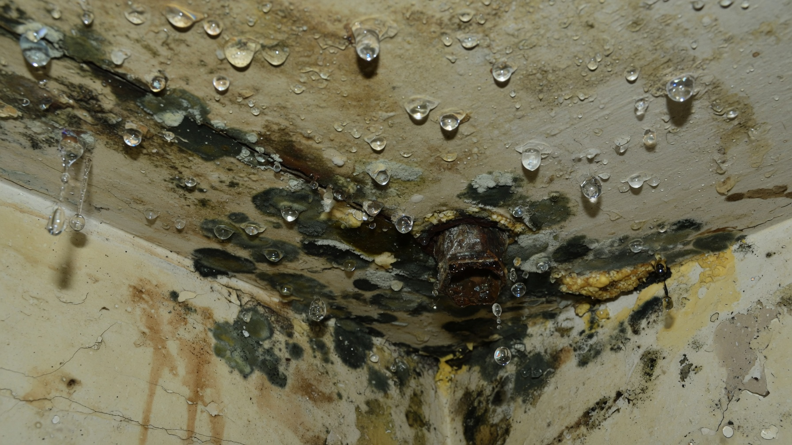
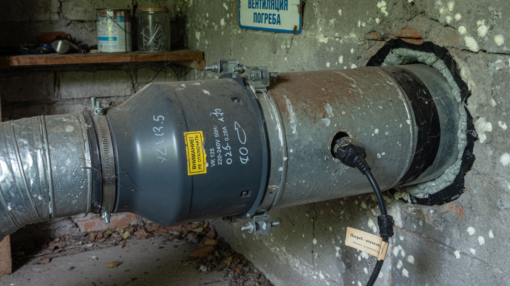

Правильная вентиляция — то, без чего погреб не работает. Именно она выносит наружу лишнюю влагу и углекислый газ, не даёт скапливаться конденсату и плесени и сохраняет урожай до весны. Без воздухообмена даже сухой и утеплённый погреб за сезон превращается в сырую камеру, где гниют овощи и заводится грибок. Разберём, как сделать вентиляцию в погребе своими руками: приточно-вытяжная схема, расчёт диаметра труб, монтаж и что делать, если вытяжка не тянет.

## 💨 Нужна ли вентиляция в погребе

Да, и это не опция, а обязательное условие. Вот что она делает:

- **выводит влагу** — от овощей, земли и дыхания продуктов её всегда много; без вентиляции она оседает конденсатом;
- **не даёт развиваться плесени и гнили** — грибок живёт именно в застойном сыром воздухе;
- **удаляет углекислый газ** — он тяжелее воздуха и скапливается внизу погреба;
- **выравнивает температуру**, не давая погребу перегреваться;
- **убирает затхлый запах**, который впитывают овощи и заготовки.

⚠️ **Важно о безопасности.** В непроветриваемом погребе накапливается углекислый газ, и спускаться туда опасно — были случаи удушья. Перед спуском в давно закрытый погреб опустите вниз горящую свечу: если пламя гаснет или сильно тускнеет — кислорода мало, погреб нужно сначала проветрить.

## 🔀 Приточно-вытяжная схема

Классическая и самая надёжная схема — **две трубы: приточная и вытяжная**. Работает она на разнице температур и высоты:

- **Приточная труба** подаёт свежий холодный воздух. Он тяжелее, поэтому её нижний конец опускают почти к полу — на **20–50 см от пола**. Снаружи труба выводится невысоко над землёй (около 0,8–1 м).
- **Вытяжная труба** удаляет тёплый влажный воздух. Он поднимается вверх, поэтому её нижний конец оставляют **под самым потолком** (5–10 см от него), а наружный поднимают **выше конька крыши** — чем выше труба, тем сильнее тяга.

Ключевое правило: **трубы располагают в противоположных углах, по диагонали.** Тогда воздух проходит через весь объём погреба, а не гуляет по кругу между двумя рядом стоящими трубами.

## 📐 Расчёт диаметра труб

Диаметр подбирают по площади погреба. Практическое правило: **на каждый 1 м² площади нужно около 26 см² сечения канала.**

| Площадь погреба | Нужное сечение | Диаметр трубы |
|---|---|---|
| 4 м² (2×2 м) | ~104 см² | 110–120 мм |
| 6 м² | ~156 см² | ~140 мм |
| 8 м² | ~208 см² | ~160 мм |
| 10 м² | ~260 см² | 180–200 мм |

Для типового дачного погреба 4–8 м² обычно берут **трубы диаметром 110–160 мм**. Вытяжную часто делают чуть большего сечения, чем приточную, — так тяга устойчивее. Слишком узкие трубы не справятся с влагой, слишком широкие зимой быстро выстудят погреб (но это решается задвижками).

Материал — пластиковые канализационные или вентиляционные трубы, реже оцинкованные. Пластик дешевле, не ржавеет и легко монтируется.

## 🔧 Монтаж: пошагово

1. **Разметить места** для труб — в противоположных углах погреба, по диагонали.
2. **Пробить отверстия** в перекрытии/стене под трубы нужного диаметра.
3. **Установить приточную трубу**: нижний срез — в 20–50 см от пола, наружный конец вывести над землёй и закрыть от осадков.
4. **Установить вытяжную трубу**: нижний срез — под потолком, наружную часть поднять выше конька крыши.
5. **Загерметизировать проходы** через перекрытие, чтобы не было щелей.
6. **Поставить задвижки (шиберы)** на обе трубы — ими регулируют поток зимой.
7. **Защитить трубы**: сверху дефлектор или зонтик от дождя и снега, снизу и на входе — сетка от грызунов и насекомых.
8. **Утеплить наружные и чердачные участки** вытяжной трубы — иначе на холодной стенке будет конденсат, а зимой она обмёрзнет и перестанет тянуть.

## 🌬️ Естественная или принудительная

**Естественная вентиляция** работает без электричества, за счёт разницы температур внутри и снаружи и высоты вытяжной трубы. Для небольшого дачного погреба этого обычно достаточно. Но у неё есть слабое место: **летом, когда разница температур мала, тяга почти пропадает**, а иногда даже опрокидывается — воздух идёт в обратную сторону.

**Принудительная вентиляция** — это канальный вентилятор, установленный в вытяжную (реже в приточную) трубу. Она нужна, если:

- погреб большой или сложной формы;
- естественной тяги не хватает (труба короткая, нет возможности поднять выше);
- нужен стабильный воздухообмен летом;
- в погребе уже появились сырость и плесень.

Вентилятор можно включать по таймеру или по датчику влажности — тогда он работает только когда нужно, экономя электричество.

## ❄️ Вентиляция зимой

Зимой у вентиляции две задачи: убирать влагу, но не выстуживать погреб. Поэтому:

- **не закрывайте трубы наглухо** — это главная зимняя ошибка: без воздухообмена погреб отсыреет и овощи сгниют;
- **прикрывайте задвижки**, уменьшая поток в сильный мороз;
- **следите за инеем и наледью** в вытяжной трубе — обмёрзшая труба перестаёт тянуть, её нужно утеплить и при необходимости прочистить.

Ориентир простой: в погребе должно быть прохладно, но **сухо и без запаха сырости**.

## 💧 Конденсат и плесень: почему появляются

Конденсат — прямое следствие плохой вентиляции. Тёплый влажный воздух поднимается к холодному потолку и оседает каплями, потолок «плачет», а следом появляются плесень и запах. Признаки того, что вентиляция не справляется:

- капли и мокрые пятна на потолке и стенах;
- плесень, белый или чёрный налёт, затхлый запах;
- овощи быстро гниют и портятся;
- иней в трубе зимой;
- свеча в погребе горит плохо или гаснет.

Лечится это восстановлением воздухообмена, а не только просушкой: пока нет вентиляции, влага будет возвращаться. Общие требования к погребу — влажность, температура, гидроизоляция и стеллажи — разбирали в статье про [обустройство погреба](https://mir-doma.pro/obustroystvo-pogreba/).

## 🛠️ Вентиляция не работает: что делать

Если тяги нет, проверяйте по порядку:

1. **Не забита ли труба** — мусор, паутина, гнездо, лёд. Прочистить.
2. **Правильно ли расположены концы труб** — частая ошибка: приточная опущена недостаточно низко, а вытяжная висит слишком далеко от потолка. Переставить.
3. **Достаточна ли высота вытяжной трубы** — короткая труба не даёт тяги. Нарастить выше конька.
4. **Открыты ли задвижки** — банально, но случается.
5. **Не рядом ли трубы** — если обе в одном углу, воздух не проходит через погреб. Развести по диагонали.
6. **Не лето ли на дворе** — при малой разнице температур естественная тяга слабеет. Решение — канальный вентилятор.
7. **Проверьте тягу** листом бумаги или дымом у вытяжной трубы: воздух должен явно втягиваться.

## ❌ Частые ошибки

- **Одна труба вместо двух** — без пары «приток + вытяжка» воздухообмена не будет.
- **Трубы рядом друг с другом** — воздух гуляет между ними, а погреб остаётся непроветренным.
- **Перепутаны концы:** приточная под потолком, вытяжная у пола — схема работать не будет.
- **Короткая вытяжная труба** — нет тяги.
- **Не утеплена наружная часть вытяжки** — обмерзание и конденсат.
- **Наглухо закрытая вентиляция зимой** — сырость, плесень и потеря урожая.
- **Нет сетки** — в трубы забираются грызуны.

## ❓ Частые вопросы

**Нужна ли вентиляция в погребе?**
Обязательно. Без неё в погребе копятся влага и углекислый газ, появляются конденсат, плесень и затхлый запах, а овощи быстро гниют. Кроме того, в непроветриваемом погребе опасно находиться.

**Как правильно сделать вытяжку в погребе?**
Установить две трубы в противоположных углах: приточную с нижним концом в 20–50 см от пола, вытяжную — под потолком, выведя её наружную часть выше конька крыши. Обе снабдить задвижками и защитой от осадков и грызунов.

**Какого диаметра должны быть трубы?**
По правилу «26 см² сечения на 1 м² площади»: для погреба 4 м² — около 110–120 мм, для 8 м² — около 160 мм. Для типового дачного погреба обычно берут трубы 110–160 мм.

**Как работает естественная вентиляция в погребе?**
За счёт разницы температур и высоты труб: холодный воздух заходит по приточной трубе внизу, тёплый и влажный поднимается и уходит через вытяжную вверху. Летом такая тяга слабеет, и может потребоваться вентилятор.

**Можно ли закрывать вентиляцию в погребе на зиму?**
Полностью — нельзя, иначе погреб отсыреет. В сильные морозы поток лишь прикрывают задвижками, чтобы погреб не промёрз, но воздухообмен сохраняют.

**Что делать, если в погребе конденсат на потолке?**
Это признак плохой вентиляции. Проверьте, не забиты ли трубы, правильно ли расположены их концы, достаточна ли высота вытяжки. Если естественная тяга не справляется — поставьте канальный вентилятор.

**Почему вытяжка в погребе не тянет?**
Причины: забитая или обмёрзшая труба, слишком короткая вытяжка, трубы стоят рядом, перепутаны концы, закрыты задвижки или на улице лето с малой разницей температур.

---

Вентиляция — сердце погреба: она решает и проблему сырости, и сохранность урожая, и безопасность. Сделать её своими руками несложно — нужны две трубы правильного диаметра, разнесённые по диагонали, с приточной у пола и вытяжной под потолком, выведенной выше крыши. Проверьте свою вентиляцию до закладки урожая — и овощи долежат до весны. Как правильно [хранить овощи зимой](https://mir-doma.pro/kak-hranit-ovoshchi-zimoy/) и что ещё нужно для [обустройства погреба](https://mir-doma.pro/obustroystvo-pogreba/), читайте в отдельных статьях. В сухом проветриваемом погребе прекрасно хранятся и [заготовки](https://mir-doma.pro/marinovannye-ogurtsy-na-zimu/).
