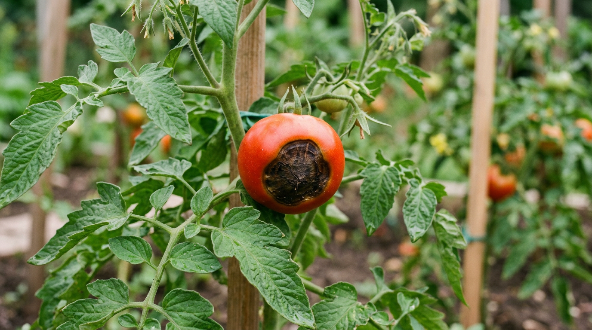
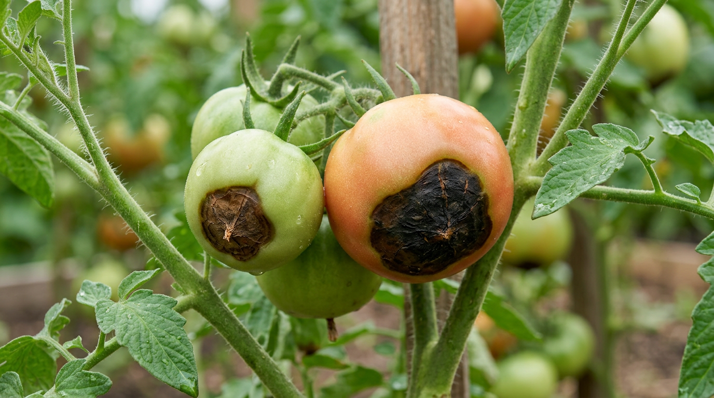
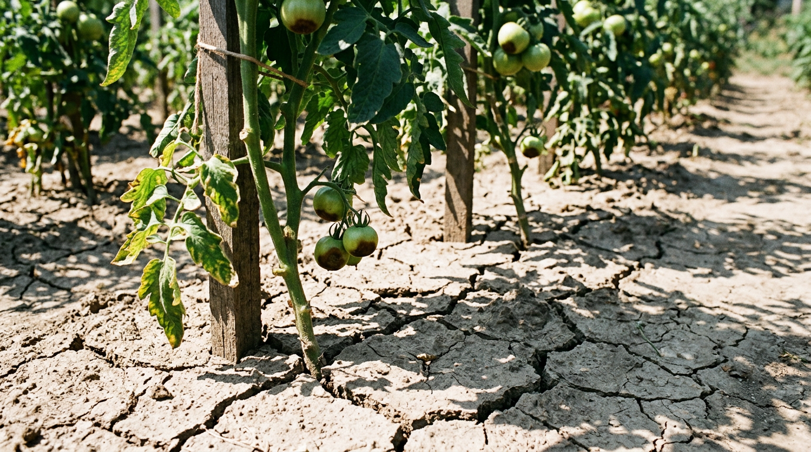
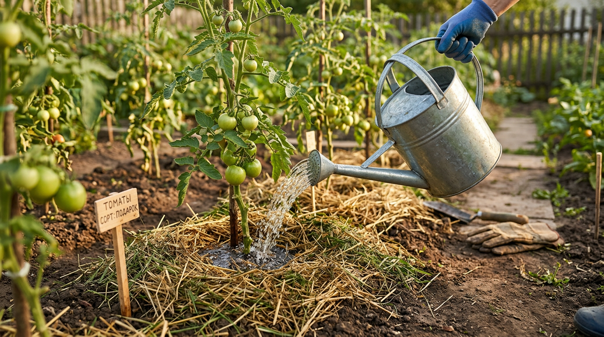
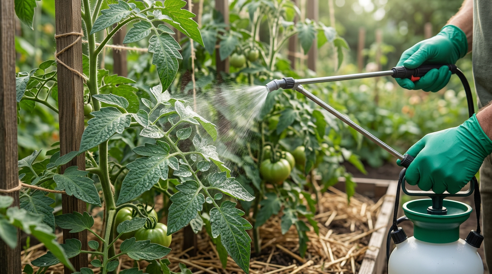
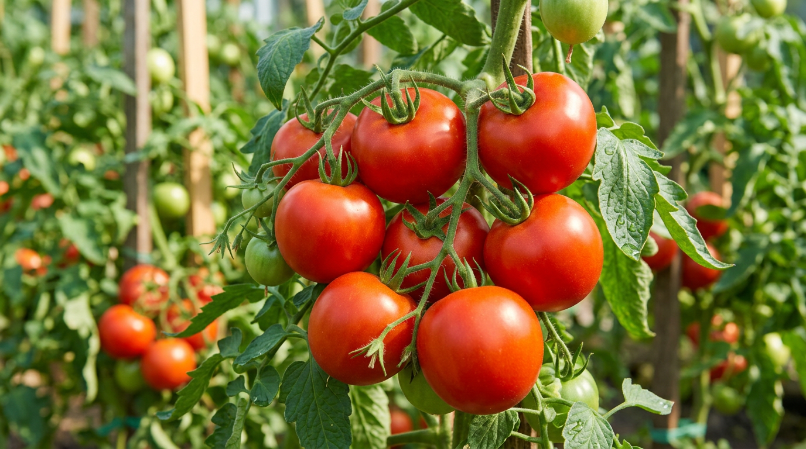

Тёмное вдавленное пятно на верхушке наливающихся помидоров — знакомая и обидная картина: плод вроде бы растёт, а низ его чернеет и засыхает. Это вершинная гниль — одно из самых частых нарушений у томатов, особенно в жаркое лето и в теплице. Многие принимают её за инфекцию и хватаются за фунгициды, но причина совсем другая, и бороться нужно иначе. В этой статье разберём, что такое вершинная гниль томатов, почему она появляется, что делать прямо сейчас и как не допустить её в будущем.

## 🍅 Что такое вершинная гниль и как она выглядит

Вершинная гниль — это нарушение, при котором на вершине плода (с той стороны, что противоположна плодоножке) появляется тёмное сухое пятно. Важно сразу понять главное: это **не инфекционная болезнь**, а физиологическое расстройство, связанное с нехваткой кальция в тканях плода. Поэтому она не лечится фунгицидами и не «заразна» в привычном смысле.

Выглядит вершинная гниль так: сначала на верхушке зеленоватого или наливающегося плода появляется водянистое светлое пятнышко, которое быстро темнеет, становится бурым или почти чёрным, вдавленным и сухим, кожистым на ощупь. Поражённая ткань твердеет, плод деформируется и перестаёт нормально расти. Иногда внутри плод выглядит здоровым, но чаще гниль проникает вглубь, и мякоть под пятном буреет. На сухой кожистой ткани со временем могут поселиться вторичные грибки, и тогда к физиологическому нарушению добавляется уже настоящая гниль — но первопричина всё равно в кальции и воде.

## 🔍 Признаки вершинной гнили

Распознать вершинную гниль несложно, если знать, на что смотреть:

- тёмное пятно располагается именно на **вершине** плода, а не на боку или у плодоножки;
- сначала пятно водянистое и светлое, затем буреет, чернеет, становится вдавленным и сухим;
- поражённая ткань плотная, кожистая, не мокрая и не склизкая (в отличие от инфекционных гнилей);
- чаще страдают плоды на первых, нижних кистях;
- особенно подвержены крупноплодные и удлинённые (сливовидные) сорта.

Если пятно мокрое, склизкое или растёт с боку плода — это, скорее всего, другая болезнь, например фитофтора или серая гниль, и меры будут иными. Вершинную гниль легко узнать по сухому, как бы «кожаному» пятну строго на носике плода: ни одна инфекция не даёт такой характерной локализации.

## ⚠️ Главная причина: дело не в инфекции, а в кальции

Корень проблемы — нехватка кальция в плодах. Кальций отвечает за прочность клеточных стенок, и когда его не хватает в быстрорастущей верхушке плода, ткани там отмирают. При этом парадокс в том, что **кальция в почве чаще всего достаточно** — проблема в том, что он не доходит до плодов.

А не доходит он по одной главной причине — из-за **нарушения водного баланса**. Кальций поступает в растение только с водой через корни. Если полив нерегулярный, стоит жара или почва пересыхает, ток воды нарушается, и кальций просто не успевает добраться до верхушек плодов, даже если в земле его в избытке. Вот почему вершинная гниль — это в первую очередь проблема полива и жары, а уже потом питания.

## 🌡️ Что нарушает поступление кальция

Нерегулярный полив — главный, но не единственный виновник. Есть и другие факторы, которые мешают кальцию доходить до плодов, и часто они действуют вместе:

- **Жара и пересыхание почвы** — в зной растение испаряет много влаги, и кальция плодам не хватает.
- **Резкие перепады влажности** — то засуха, то обильный полив; ровный режим важнее обильного.
- **Избыток азота** — бурный рост зелёной массы оттягивает кальций на себя, в ущерб плодам; перекормленные азотом кусты особенно склонны к вершинной гнили.
- **Избыток калия и магния** — эти элементы конкурируют с кальцием и мешают его усвоению (антагонизм).
- **Кислая почва** — на кислых грунтах кальций хуже доступен растению.
- **Повреждение корней** — при пересадке, рыхлении или болезни корни хуже подают воду и кальций.
- **Высокая концентрация солей** в почве из-за перекорма — затрудняет поступление воды.

Часто вершинная гниль — результат сочетания нескольких факторов: жара плюс нерегулярный полив плюс перекорм азотом.

## 🔬 Как отличить вершинную гниль от других проблем

Вершинную гниль часто путают с инфекционными болезнями, и из-за этого лечат неправильно. Вот как её отличить:

- **Фитофтороз** даёт бурые расплывчатые пятна, которые появляются и на листьях, и на плодах в любом месте, ткань влажная; распространяется в сырую погоду. Подробнее — в статье о [фитофторе на помидорах](https://mir-doma.pro/fitoftora-na-pomidorah/).
- **Серая гниль** — мокрое пятно с серым пушистым налётом, чаще у плодоножки или на повреждённых местах.
- **Растрескивание плодов** — трещины из-за резкого полива после засухи; кожица лопается, но пятна нет.
- **Вершинная гниль** — сухое, вдавленное, кожистое пятно строго на вершине плода, без налёта и мокроты.

Запомните ключевое: вершинная гниль всегда сухая и всегда на носике плода. Если пятно мокрое, с налётом или в другом месте — ищите инфекцию.

## ✅ Что делать: первая помощь

Если вершинная гниль уже появилась, действуйте так:

1. **Удалите поражённые плоды.** Они уже не вылечатся, а растение тратит на них силы. Снимите их, чтобы куст направил ресурсы на здоровые завязи.
2. **Наладьте регулярный полив.** Это главная и самая важная мера. Поливайте равномерно, тёплой водой под корень, не допуская ни пересушки, ни залива. Лучше реже, но обильно и стабильно — глубокий полив раз в 2–3 дня полезнее, чем ежедневное поверхностное смачивание. Резкий обильный полив после засухи, наоборот, вредит — отсюда и трещины, и гниль.
3. **Замульчируйте почву.** Слой мульчи (солома, скошенная трава) удерживает влагу и сглаживает перепады, защищая от пересыхания.
4. **Проведите внекорневую подкормку кальцием.** Опрыскивание по листу действует быстрее всего — об этом ниже.
5. **Не перекармливайте азотом и калием** до восстановления — они мешают усвоению кальция.
6. **Притените растения в сильную жару**, особенно в теплице, чтобы снизить испарение.

Уже через несколько дней после нормализации полива и кальциевой подкормки новые плоды обычно завязываются здоровыми. Главное — не паниковать и не заливать растения фунгицидами: они здесь бесполезны и только добавят стресса. Сосредоточьтесь на воде и кальции, и проблема отступит.

## 🌿 Чем подкормить: восполняем кальций

Поскольку причина в кальции, его и восполняют — но с умом, ведь важнее наладить его поступление, чем просто внести побольше. Просто высыпать в лунку мел или скорлупу недостаточно: если полив нарушен, кальций всё равно не дойдёт до плодов. Поэтому подкормку всегда сочетают с нормализацией полива.

- **Кальциевая селитра** — лучший и самый быстрый способ. Раствором (около 10 г на 10 л воды) опрыскивают растения по листу и поливают под корень. Внекорневая подкормка действует быстрее, потому что кальций сразу попадает в ткани. Это основное средство при вершинной гнили.
- **Хлористый кальций** — аптечный раствор тоже годится для опрыскивания в слабой концентрации.
- **Мел, доломитовая мука, известь** — вносят в почву для пополнения кальция и раскисления, но действуют медленно, поэтому это скорее профилактика на будущее.
- **Яичная скорлупа** — измельчённую скорлупу добавляют в почву как источник кальция, но усваивается она долго и для быстрой помощи не подходит.

Важно: при опрыскивании кальцием не смешивайте его в одном растворе с фосфорными и некоторыми другими удобрениями — они образуют нерастворимые соединения. Кальциевые подкормки проводят отдельно.

## 🛡️ Профилактика вершинной гнили

Предотвратить вершинную гниль гораздо проще, чем бороться с ней. Главное — стабильность ухода:

- **Поливайте равномерно и регулярно** — это самое важное. Никаких качелей «засуха — потоп».
- **Мульчируйте почву** соломой, скошенной травой или другим материалом — мульча удерживает влагу, сглаживает перепады и защищает корни от перегрева, что особенно важно в жару.
- **Не перекармливайте азотом**, соблюдайте баланс с фосфором и калием. Подробно о балансе питания — в статье о [летних подкормках овощей](https://mir-doma.pro/letnie-podkormki-ovoshchey/).
- **Раскисляйте кислую почву** мелом или доломитовой мукой ещё до посадки.
- **Притеняйте теплицу** в сильную жару и проветривайте её.
- **Аккуратно рыхлите**, чтобы не повредить корни, или замените рыхление мульчированием.
- **Выбирайте устойчивые сорта** — некоторые сорта и гибриды меньше склонны к вершинной гнили (это указывают в описании).

Вершинная гниль часто соседствует с другими проблемами томатов. Если у растений к тому же [желтеют листья](https://mir-doma.pro/zhelteyut-listya-u-pomidorov/) или появляются бурые пятна, причиной может быть тот же стресс от жары и неправильного полива — и решать вопрос нужно комплексно, начиная с режима полива.

## 🥒 Бывает ли вершинная гниль у других культур

Да, вершинная гниль — не только «помидорная» проблема. По тому же механизму (нехватка кальция из-за нарушения водного баланса) она поражает **перец, баклажаны, кабачки, тыкву и арбузы**. Признаки и меры борьбы у них те же: наладить регулярный полив, восполнить кальций и не перекармливать азотом. Так что, заметив тёмные пятна на верхушках перцев или кабачков, действуйте так же, как с томатами: первым делом проверьте режим полива, замульчируйте почву и проведите кальциевую подкормку. Механизм везде один, и решение тоже общее.

## ❓ Частые вопросы

### Из-за чего появляется вершинная гниль, если кальция в почве хватает?

Это самый частый и парадоксальный случай: кальций в земле есть, но он не доходит до плодов из-за нарушенного водного баланса. Кальций перемещается по растению только с водой, поэтому при нерегулярном поливе и жаре он не успевает добраться до верхушек плодов. Решение — не вносить ещё больше кальция, а наладить полив.

### Вершинная гниль заразна?

Нет. Это не инфекция, а физиологическое нарушение из-за нехватки кальция в плодах. Она не передаётся от плода к плоду, но поскольку условия (жара, нерегулярный полив) одинаковы для всех кустов, пострадать может сразу много плодов — отсюда и впечатление «заразности».

### Можно ли есть помидоры с вершинной гнилью?

Сам плод не ядовит, и если поражена только верхушка, здоровую часть можно срезать и использовать в готовке или переработке. Но лучше такие плоды удалять с куста заранее, чтобы растение не тратило на них силы и направляло их в здоровые завязи.

### Чем обработать томаты от вершинной гнили?

Фунгициды здесь не помогут — это не грибок. Помогает внекорневая подкормка кальцием: опрыскивание раствором кальциевой селитры (около 10 г на 10 л воды). Но главное — наладить регулярный полив, потому что без воды кальций всё равно не дойдёт до плодов.

### Почему вершинная гниль появляется в теплице чаще?

В теплице жарче и суше, испарение влаги выше, а перепады между дневной жарой и ночной прохладой сильнее — всё это нарушает поступление воды и кальция к плодам. Поэтому в теплице особенно важны равномерный полив, мульчирование и притенение в зной.

### Поможет ли яичная скорлупа от вершинной гнили?

Скорлупа — источник кальция, но усваивается она очень медленно, поэтому для быстрой помощи при уже появившейся гнили не годится. Её используют для профилактики, заранее внося в почву. При активной проблеме нужна быстрая внекорневая подкормка кальциевой селитрой.

### Как быстро проходит вершинная гниль после мер?

Уже поражённые плоды не восстановятся — их удаляют. Но после налаживания полива и кальциевой подкормки новые завязи и плоды растут здоровыми обычно уже через несколько дней. То есть проблема решается «на будущее»: спасают не больные плоды, а те, что завяжутся следующими.

### Нужно ли удалять плоды с вершинной гнилью сразу?

Да, поражённые плоды лучше снять как можно раньше. Вылечить их нельзя, а растение продолжает тратить на них силы и воду. Удалив их, вы направите ресурсы куста на здоровые завязи и ускорите восстановление.

### Почему вершинная гниль чаще на первых плодах?

Первые крупные плоды на нижних кистях растут особенно быстро и требуют много кальция, а молодая корневая система ещё не всегда успевает его подать, особенно в жару. По мере роста куста и налаживания полива следующие плоды обычно завязываются здоровыми.

## Заключение

Вершинная гниль томатов выглядит пугающе, но на деле это не инфекция, а сигнал, что растению не хватает кальция из-за нарушенного полива. Поэтому и лечится она не фунгицидами, а правильным уходом: удалите поражённые плоды, наладьте равномерный полив, замульчируйте почву, проведите кальциевую подкормку по листу и не перекармливайте азотом. А стабильный полив и профилактика кальцием с самого начала сезона помогут вовсе забыть об этой проблеме — и собрать урожай красивых, целых помидоров. Запомните главное: вершинная гниль — это не про болезнь, а про воду и кальций, и ключ к её решению всегда в режиме полива.

А вы сталкивались с вершинной гнилью и что помогло справиться? Делитесь опытом в комментариях и подписывайтесь, чтобы не пропустить новые статьи об уходе за огородом.
