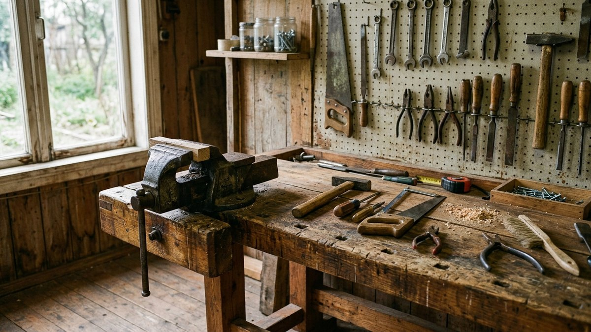
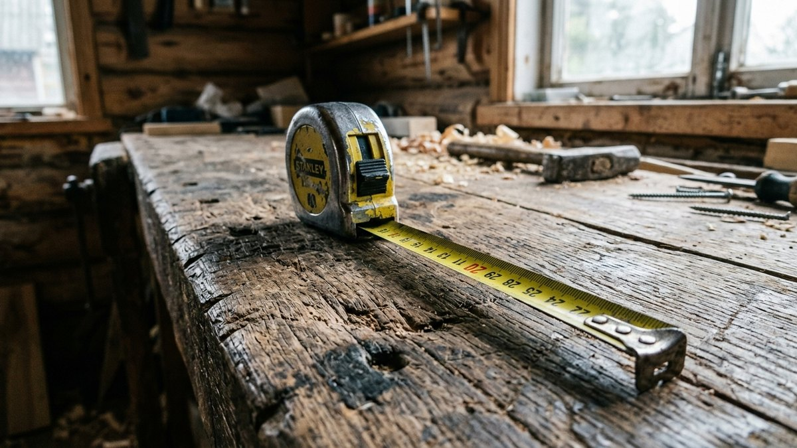
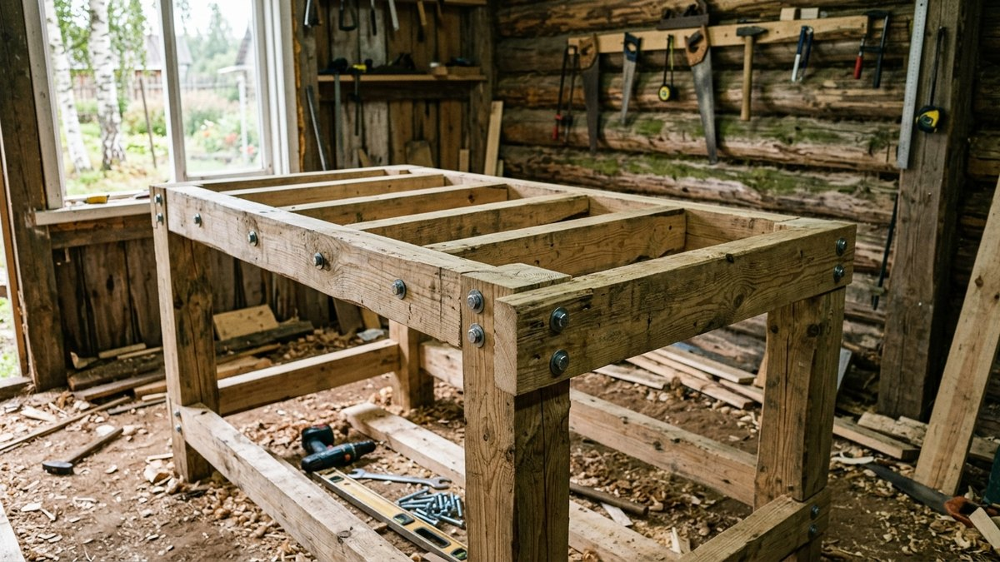
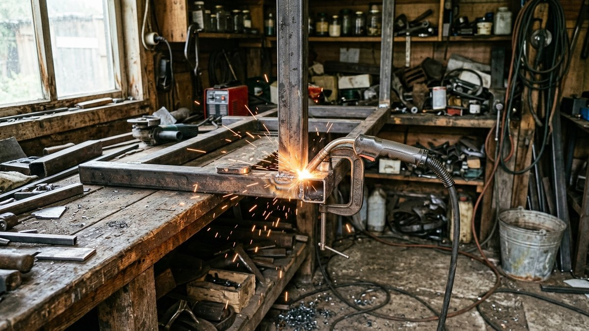
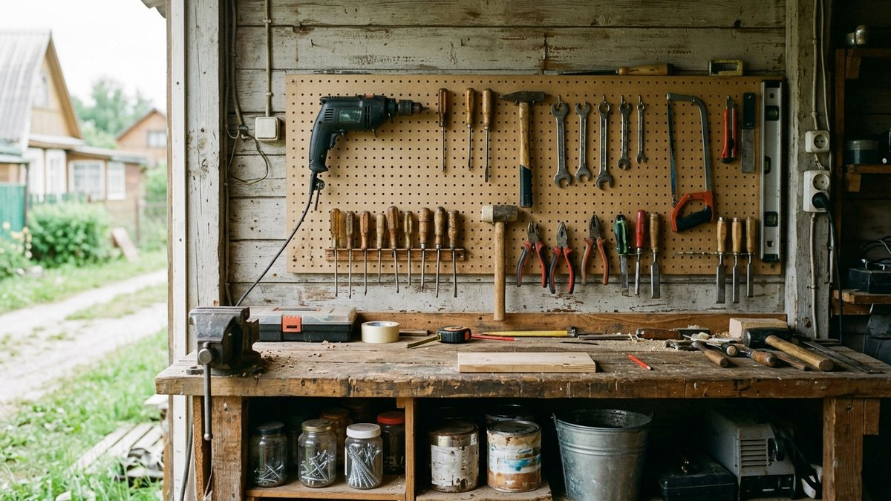
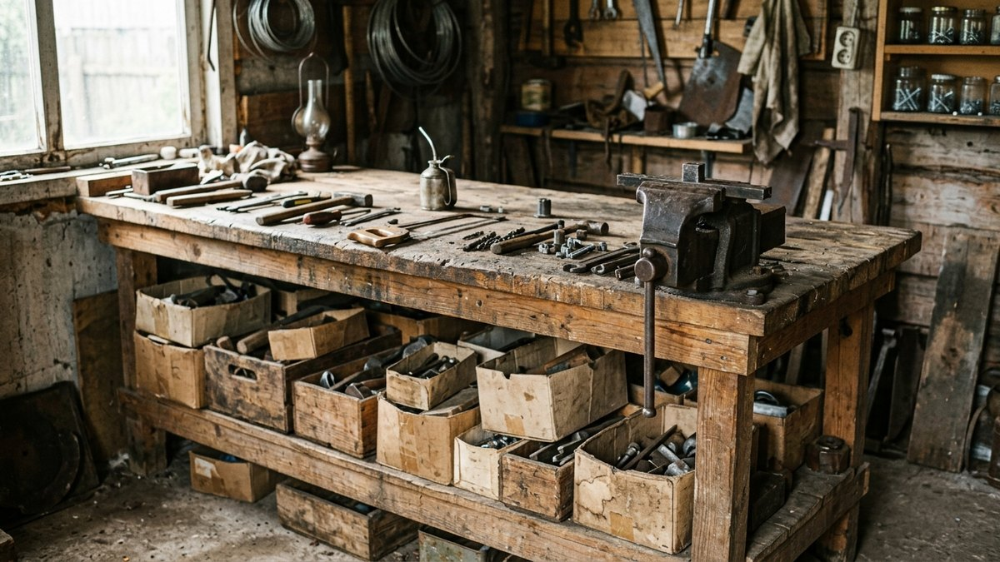

# Верстак своими руками: деревянный и металлический — размеры, чертёж и сборка

Верстак — первое, что стоит сделать в мастерской или гараже: без
устойчивого рабочего стола любая работа превращается в борьбу с
шатающейся доской на козлах. Хорошая новость — верстак своими руками
получается прочнее и дешевле магазинного, а размеры можно подогнать под
свой рост и своё помещение. Разберём, чем столярный верстак отличается
от слесарного, из чего делать каркас и столешницу, какая высота нужна
именно вам, и соберём деревянный и металлический варианты по шагам.

## Столярный или слесарный

| | Столярный | Слесарный |
|---|---|---|
| Для чего | Строгание, пиление, сборка из дерева | Работа с металлом, ремонт техники, заточка |
| Столешница | Толстое дерево 40–60 мм, можно строгать и сверлить | Фанера или доска, обитая стальным листом |
| Тиски | Деревянные, встроенные в столешницу | Слесарные, металлические, на край столешницы |
| Каркас | Брус | Профтруба или уголок, реже брус |
| Высота | Ниже, чтобы давить на рубанок весом тела | Выше, губки тисков на уровне локтя |

Для дачи и гаража часто делают **универсальный** верстак:
деревянная столешница на крепком каркасе, слесарные тиски на одном
углу. Его хватает и для деревянных поделок, и для ремонта
[триммера или мотоблока](https://mir-doma.pro/kakoy-motoblok-vybrat/).

## Размеры

- **Длина** — 1,5–2 м. Меньше — неудобно работать с длинными
  заготовками, больше — не во всякой мастерской поместится.
- **Глубина** — 60–80 см. Глубже — трудно дотянуться до дальнего края.
- **Толщина столешницы** — 40–60 мм для столярного, от 18–21 мм фанеры
  под стальным листом для слесарного.
- **Высота** — главный параметр, её считают под рост (калькулятор ниже).

Если верстак будет стоять у стены, над ним удобно повесить
перфорированную панель для инструмента. Полки внизу, между ногами,
заодно делают каркас тяжелее и устойчивее.

## Калькулятор высоты верстака

Неправильная высота — главная причина, почему за верстаком болит
спина. Слишком низкий — работаете согнувшись, слишком высокий — руки
устают, и давить на инструмент неудобно.

<!-- wp:html -->

  
Какая высота верстака нужна под ваш рост

  <label class="md-calc__label" for="mdBnH">Ваш рост, см</label>
  <input type="number" id="mdBnH" class="md-calc__input" min="140" max="210" step="1" value="175">
  
Введите рост

<!-- /wp:html -->

Цифры — средние пропорции тела. Перед окончательной сборкой соберите
каркас без столешницы, положите сверху доску и поработайте пять минут:
если неудобно, подрежьте или нарастите ноги.

## Деревянный верстак: сборка по шагам

**Материалы:**

- брус 100×100 или 80×80 мм на ноги (4–6 шт.);
- брус 50×100 мм на царги и нижнюю обвязку;
- доска 50 мм или клеёный щит 40–60 мм на столешницу;
- доска 25 мм или фанера на нижнюю полку;
- болты М10–М12 с шайбами, саморезы по дереву, столярный клей;
- тиски (слесарные или столярные).

**Сборка:**

1. **Нарежьте ноги** в размер: высота из калькулятора минус толщина
   столешницы.
2. **Соберите две боковые рамы**: две ноги, верхняя и нижняя поперечины.
   Соединения — на клей и болты, а не на одни саморезы: верстак
   работает на удар и расшатывание.
3. **Соедините рамы продольными царгами** сверху и снизу.
4. **Проверьте диагонали**: у прямоугольного каркаса они равны.
5. **Уложите нижнюю полку** на нижнюю обвязку.
6. **Соберите столешницу** из досок на клей и стяжки или положите
   готовый щит. Крепите к царгам снизу, через уголки, чтобы сверху не
   было шляпок.
7. **Установите тиски** на угол, над ногой, где жёсткость максимальна.
8. **Пропитайте** столешницу маслом или воском, а не лаком: лак
   скользит и скалывается от ударов.

Как собирают обычный стол для дачи и чем стол отличается по нагрузкам,
разобрано в статье [стол для дачи своими руками](https://mir-doma.pro/stol-dlya-dachi-svoimi-rukami/).
У верстака каркас в разы массивнее, потому что работает на удар.

## Металлический верстак

Для гаража, где много работы с металлом, прочнее каркас из профильной
трубы.

**Материалы:**

- профтруба 40×40 или 60×40 мм, стенка 2–3 мм, на ноги и обвязку;
- уголок 40×40 мм для рамки под столешницу;
- фанера 18–21 мм или доска 40 мм на столешницу;
- стальной лист 2–3 мм сверху;
- регулируемые опоры на ноги (для неровного пола гаража).

**Сборка:**

1. Нарежьте трубу, сварите две боковые рамы.
2. Соедините их продольными перемычками, проверьте диагонали.
3. Приварите рамку из уголка под столешницу.
4. Уложите фанеру в рамку, сверху стальной лист, крепите болтами с
   потайной головкой.
5. Приварите или прикрутите полку внизу.
6. Зачистите швы, покрасьте каркас.

Сварка каркаса — та же техника, что и при изготовлении навеса или
буржуйки. Если у вас уже есть сварочный опыт, стоит посмотреть статью
[буржуйка своими руками](https://mir-doma.pro/burzhuyka-svoimi-rukami/):
печь в мастерской и верстак обычно появляются в одном сезоне.

## Что добавить к верстаку

- **Тиски.** Слесарные — на край, так, чтобы длинная заготовка не
  упиралась в ногу. Столярные — встраивают в переднюю кромку.
- **Упоры для строгания** — съёмные бруски в отверстиях столешницы.
- **Розетки** на передней царге: инструмент не тянет провод через всю
  мастерскую. Подключать мастерскую лучше отдельной линией с автоматом.
- **Свет** над верстаком: лампа или светодиодная панель без теней от
  головы.
- **Перфопанель** на стене для инструмента: дрель, шуруповёрт,
  ножовки на виду. Какой инструмент стоит держать на даче в первую
  очередь, разобрано в статье
  [инструменты для дачи](https://mir-doma.pro/instrumenty-dlya-dachi/).

## Частые ошибки

- **Лёгкий каркас на саморезах.** Шатается с первого дня. Нужны брус
  или труба и болты с клеем.
- **Высота «как у стола».** Обеденный стол — 75 см, а верстак под
  рост 180 см для слесарки должен быть заметно выше.
- **Лак на столешнице.** Скользко и быстро скалывается.
- **Тиски посередине пролёта.** Столешница пружинит при ударе.
- **Нет полки внизу.** Каркас легче и хуже держит вибрацию.

## Частые вопросы

### Какой высоты должен быть верстак

Для столярной работы — примерно на уровне ладоней опущенных рук, для
слесарной — выше, чтобы губки тисков были на уровне согнутого локтя.
Для роста 175 см это обычно 80–95 см в зависимости от типа.

### Из чего сделать столешницу для верстака

Для столярного — толстая доска 50 мм или клеёный щит 40–60 мм. Для
слесарного — фанера 18–21 мм, обитая стальным листом 2–3 мм.

### Какой брус нужен для верстака

На ноги — 100×100 или 80×80 мм, на царги и обвязку — 50×100 мм.

### Что лучше: деревянный или металлический верстак

Деревянный проще сделать и приятнее для столярки. Металлический
прочнее и лучше для гаража, где работают с металлом и тяжёлыми деталями.

### Какой длины делать верстак

Обычно 1,5–2 м при глубине 60–80 см. Под короткую стену гаража можно
сделать 1,2 м, но с длинными заготовками будет тесно.

## Итог

Верстак своими руками — это массивный каркас из бруса или трубы,
толстая столешница и высота под ваш рост. Для дачи чаще всего хватает
универсального варианта: деревянная столешница, слесарные тиски на
углу, полка внизу. Высоту посчитайте в калькуляторе и проверьте на
месте до окончательной сборки.
