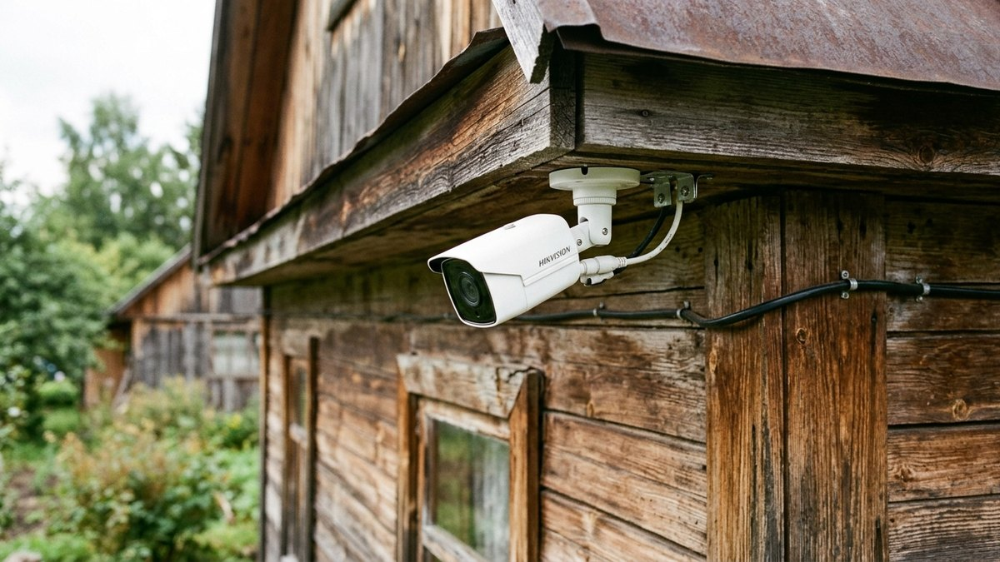
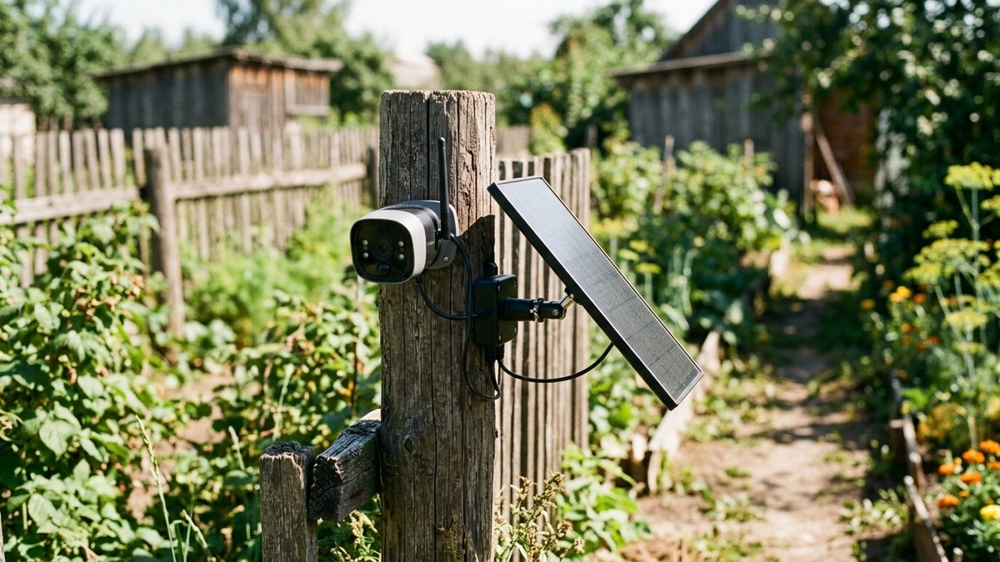
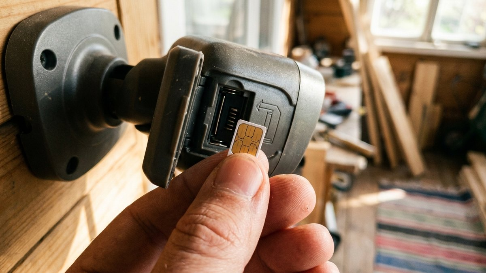
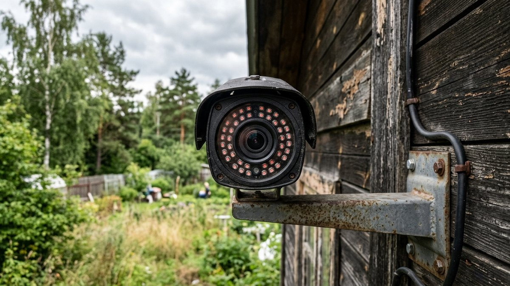
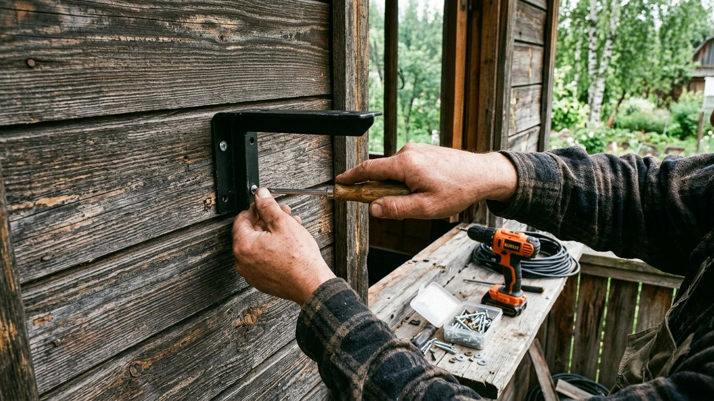
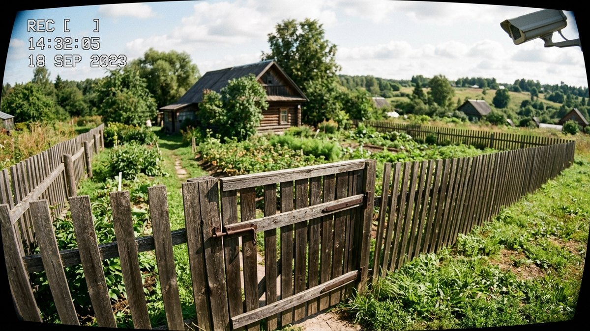

# Видеонаблюдение на даче своими руками: как настроить без интернета

Дача обычно пустует всю рабочую неделю, а зимой — по несколько месяцев
подряд, и именно в это время туда чаще всего забираются воры. Организовать
видеонаблюдение на даче своими руками можно даже там, где нет ни
стационарного интернета, ни постоянного электричества — камера получает
питание от розетки или батареи, а видео передаёт через мобильную сеть.
Разберём, какие варианты подходят для участка без интернета, как выбрать
камеру и сколько мобильного трафика она съест за месяц.

## Какие бывают варианты видеонаблюдения на даче

Все камеры для частного участка делятся на четыре типа по способу передачи
сигнала — от этого зависит, нужен ли на даче интернет вообще.

- **Wi-Fi-камера** — работает через домашний роутер, видео пишется в облако
  или на карту памяти, просмотр — через приложение с телефона. Требует
  постоянного интернета на участке.
- **4G/LTE-камера** — со своей SIM-картой, передаёт видео через мобильную
  сеть напрямую в приложение, роутер не нужен.
- **GSM-камера** — упрощённый вариант: шлёт SMS или MMS с фото при
  срабатывании датчика движения, постоянного видеопотока нет, зато
  почти не расходует трафик и работает от простой SIM-карты без интернет-пакета.
- **Автономная камера с записью на SD-карту** — вообще не передаёт данные
  наружу, просто пишет видео на карту памяти, которую вынимают и
  просматривают на месте. Подходит, если нужен архив событий, а не
  оповещение в реальном времени.

## Видеонаблюдение без интернета: как это работает

Если на участке нет ни кабельного, ни Wi-Fi-интернета, задачу решает
4G-камера с собственной SIM-картой — по сути, это отдельный мобильный
модем внутри корпуса камеры. Она регистрируется в сети оператора точно так
же, как смартфон, и передаёт видео через тот же канал, что и мобильный
интернет в телефоне: важно только, чтобы на участке уверенно ловил
LTE-сигнал хотя бы одного оператора.

Питание — второй вопрос, который на даче без постоянного электричества
встаёт не менее остро, чем интернет. Часть 4G-камер работает от
встроенного аккумулятора с подзарядкой от солнечной панели, часть —
только от сети 220 В. Если электричество на участке уже
[проведено и разведено по щитку](https://mir-doma.pro/elektrichestvo-na-dache-svoimi-rukami/),
проще взять камеру с питанием от розетки и не зависеть от заряда батареи в
пасмурную неделю.

Отдельно стоит учитывать, что дача обычно консервируется на зиму на
несколько месяцев — именно этот период и есть основной риск, ради
которого ставят камеру. При
[подготовке дачи к зиме](https://mir-doma.pro/konservaciya-dachi-na-zimu/)
камеру с автономным питанием стоит проверить и зарядить отдельно, а не
оставлять на морозе с севшим аккумулятором.

## Сравнение вариантов: что выбрать

| Тип камеры | Нужен интернет на участке | Как приходит уведомление | Расходы в месяц | Когда выбрать |
|---|---|---|---|---|
| Wi-Fi-камера | Да, постоянный | Push в приложении, видеопоток онлайн | Только интернет, который уже оплачен | Дача с проведённым интернетом и Wi-Fi-роутером |
| 4G/LTE-камера | Нет, своя SIM-карта | Push в приложении, видео в реальном времени | Тариф на мобильный интернет, 150–500 ₽ | Участок без интернета, нужен просмотр видео онлайн |
| GSM-камера | Нет | SMS или MMS с фото при движении | Минимальный тариф без интернет-пакета | Достаточно знать о самом факте вторжения |
| Автономная на SD-карту | Не нужен | Нет уведомлений, только архив на карте | Разовая покупка карты памяти | Нужен только архив на случай разбирательства |

## Как выбрать камеру для дачи

- **Класс защиты не ниже IP65–IP67.** Дачная камера стоит на улице
  круглый год, и обычная «квартирная» модель без влагозащиты откажет уже
  после первых осенних дождей.
- **Диапазон рабочих температур минимум −30…+50 °C** — иначе камера
  перестанет запускаться в морозы, когда дача особенно нужна под
  присмотром.
- **ИК-подсветка или встроенный прожектор** для ночной съёмки — без неё
  камера ночью показывает только шум.
- **Детектор движения с настройкой зон** — чтобы не писать видео на каждый
  проехавший по дороге автомобиль или качающуюся ветку, расходуя трафик и
  память впустую.
- **Способ питания под ваши условия участка**: розетка 220 В — самый
  надёжный вариант, аккумулятор с солнечной панелью — там, где
  электричества нет вообще.

## Пошаговая установка своими руками

1. **Выберите точку обзора.** Камера у калитки или
   [ворот участка](https://mir-doma.pro/vorota-dlya-dachi-svoimi-rukami/)
   фиксирует всех, кто заходит на участок, — это обычно даёт больше
   пользы, чем общий план на весь двор.
2. **Закрепите кронштейн на высоте 2,5–3 м.** Ниже — камеру легко снять
   или закрыть рукой, выше — хуже видно лица.
3. **Разверните объектив так, чтобы солнце не било прямо в кадр** ни утром,
   ни вечером — иначе изображение будет засвечено именно в те часы, когда
   важнее всего видно происходящее.
4. **Подключите питание.** При подключении от сети 220 В используйте УЗО
   на группе и по возможности заведите камеру через
   [защиту от грозовых перенапряжений](https://mir-doma.pro/molniezashchita-chastnogo-doma/) —
   уличная электроника чаще всего сгорает именно при близком разряде
   молнии.
5. **Установите SIM-карту** (для 4G- и GSM-камер) — активируйте её заранее
   в телефоне, чтобы не разбираться с балансом и тарифом уже после
   монтажа на высоте.
6. **Настройте приложение и зоны детекции движения**, отключив срабатывание
   на дорогу за забором и качающиеся ветки деревьев.
7. **Проверьте картинку днём и ночью** перед тем, как уехать с дачи —
   ошибки в направлении объектива видно сразу, а по SMS-уведомлению
   через месяц — уже нет.

## Калькулятор трафика для 4G-камеры

Главный вопрос при выборе тарифа — сколько гигабайт камера съест за месяц.
Введите разрешение и режим записи — калькулятор посчитает трафик в сутки и
в месяц и подскажет, тариф какого объёма брать.

<!-- wp:html -->

<h3 class="md-vn__title">Калькулятор трафика 4G-камеры</h3>

Оценка усреднённая — реальный расход зависит от кодека (H.264/H.265) и сложности сцены в кадре.

<label class="md-vn__f">Разрешение видео
<select id="vnRes">
<option value="1">720p (HD)</option>
<option value="2" selected>1080p (Full HD)</option>
<option value="4">1440p (2K)</option>
<option value="8">2160p (4K)</option>
</select></label>
<label class="md-vn__f">Часов записи в сутки<input type="number" id="vnHours" value="3" min="0.1" max="24" step="0.1"></label>
<label class="md-vn__f">Дней в месяце<input type="number" id="vnDays" value="30" min="1" max="31" step="1"></label>

Для записи только по движению обычно набегает 1–4 часа реального видео в сутки. Для непрерывной записи 24/7 поставьте 24 часа.

Трафик в сутки<b id="vnDay">0,8 ГБ</b>

Трафик в месяц<b id="vnMonth">24,7 ГБ</b>

Нужен тариф<b id="vnTariff">—</b>

<button type="button" id="vnCopy" class="md-vn__btn md-vn__btn--main">Скопировать результат</button>
<a id="vnVk" class="md-vn__btn md-vn__btn--vk" href="#" target="_blank" rel="noopener noreferrer">Поделиться ВКонтакте</a>
<a id="vnTg" class="md-vn__btn md-vn__btn--tg" href="#" target="_blank" rel="noopener noreferrer">Поделиться в Telegram</a>
<button type="button" id="vnShareNative" class="md-vn__btn" hidden>Поделиться…</button>
<button type="button" id="vnPrint" class="md-vn__btn">Печать</button>

<!-- /wp:html -->

## Частые ошибки

- **Экономия на защите корпуса.** Камера без реального IP65+ перестаёт
  работать после первой же дождливой осени — на упаковке китайских камер
  маркировка IP нередко завышена, лучше проверять отзывы конкретной
  модели.
- **Камера смотрит против света.** Направление на восход или закат
  засвечивает кадр именно на рассвете и в сумерках — самое частое время
  для проникновения на участок.
- **Нет резервного питания.** При отключении электричества камера от сети
  220 В без аккумулятора просто перестаёт писать видео — именно тогда,
  когда участок остаётся без света и без присмотра одновременно.
- **Слишком широкий угол обзора вместо зума на нужную зону.** Камера
  «видит всё и сразу», но лицо человека у калитки на таком кадре
  неразличимо — лучше направленный обзор на точку входа.

## Частые вопросы

### Можно ли настроить видеонаблюдение на даче без интернета

Да — для этого берут 4G-камеру со своей SIM-картой: она работает через
мобильную сеть напрямую, роутер и стационарный интернет на участке не
нужны. Единственное условие — уверенный приём LTE хотя бы одного
оператора в месте установки.

### Можно ли смотреть видео с камеры на даче через телефон

Да, у всех Wi-Fi- и 4G-камер есть фирменное приложение для смартфона: оно
показывает видеопоток в реальном времени, присылает push-уведомления при
движении и даёт доступ к архиву за несколько последних дней.

### Какой тариф выбрать для 4G-камеры на даче

Зависит от режима записи: при записи только по движению обычно хватает
5–15 ГБ в месяц, при постоянной записи 24/7 счёт идёт на десятки гигабайт
и выгоднее безлимитный тариф для видеонаблюдения — точную цифру для своих
настроек удобно прикинуть в калькуляторе выше.

### Нужно ли разрешение на установку камеры на своём участке

На собственном участке для съёмки своей территории разрешение не нужно.
Ограничение одно: камера не должна снимать чужую частную территорию —
соседний двор или окна соседнего дома, — направление объектива стоит
проверить сразу после монтажа.

### Сколько работает камера видеонаблюдения от солнечной панели зимой

Заметно меньше, чем летом, — короткий световой день и снег на панели
резко снижают заряд. Для зимней работы либо берут камеру с питанием от
сети 220 В, либо ставят панель мощнее рекомендованной производителем «с
запасом».
