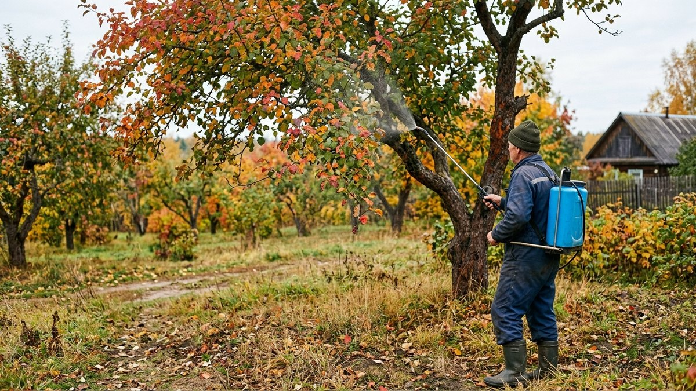
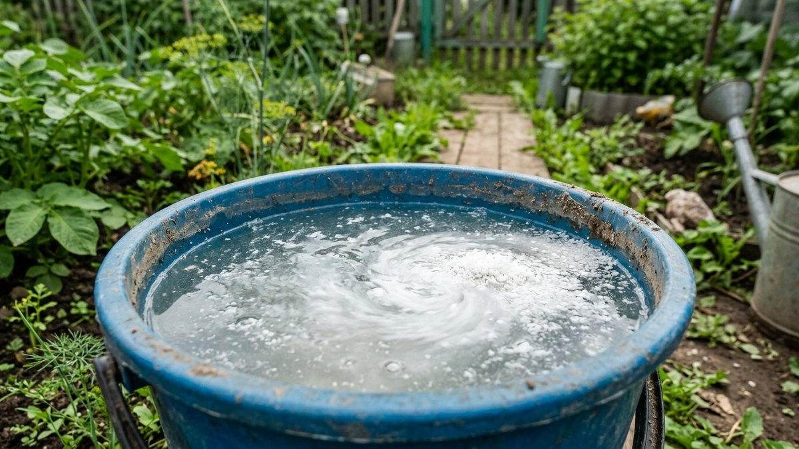
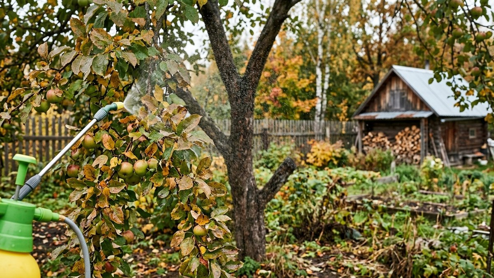
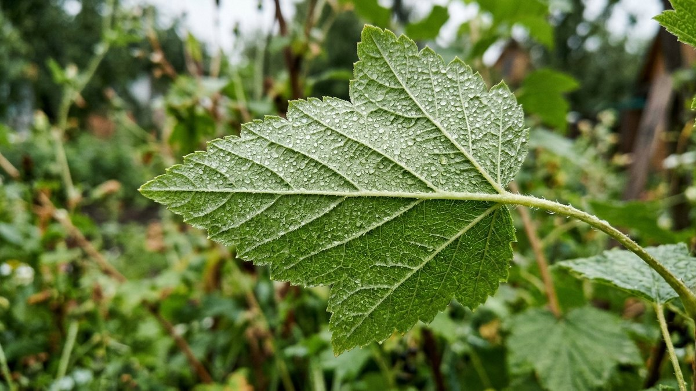
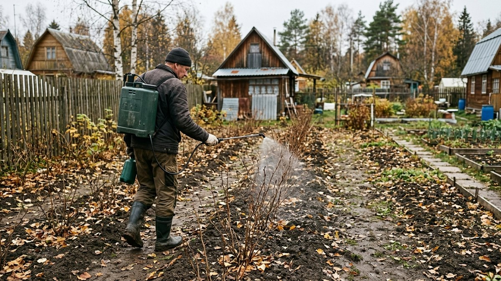
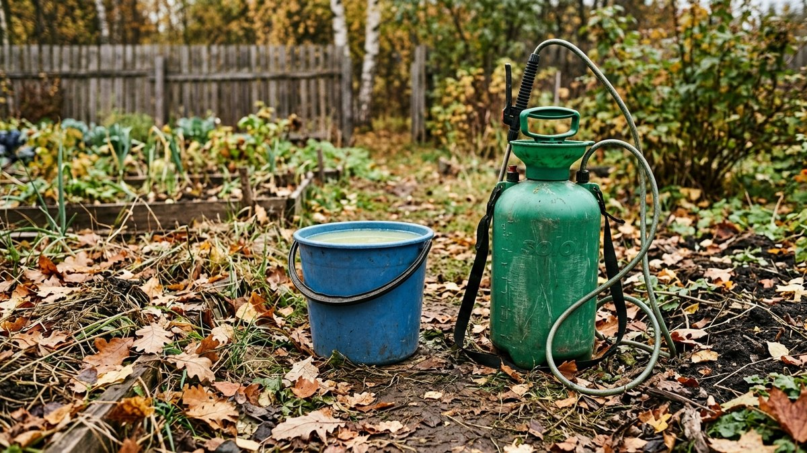

Осенние подкормки обычно вносят в почву под корень, но у внекорневой
подкормки по листу — своя, отдельная задача, и путать их не стоит. Полив
под корень готовит запас питания в почве на будущий год, а опрыскивание по
листу осенью работает быстрее и точечнее: помогает растению завершить
сезон без стресса и повышает устойчивость к морозу за счёт готовых
элементов, которые лист усваивает напрямую, минуя корневую систему.
Разбираем, чем опрыскивать сад осенью, в какие сроки и почему для этой
подкормки состав принципиально другой, чем для корневой.

## Чем внекорневая подкормка отличается от корневой

Корневая подкормка (компост, зола, минеральные удобрения в приствольный
круг) — это запас на будущий сезон: растение усвоит его постепенно, по
мере таяния снега и прогрева почвы весной. Внекорневая подкормка по
листу действует иначе: элементы усваиваются через устьица листа за
1–3 дня, минуя долгий путь через корень и почву. Осенью это особенно
ценно — до листопада остаётся мало времени, и корневая подкормка просто
не успеет сработать до конца вегетации.

Основная цель осеннего опрыскивания — не нарастить массу (как весной или
летом), а помочь растению перевести питательные вещества в запасающие
органы (кору, корни, многолетнюю древесину) и подготовиться к зиме с
достаточным запасом калия и фосфора, которые повышают морозостойкость
тканей.

## Чем опрыскивать сад осенью

| Состав | Концентрация | Для чего |
|---|---|---|
| Монофосфат калия | 10–15 г на 10 л воды | Основной осенний состав: калий и фосфор без азота |
| Сульфат калия | 15–20 г на 10 л воды | Альтернатива монофосфату, чуть медленнее действует |
| Борная кислота | 5–10 г на 10 л воды | Дополнительно, раз в 2–3 года, для косточковых и семечковых |
| Карбамид (мочевина), низкая концентрация | 300–500 г на 10 л воды | Только для профилактики парши и вредителей, не как подкормка (см. ниже) |

Азотные удобрения (в том числе карбамид в подкормочной концентрации)
осенью по листу не вносят вообще — азот стимулирует рост новых побегов,
которые не успевают одревеснеть до морозов и вымерзают в первую же
холодную ночь. Карбамид высокой концентрации (500 г на 10 л) осенью
применяют не как подкормку, а как обеззараживающую обработку от парши и
зимующих вредителей — это отдельная задача с другой целью.

## Сроки: когда опрыскивать

Внекорневая подкормка калием и фосфором проводится после сбора урожая, но
до массового листопада — обычно это конец сентября — первая половина
октября в средней полосе, когда на дереве ещё есть достаточно
здоровых листьев для усвоения раствора. Опрыскивание по облетевшим веткам
без листвы бессмысленно — усваивать раствор нечем.

Оптимальные условия для обработки:

- сухая безветренная погода, без осадков в ближайшие 5–6 часов после
  опрыскивания;
- температура воздуха выше +5°C — при более низкой температуре
  усвоение через лист замедляется;
- утро или вечер, без прямого палящего солнца — днём в жару раствор
  испаряется быстрее, чем успевает впитаться.

## Как правильно опрыскивать

1. **Приготовить раствор** согласно дозировке на 10 л воды, полностью
   растворив кристаллы — нерастворённые частицы могут оставить ожоги на
   листе в местах повышенной концентрации.
2. **Обработать крону равномерно**, включая нижнюю сторону листа — именно
   там расположено больше всего устьиц, через которые идёт усвоение.
3. **Не совмещать с корневой подкормкой азотом** в этот же период — если
   осенью вносится компост или перегной под корень, внекорневая подкормка
   калием и фосфором дополняет его, а не заменяет; общий порядок осенних
   подкормок разобран в статье
   [осенние подкормки](https://mir-doma.pro/osennie-podkormki/).
4. **Повторить через 10–14 дней** при необходимости, если после первой
   обработки прошёл дождь в течение первых нескольких часов и раствор
   смыло.

## Каким растениям это особенно нужно

- **Плодовые деревья** (яблони, груши, сливы, вишни) — после плодоношения
  особенно нуждаются в восполнении калия и фосфора, потраченных на
  формирование урожая; общая подготовка сада к зиме разобрана в статье
  [подготовка сада к зиме](https://mir-doma.pro/podgotovka-sada-k-zime/).
- **Ягодные кустарники** (смородина, крыжовник) — тонкие однолетние
  побеги особенно уязвимы к вымерзанию без достаточного запаса калия.
- **Розы и другие теплолюбивые декоративные растения** — калийно-
  фосфорная подкормка по листу — стандартная часть подготовки роз к
  укрытию на зиму.
- **Молодые саженцы первого-второго года** — не успевшая полностью
  одревеснеть древесина выигрывает от внекорневой подкормки больше, чем
  взрослые растения с уже сформированным запасом.

## Частые ошибки

- **Использование азотных удобрений осенью по листу.** Стимулирует рост
  новых побегов, которые вымерзают при первых заморозках, ослабляя
  растение сильнее, чем полное отсутствие подкормки.
- **Опрыскивание после начала массового листопада.** К этому моменту
  усваивать раствор уже почти нечем — эффект близок к нулю.
- **Слишком высокая концентрация раствора «для надёжности».** Превышение
  дозировки монофосфата калия или борной кислоты оставляет ожоги на
  листовой пластине вместо пользы.
- **Обработка перед дождём.** Раствор смывается, не успев впитаться —
  вся подкормка проходит впустую.
- **Путаница между внекорневой подкормкой и обработкой карбамидом от
  парши.** Это разные задачи с разной концентрацией одного и того же
  вещества, смешивать их в одном растворе не стоит.

## Частые вопросы

### Нужна ли внекорневая подкормка осенью, если уже внесено удобрение под корень

Да, это дополняющие, а не взаимозаменяемые меры. Корневая подкормка
создаёт запас в почве на будущий год, внекорневая по листу помогает
растению быстро подготовиться к зиме именно в текущем сезоне.

### Можно ли опрыскивать сад мочевиной осенью

Как подкормку — нет, азот стимулирует рост побегов, которые вымерзают. В
высокой концентрации (500 г на 10 л) карбамид применяют отдельно, как
защитную обработку от парши и вредителей, а не для питания растения.

### До какого числа можно проводить внекорневую подкормку

Ориентир — до начала массового листопада, обычно первая половина
октября в средней полосе. Точный срок зависит от региона и погоды
конкретного года — важна не дата, а наличие здоровой листвы на дереве.

### Чем опрыскать плодовые деревья осенью для морозостойкости

Монофосфатом калия (10–15 г на 10 л воды) или сульфатом калия — эти
составы повышают устойчивость тканей к морозу без стимуляции роста новых
побегов.

### Можно ли совмещать внекорневую подкормку с обработкой от вредителей

Не в одном растворе — совместимость конкретных препаратов нужно уточнять
отдельно, а по срокам обработки удобно разносить на разные дни, чтобы не
перегружать растение одновременно и питанием, и химической защитой.

