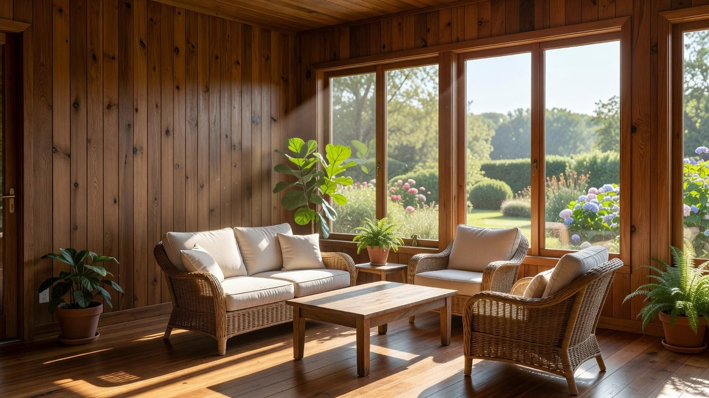
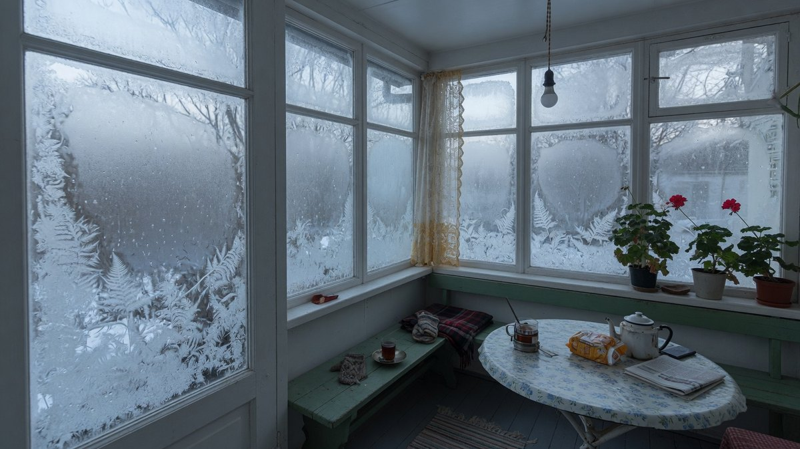
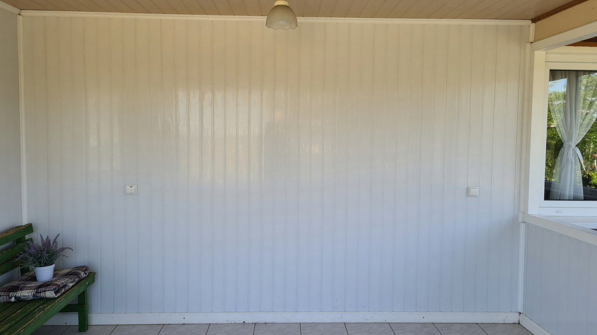
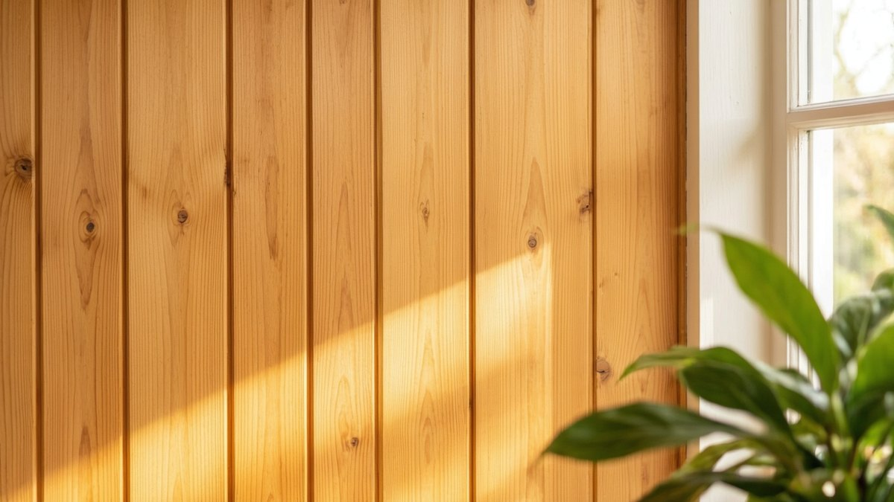
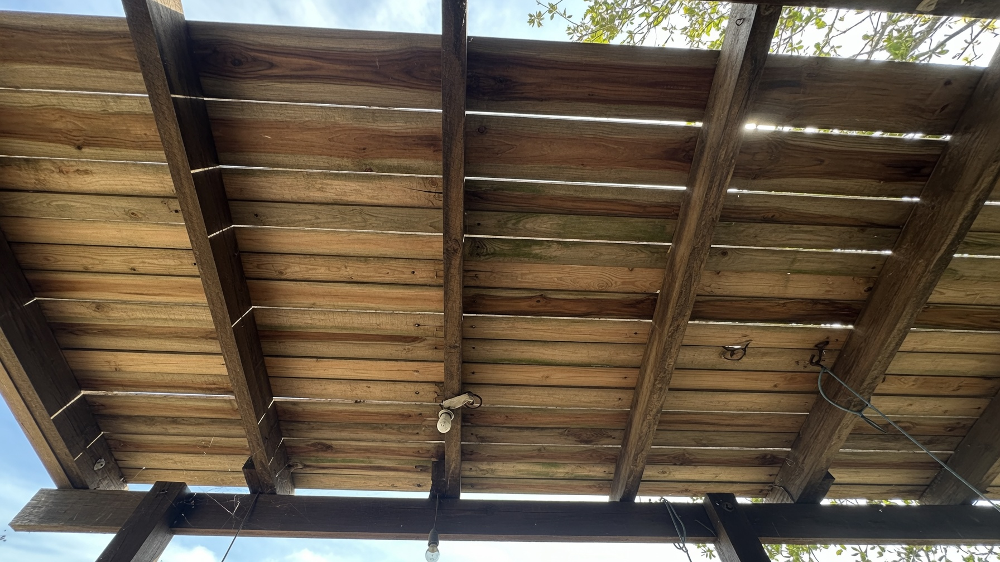
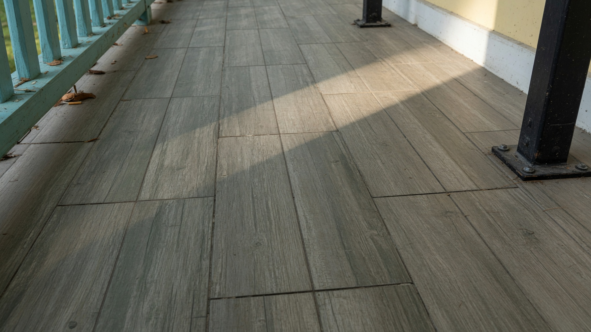
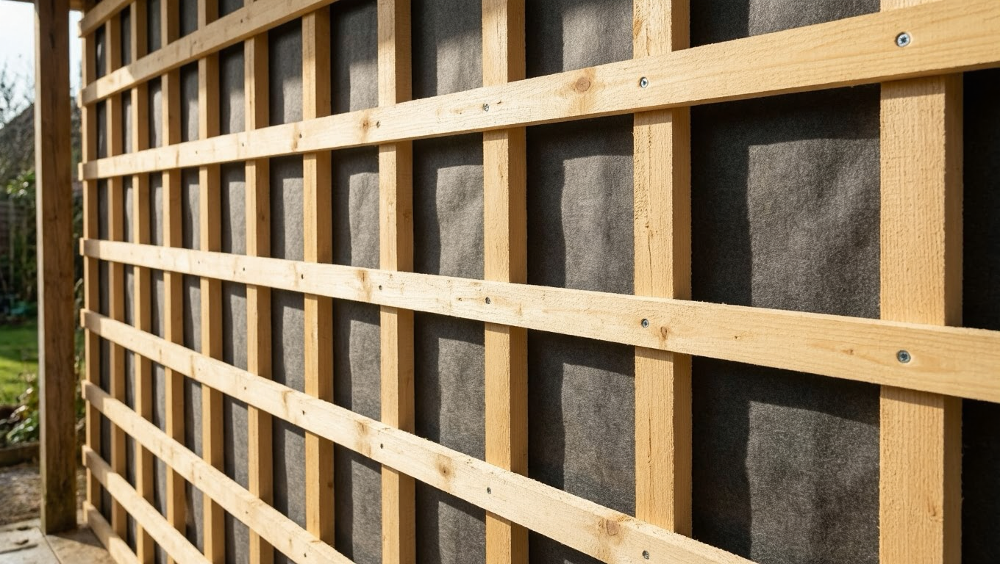
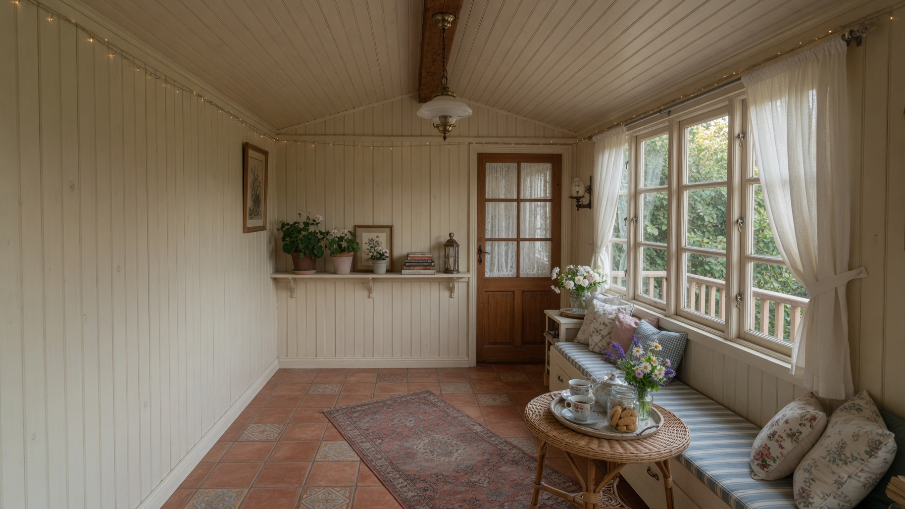

Веранда — самое противоречивое помещение в доме: формально она внутри, а условия в ней почти уличные. Здесь и перепады температуры, и конденсат по утрам, и солнце в упор через панорамные окна. Поэтому материал, который десять лет прослужит в комнате, на веранде может вздуться за одну зиму. Разберём внутреннюю отделку веранды по узлам: чем обшить стены, чем подшить потолок и чем застелить пол, сколько это стоит и как всё смонтировать своими руками.

**В статье:** развилка «тёплая или холодная» → материалы для стен со сравнением → потолок → пол → утепление → расчёт материала → монтаж → ошибки → ответы на частые вопросы.

## 🌡️ Главная развилка: тёплая веранда или холодная

С этого начинается любой выбор материалов, и ошибка здесь стоит дороже всего остального.

**Тёплая (отапливаемая) веранда** — присоединена к дому, утеплена, зимой в ней плюс. Условия близки к комнатным, поэтому подходит практически любая отделка: гипсокартон под покраску, МДФ-панели, ламинат, обои.

**Холодная (неотапливаемая) веранда** — зимой минус, весной и осенью конденсат, летом перегрев на солнце. За год материал переживает десятки переходов через ноль. Здесь выживают только влаго- и морозостойкие материалы.

**Сезонная летняя веранда** — фактически открытая или полузакрытая: помимо перепадов добавляется прямое воздействие осадков и ультрафиолета.

| Материал | Тёплая веранда | Холодная веранда |
|---|---|---|
| Деревянная вагонка | ✅ | ✅ (с защитным покрытием) |
| Блок-хаус, имитация бруса | ✅ | ✅ (с защитным покрытием) |
| ПВХ-панели | ✅ | ✅ (только морозостойкие) |
| Влагостойкая фанера, ОСП-3 | ✅ | ✅ |
| МДФ-панели | ✅ | ❌ разбухают |
| Гипсокартон (даже влагостойкий) | ✅ | ❌ крошится от сырости |
| Ламинат на стену | ✅ | ❌ коробится |
| Бумажные обои | ✅ | ❌ отходят за сезон |

Отдельный частый вопрос — обои: можно ли их клеить там, где зимой минус, и какие выдержат, разобрано в статье про [обои на холодной веранде](https://mir-doma.pro/oboi-na-holodnoy-verande/). Если ваша веранда неотапливаемая, все нюансы — пароизоляция, борьба с конденсатом, какие обои выдержат мороз — собраны в отдельной статье про [отделку холодной веранды внутри](https://mir-doma.pro/otdelka-holodnoy-verandy/).

## 🪵 Чем обшить стены: обзор материалов

**Деревянная вагонка** — самый популярный выбор для веранды. Натуральная фактура, тёплый вид, ремонтопригодность: повреждённую ламель можно заменить. Подходит и для тёплой, и для холодной веранды, но требует защиты — антисептик плюс лак, масло или краска. Берите древесину камерной сушки (влажность 12–15%), иначе после монтажа её поведёт и появятся щели.

**Блок-хаус и имитация бруса** — та же древесина, но с фактурой: блок-хаус имитирует оцилиндрованное бревно, имитация бруса даёт ровную «брусовую» стену. Смотрится основательнее вагонки, стоит дороже и толще — на маленькой веранде заметно съедает пространство.

**ПВХ-панели (пластик)** — бюджетный и практичный вариант: не боятся влаги, моются, монтируются за день. Минусы: выглядят проще дерева, трескаются от удара, а дешёвый пластик на морозе становится хрупким — для холодной веранды берите морозостойкие.

**Влагостойкая фанера и ОСП-3** — прочные листовые материалы, быстро закрывают большие площади. Хороши под покраску в современном «дачно-лофтовом» стиле. Требуют финишной отделки и обработки стыков.

**МДФ-панели** — богатый выбор фактур и ровная поверхность, но **боятся влаги и мороза**: разбухают. Только для тёплой веранды.

**Гипсокартон** — идеальная база под покраску, обои или декоративную штукатурку. Но даже влагостойкий ГКЛ в неотапливаемом помещении разрушается. Только для тёплой веранды со стабильной температурой.

### Сравнение по параметрам

Все материалы для внутренней отделки веранды удобно сравнивать по четырём критериям — цена, влагостойкость, сложность монтажа и внешний вид:

| Материал | Цена | Влагостойкость | Монтаж | Вид |
|---|---|---|---|---|
| Вагонка | Средняя | Средняя (с покрытием — высокая) | Своими руками, на обрешётку | Натуральное дерево |
| Блок-хаус | Выше средней | Средняя (с покрытием) | Своими руками | Дерево, фактурный |
| ПВХ-панели | Низкая | Высокая | Самый простой | Простой, «дачный» |
| Фанера, ОСП-3 | Низкая | Высокая (ФСФ/ОСП-3) | Своими руками | Под покраску |
| МДФ-панели | Средняя | Низкая | Простой | Разнообразный |
| Гипсокартон | Низкая | Низкая | Средней сложности | Любая финишная отделка |

Если коротко: **чем обшить веранду внутри недорого** — ПВХ-панели или фанера под покраску; **красиво и надолго** — деревянная вагонка или блок-хаус; **под любую финишную отделку** — гипсокартон, но только на тёплой веранде.

Подробный разбор именно стеновой обшивки — с расчётом количества и технологией крепления на кляймеры — в статье про то, [чем обшить стены веранды изнутри](https://mir-doma.pro/chem-obshit-verandu-vnutri/).

## ⬆️ Чем подшить потолок на веранде

Потолок на веранде — узел, о котором думают в последнюю очередь, а зря: именно на нём собирается тёплый влажный воздух и первым появляется конденсат.

**Что подходит:**

- **вагонка** — самый частый вариант, визуально объединяет потолок со стенами;
- **ПВХ-панели** — практично и дёшево, легко моются, не боятся влаги;
- **фанера или ОСП под покраску** — ровная поверхность, современный вид;
- **открытые балки** — если высота позволяет, потолок можно вообще не зашивать: покрасить или обработать маслом стропила и подшить между ними доску. Красиво и дёшево.

**Чего избегать на холодной веранде:** натяжного потолка из ПВХ-плёнки (на морозе становится хрупкой и может треснуть), гипсокартона и МДФ.

**Два технических правила для потолка:**

1. **Вентиляционный зазор обязателен.** Подшивка крепится на обрешётку, между ней и перекрытием остаётся воздушная прослойка — иначе конденсат будет собираться в закрытой полости и подшивка загниёт.
2. **Начинайте отделку с потолка**, а не со стен. Тогда стеновая обшивка подойдёт снизу и закроет верхний стык — выглядит аккуратнее, и не придётся подрезать по месту.

Как смонтировать обрешётку, какой шаг выбрать под разные материалы, нужно ли утеплять потолок и как развести освещение — подробно в статье про [потолок на веранде](https://mir-doma.pro/potolok-na-verande/).

## ⬇️ Чем застелить пол на веранде

Пол на веранде принимает всё: уличную обувь, песок, воду с зонтов и снег с сапог. Требования — влагостойкость и износостойкость.

**Керамогранит и напольная плитка** — оптимальный вариант: не боятся влаги, легко моются, служат десятилетиями. Для холодной веранды берите **морозостойкую** плитку и клей для наружных работ. Минус — холодная поверхность, но это решается [тёплым полом](https://mir-doma.pro/teplyy-pol-na-dache/) на утеплённой веранде.

**Террасная доска (декинг)** — древесно-полимерный композит. Не боится влаги и перепадов, приятна на ощупь, подходит и для полуоткрытых веранд.

**Доска пола из лиственницы** — натуральное дерево, устойчивое к влаге; требует обработки маслом или лаком для наружных работ и периодического обновления.

**Линолеум** — бюджетно и практично для тёплой веранды. На холодной дешёвый линолеум на морозе дубеет и трескается — нужен морозостойкий.

**Кварцвиниловая плитка (SPC/LVT)** — влагостойкая, тёплая на ощупь, выдерживает перепады лучше ламината.

**Чего избегать:** обычного ламината (разбухает от влаги и коробится от перепадов), паркета, ковролина на неотапливаемой веранде.

Подробный разбор для неотапливаемой веранды — пироги по лагам и по бетону, нужно ли утеплять и калькулятор материалов — в статье про [пол на холодной веранде](https://mir-doma.pro/pol-na-holodnoy-verande/).

**Важно про основание.** Прежде чем стелить финишное покрытие, проверьте состояние лаг и чернового пола — на старых верандах они часто подгнившие. Как перебрать и починить основание, разобрано в статье про [ремонт деревянного пола](https://mir-doma.pro/remont-derevyannogo-pola/), а если пол холодный — сначала стоит его [утеплить](https://mir-doma.pro/uteplenie-pola-na-dache/), потому что второй раз вскрывать не захочется.

## 🧊 Чем утеплить веранду изнутри и нужно ли

Ответ зависит от того, будете ли вы её отапливать — и это важнее, чем кажется.

**Если веранда отапливается** — утепление обязательно и оправданно: без него отопление будет греть улицу. Чем утеплить веранду изнутри: минеральной ватой или эковатой между стойками каркаса (они паропроницаемы и подходят для деревянных конструкций), реже — плитами ЭППС на каменных стенах. Пирог стандартный: пароизоляция со стороны помещения → утеплитель между стойками → ветро-влагозащита → вентзазор → обшивка. Толщина — как для стен дома, 100–150 мм для средней полосы.

**Если веранда не отапливается** — утепление в классическом виде **не имеет смысла и может навредить**. Утеплитель работает только тогда, когда есть что удерживать: он замедляет уход тепла, но не производит его. В неотапливаемом помещении температура всё равно сравняется с уличной, зато внутри утеплителя начнёт скапливаться конденсат, и обшивка с каркасом станут сыреть.

Что действительно помогает холодной веранде:

- **герметизация щелей** и стыков — убирает сквозняки, которые ощущаются сильнее холода;
- **уплотнители на окнах и двери** между верандой и домом;
- **утепление именно двери и стены между домом и верандой** — чтобы веранда не вытягивала тепло из жилой части;
- **тамбурный эффект** — сама веранда уже работает как воздушная прослойка, защищающая дом.

Полный разбор — сравнение утеплителей, расчёт толщины по регионам и пирог стены для каркасной и кирпичной веранды — в статье про то, [чем утеплить веранду изнутри](https://mir-doma.pro/chem-uteplit-verandu-iznutri/). Общие принципы теплового контура разобраны в статье про [утепление дачного дома](https://mir-doma.pro/kak-uteplit-dachnyy-dom/), а как утеплить дверь и окна — в материале про [утепление окон и дверей](https://mir-doma.pro/uteplenie-okon-i-dverey/).

## 📐 Сколько нужно материала: расчёт

Считать лучше до магазина — так вы поймёте реальный бюджет и не будете докупать посреди работы.

**Стены и потолок:**

1. Площадь стен — периметр умножить на высоту; площадь потолка — длина на ширину.
2. Вычесть проёмы: на веранде окон обычно много, и это заметная экономия.
3. Добавить **10–15% на подрезку** (при диагональной укладке — 20%).
4. Разделить на площадь упаковки материала.

**Пол:** площадь помещения плюс 10% запаса, для плитки при диагональной раскладке — 15%.

**Обрешётка:** брусок с шагом 40–60 см. Метраж считают так: длину стены разделить на шаг и умножить на высоту.

**Крепёж:** кляймеры для вагонки и блок-хауса — примерно 15–20 штук на м²; саморезы для листовых материалов — по периметру и промежуточным лагам.

**Практический совет:** берите материал **одной партией**. У дерева и ПВХ оттенок между партиями отличается, и разница будет видна на стене.

## 🔨 Порядок работ: как отделать веранду

Последовательность экономит время и нервы:

1. **Подготовка.** Освободить помещение, снять старую отделку, оценить состояние каркаса, лаг и обвязки. Обнаружили гниль — устраните до отделки, потом не подобраться.
2. **Коммуникации.** Развести электрику: розетки, выключатели, светильники. После обшивки штробить будет негде.
3. **Обработка антисептиком** всех деревянных элементов, включая изнанку обшивки и торцы — до монтажа.
4. **Потолок.** Обрешётка → подшивка. Сверху вниз.
5. **Стены.** Обрешётка по уровню с шагом под ширину плит утеплителя (если он есть) → при необходимости пароизоляция → обшивка от угла, тщательно выставив первый элемент по вертикали.
6. **Пол.** Проверка и ремонт лаг → при необходимости утепление → черновой пол → финишное покрытие.
7. **Финиш.** Плинтусы, уголки, наличники, обналичка проёмов.
8. **Защитное покрытие** — антисептик, масло, лак или краска для наружных или неотапливаемых помещений.

**Ключевое правило монтажа:** обшивка крепится **на обрешётку**, а не прямо на стену. Обрешётка создаёт вентиляционный зазор, и стена «дышит». Крепление вплотную — самая частая причина конденсата и плесени за красивой вагонкой.

И ещё: оставляйте **зазор 1–2 см** у пола и потолка на температурное расширение. Дерево «дышит», и без зазора обшивку выгнет.

## ❌ Частые ошибки

- **МДФ, гипсокартон или ламинат на холодной веранде** — разбухают и коробятся за сезон-другой.
- **Крепление обшивки прямо на стену** без обрешётки — нет вентзазора, копится конденсат.
- **Сырое дерево** — после монтажа усыхает, появляются щели.
- **Нет зазора у пола и потолка** — обшивку выгибает при расширении.
- **Утепление неотапливаемой веранды** без понимания, зачем — конденсат внутри пирога и сырость.
- **Дерево без защитной обработки** — темнеет и гниёт от влаги.
- **Кривая обрешётка** — обшивка идёт волной, и это уже не исправить.
- **Отделка поверх гнилых лаг и обвязки** — через год всё придётся вскрывать.
- **Электрика после обшивки** — провода снаружи или штробление по свежей отделке.

## 💡 Как сэкономить без потери качества

- **ПВХ-панели** вместо дерева там, где вид не критичен — например, на потолке хозяйственной части.
- **Вагонка сорта АВ или В** вместо экстра: мелкие сучки на даче смотрятся уместно и стоят заметно дешевле.
- **Фанера или ОСП под покраску** — быстро, дёшево и современно.
- **Открытые балки** вместо подшивного потолка — экономия материала и работы.
- **Комбинирование:** дерево на видовых стенах, пластик в углах и подсобных зонах.
- **Монтаж своими руками** — навесная обшивка по обрешётке по силам без опыта, это половина сметы.

## ❓ Частые вопросы

**Чем лучше отделать веранду внутри?**
Для тёплой веранды подойдёт что угодно — от вагонки до гипсокартона под покраску. Для холодной выбирают влаго- и морозостойкие материалы: деревянную вагонку с защитным покрытием, блок-хаус, морозостойкие ПВХ-панели или влагостойкую фанеру.

**Чем подшить потолок на веранде?**
Вагонкой, ПВХ-панелями или фанерой под покраску. Красивое и бюджетное решение — оставить открытые балки, обработав их маслом. На холодной веранде не стоит ставить натяжной потолок из ПВХ: на морозе плёнка становится хрупкой.

**Чем застелить пол на веранде?**
Морозостойким керамогранитом или плиткой, террасной доской, доской из лиственницы или кварцвиниловой плиткой. Обычный ламинат для веранды не годится — разбухает от влаги и коробится от перепадов температуры.

**Нужно ли утеплять веранду изнутри?**
Только если вы её отапливаете. В неотапливаемом помещении утеплитель бесполезен: удерживать ему нечего, а внутри пирога будет копиться конденсат. Холодной веранде помогают герметизация щелей и утеплённая дверь между ней и домом.

**Можно ли обшить веранду гипсокартоном?**
Только тёплую, отапливаемую. На холодной веранде даже влагостойкий гипсокартон разбухает и крошится от сырости и перепадов температур.

**Нужна ли обрешётка под обшивку?**
Да. Она создаёт вентиляционный зазор, позволяет выровнять плоскость и уложить утеплитель. Крепление обшивки прямо на стену приводит к конденсату и плесени за отделкой.

**С чего начинать отделку веранды — с потолка или со стен?**
С потолка. Тогда стеновая обшивка подойдёт снизу и закроет верхний стык, а подрезать по месту не придётся. Пол делают последним, чтобы не повредить готовое покрытие.

---

Внутренняя отделка веранды сводится к одному вопросу: будет ли здесь зимой плюс. Ответ на него определяет и материалы, и необходимость утепления, и бюджет. Дальше всё просто: обрешётка с вентзазором, сухое дерево, защитное покрытие и зазоры на расширение — эти четыре правила спасают отделку от 90% проблем.

**Куда идти дальше:**

- Если веранда неотапливаемая, там своя специфика — пароизоляция, конденсат, какие обои выдержат мороз: [отделка холодной веранды внутри](https://mir-doma.pro/otdelka-holodnoy-verandy/).
- Определяетесь с материалом для стен и хотите сравнить их по цене и монтажу вплотную — [чем обшить стены веранды изнутри](https://mir-doma.pro/chem-obshit-verandu-vnutri/).
- Отделка готова, осталось наполнить пространство — за идеями по стилю, цвету и мебели загляните в [дизайн веранды на даче](https://mir-doma.pro/dizayn-verandy-na-dache/).
- Если веранда ещё не застеклена, с этого и начинают: холодный алюминий или тёплый ПВХ, что выдержит фундамент и из чего складывается смета — [остекление веранды](https://mir-doma.pro/osteklenie-verandy/).
- А если веранда пока летняя и вы думаете, как её обустроить с нуля, — начните со статьи про [летнюю веранду на даче](https://mir-doma.pro/letnyaya-veranda-na-dache/).
