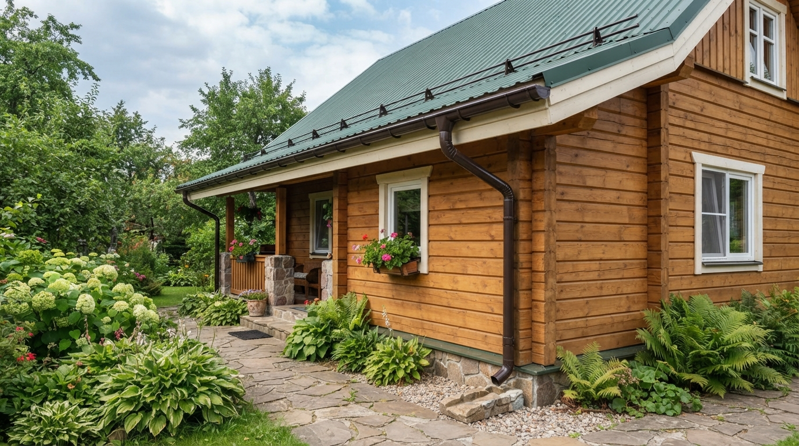
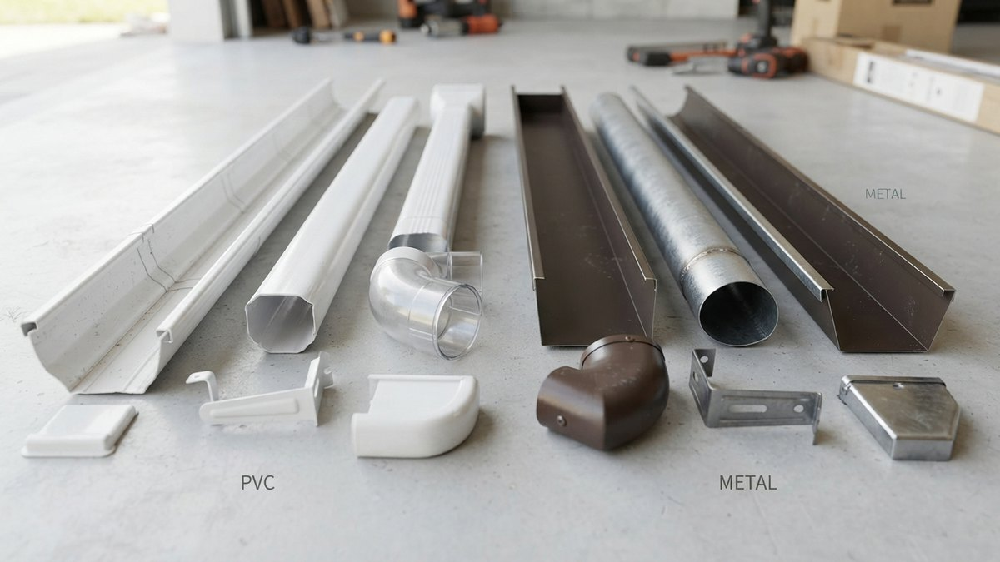
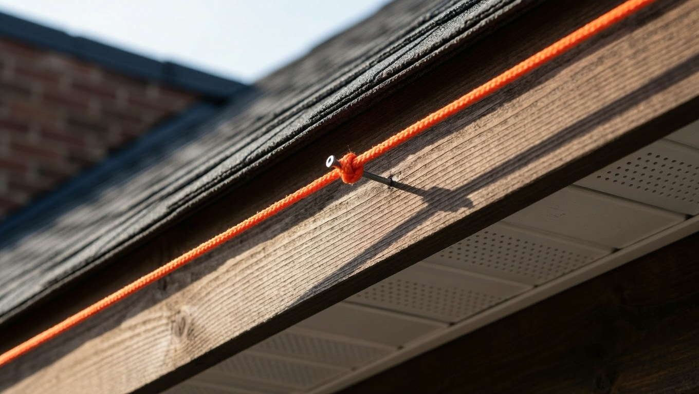
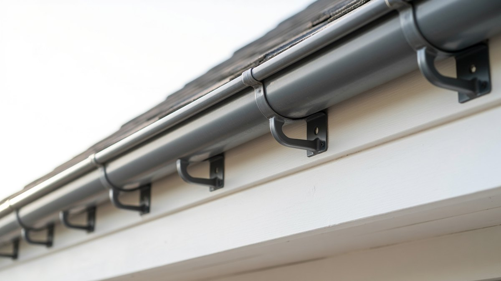
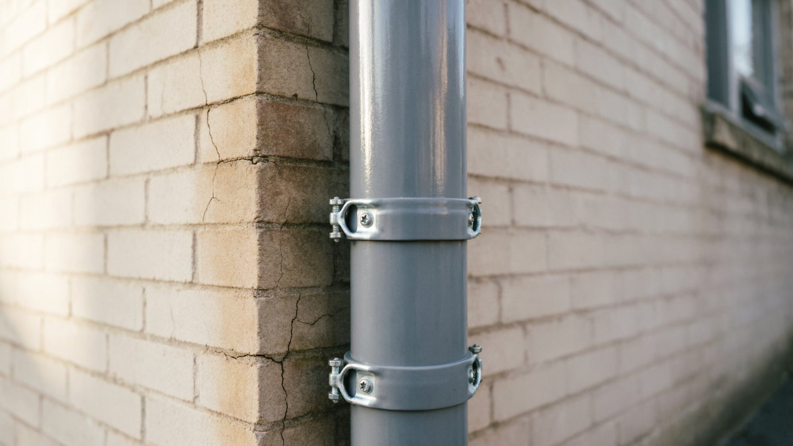
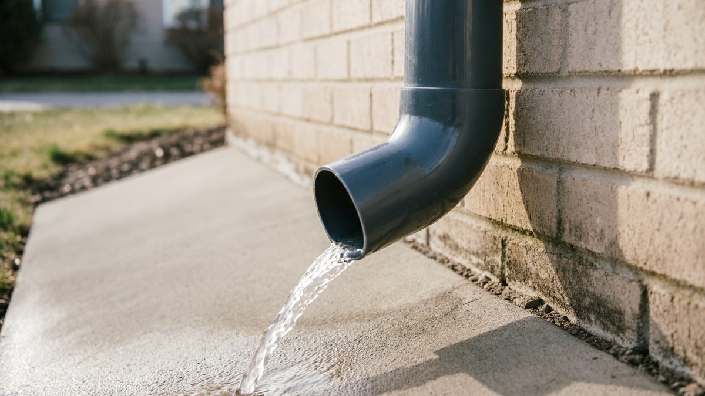

Водосток — деталь, на которой экономят чаще всего и жалеют об этом первыми. Без него вода с крыши льётся прямо на отмостку и цоколь, подмывает фундамент, брызги пачкают стены, а зимой у стены намерзает наледь. При этом собрать водосток на дачном доме реально за один-два дня, а весь расчёт сводится к простой связке: **площадь ската → диаметр жёлоба → диаметр трубы → число воронок**. Разберём расчёт, инструменты и монтаж по шагам, а материалы посчитаем прямо в статье.

## 🧮 Расчёт: диаметр по площади ската

Всё начинается с площади ската, с которого собирается вода. Считается она просто: **длина ската × его ширина по скату** (не по горизонтали — по наклонной плоскости).

| Площадь одного ската | Диаметр жёлоба | Диаметр трубы | Воронок на скат |
|---|---|---|---|
| до 30 м² | 90–100 мм | 75–80 мм | 1 |
| 30–70 м² | 100–125 мм | 80–90 мм | 1–2 |
| 70–120 м² | 125–150 мм | 90–100 мм | 2 |
| 120–200 м² | 150 мм и больше | 100–110 мм | 2–3 |

**Как пользоваться таблицей:** возьмите площадь **одного** ската, а не всей крыши — у каждого ската свой жёлоб и своя система. Для типовой дачи 6×8 м с двускатной крышей площадь одного ската обычно 30–45 м², то есть достаточно жёлоба 100–125 мм и одной-двух воронок.

**Правило по воронкам:** одна воронка обслуживает **примерно 8–10 погонных метров жёлоба**. Если скат длиннее — ставьте вторую, иначе в сильный дождь жёлоб переполнится и вода пойдёт через край.

**Если сомневаетесь между двумя размерами** — берите больший. Переплата небольшая, а запас по пропускной способности спасает в ливень и при таянии снега.

## 🪛 ПВХ или металл: что выбрать

| Параметр | ПВХ (пластик) | Металл (сталь с покрытием) |
|---|---|---|
| Цена | Ниже | Выше |
| Монтаж | Проще, режется ножовкой | Сложнее, нужны заклёпки/герметик |
| Шум от дождя | Тише | Громче |
| Мороз | Хрупкий на сильном морозе | Не боится |
| Наледь и лёд | Может треснуть под нагрузкой | Держит |
| Срок службы | 15–25 лет | 25–50 лет |
| Ремонт | Заменить элемент просто | Сложнее |

**Практический вывод:**

- **средняя полоса и юг, дача без снегоуборки** → ПВХ: дешевле, тише и монтируется своими руками легко;
- **регионы с суровой зимой, много снега, крыша с большим скатом** → металл: пластик на морозе становится хрупким, а сходящий снег и наледь его ломают;
- **мягкая кровля с малым уклоном** → любой вариант, нагрузка от снега меньше.

ПВХ-системы имеют важную особенность: пластик **заметно расширяется при нагреве**. Поэтому в них предусмотрены температурные зазоры — при монтаже жёлоб не вставляют в замок до упора, а оставляют метку производителя. Проигнорируете — летом систему выгнет.

## 📏 Уклон жёлоба: сколько и как выдержать

Жёлоб монтируют **не горизонтально**, а с уклоном в сторону воронки.

**Норма уклона: 3–5 мм на каждый погонный метр.** То есть на 10 метров жёлоба перепад составит 3–5 см.

- **меньше 3 мм/м** — вода застаивается, в жёлобе копится мусор и грязь, зимой намерзает лёд;
- **больше 5 мм/м** — уклон становится заметен глазом и портит вид, а вода в сильный дождь может проскакивать мимо воронки.

**Как выдержать уклон на практике:**

1. Отметьте на стене (или лобовой доске) положение **первого кронштейна** у воронки — самая низкая точка.
2. Отметьте положение **последнего кронштейна** на другом конце ската, подняв его на нужную величину: длина ската × 4 мм.
3. Натяните между метками **шнурку** — она задаст линию.
4. Крепите промежуточные кронштейны точно по шнурке.

Если воронка одна и стоит посередине ската, уклон делают **с двух сторон к ней** — от краёв вниз к центру.

## 🔩 Шаг кронштейнов: почему нельзя реже

**Норма: 50–60 см между кронштейнами.** Дополнительно кронштейн ставят рядом с воронкой, на углах и по краям жёлоба (отступ от края 10–15 см).

**Что происходит при большем шаге:**

- жёлоб **провисает между опорами** — образуются «карманы», где стоит вода и копится грязь;
- зимой в этих местах намерзает лёд, вес растёт, и жёлоб деформируется;
- **сходящий с крыши снег** отрывает слабо закреплённый жёлоб целиком;
- нарушается уклон — вода перестаёт уходить к воронке.

Экономия на кронштейнах — самая распространённая ошибка в самостоятельном монтаже. Разница в стоимости небольшая, а последствия видны уже после первой зимы.

**Куда крепить кронштейны:**

- **на лобовую доску** — самый удобный вариант, монтаж возможен после укладки кровли;
- **на стропила или обрешётку** — прочнее, но делается до монтажа кровельного покрытия;
- **на стену** — если конструкция крыши не позволяет иначе.

## 🧰 Инструменты

Специального оборудования не нужно, всё найдётся в дачном наборе:

- **рулетка, карандаш, маркер** — разметка;
- **уровень (лучше водяной или лазерный)** и **шнурка** — задать уклон;
- **шуруповёрт** с битами — крепление кронштейнов;
- **ножовка по металлу** (для ПВХ) или **ножницы по металлу** (для стального водостока). Болгаркой металлические элементы резать **нельзя** — сгорает защитное покрытие, и место реза начинает ржаветь;
- **резиновый молоток** — посадка элементов в замки без повреждений;
- **заклёпочник и герметик** — для металлических систем;
- **напильник или наждачка** — снять заусенцы после реза;
- **стремянка или леса**, страховочная система при работе на высоте;
- **перчатки** — кромки металла острые.

⚠️ **Работа на высоте.** Водосток монтируют по краю крыши — это зона повышенного риска. Работайте вдвоём, используйте устойчивую лестницу с упором, не тянитесь вбок с последней ступени и не выходите на скользкую кровлю. Общие правила безопасности на кровле разобраны в статье про [крышу из профнастила своими руками](https://mir-doma.pro/krysha-iz-profnastila-svoimi-rukami/).

## 🧮 Калькулятор водостока

Посчитайте, сколько элементов понадобится на ваш дом. Размеры типовые — перед покупкой сверьтесь с системой конкретного производителя, длины желобов и труб у них различаются.

<!-- wp:html -->

<h3 class="md-vc__title">Калькулятор водостока</h3>

Укажите размеры крыши — калькулятор подберёт диаметры и посчитает элементы.

<label class="md-vc__f">Длина ската (вдоль стены), м<input type="number" id="vcLen" value="8" min="1" max="60" step="0.1"></label>
<label class="md-vc__f">Ширина ската (по наклону), м<input type="number" id="vcWid" value="4" min="1" max="30" step="0.1"></label>
<label class="md-vc__f">Сколько скатов с водостоком
<select id="vcSides"><option value="1">1 (односкатная / один скат)</option><option value="2" selected>2 (двускатная крыша)</option><option value="4">4 (вальмовая)</option></select></label>
<label class="md-vc__f">Высота стены до жёлоба, м<input type="number" id="vcHgt" value="3" min="1" max="15" step="0.1"></label>
<label class="md-vc__f">Материал системы
<select id="vcMat"><option value="pvh" selected>ПВХ (пластик)</option><option value="met">Металл</option></select></label>
<label class="md-vc__f">Длина жёлоба в системе, м
<select id="vcGl"><option value="3" selected>3 м</option><option value="4">4 м</option></select></label>

Площадь одного ската<b id="vcArea">32,0 м²</b>

Диаметр жёлоба<b id="vcDg">125 мм</b>

Диаметр трубы<b id="vcDt">90 мм</b>

Воронок на скат<b id="vcFun">1</b>

<h4 class="md-vc__outtitle">Что понадобится на всю крышу</h4><ul id="vcList" class="md-vc__list"></ul>

Длины элементов у производителей различаются — сверьтесь с системой перед покупкой. Расчёт с запасом на подрезку.

<button type="button" id="vcCopy" class="md-vc__btn md-vc__btn--main">Скопировать список</button>
<button type="button" id="vcPrint" class="md-vc__btn">Распечатать</button>

<!-- /wp:html -->

## 🔨 Монтаж пошагово

1. **Разметка.** Определите место воронки (обычно у угла дома, ближе к точке отвода воды). Отметьте крайние кронштейны с учётом уклона 3–5 мм на метр и натяните шнурку.
2. **Кронштейны.** Закрепите крайние, затем промежуточные строго по шнурке с шагом 50–60 см. Дополнительные — у воронки и по углам.
3. **Воронка.** Установите её в жёлоб: в ПВХ-системах отверстие вырезают ножовкой по разметке, края зачищают. В металлических воронка обычно уже готовая.
4. **Жёлоба.** Уложите в кронштейны, соединяя элементы. В ПВХ — через соединители с резиновыми уплотнителями, **оставляя температурный зазор** по метке производителя. В металле — с герметиком и заклёпками.
5. **Заглушки** на торцах жёлоба — обязательно с герметиком, иначе будет подтекать.
6. **Углы.** На угловых участках ставят угловые элементы; проверьте, что уклон сохраняется по всей длине.
7. **Трубы.** Соберите вертикальную линию от воронки вниз: колено от воронки → соединительная труба → колено к стене → прямые трубы.
8. **Хомуты** на трубы с шагом **1,5–2 м** и обязательно у каждого соединения. Между стеной и трубой оставьте зазор 2–3 см.
9. **Слив внизу.** Нижнее колено (отмёт) устанавливают на высоте **20–30 см от земли** или направляют в дождеприёмник.
10. **Проверка.** Пролейте жёлоб водой из ведра или шланга: вода должна уходить к воронке без застоев, соединения не подтекать.

## 💧 Куда отводить воду

Ошибка, которая обесценивает весь водосток: труба выводит воду **прямо к цоколю**. Тогда вместо равномерного увлажнения стены вы получаете концентрированный поток в одну точку — и подмытый фундамент.

**Рабочие варианты:**

- **отмостка с уклоном** от дома — минимум, который должен быть в любом случае. Вода с отмёта попадает на неё и уходит от стены;
- **дождеприёмник с отводом** в дренаж или ливнёвку — лучший вариант;
- **бетонный лоток** от отмёта в сторону от дома;
- **бочка для полива** — практично на даче: вода с крыши идёт на полив, но нужен перелив, иначе в ливень бочка переполнится и всё пойдёт к фундаменту;
- **дренажная труба** в грунте с отводом в канаву или дренажный колодец.

**Минимальное правило:** вода должна уходить **не менее чем на 1,5–2 метра от стены**. Если отмостки нет, водосток частично теряет смысл — вы просто переносите проблему из-под всей крыши в одну точку.

На открытом навесе без стен та же логика работает ещё жёстче: без желоба вода
со ската стекает прямо по обшивке боковин и разрушает её в разы быстрее
расчётного срока. Какие материалы обшивки выдерживают такой режим, если
водосток всё же не спасает от косого дождя, разобрано в статье
[чем обшить навес изнутри](https://mir-doma.pro/chem-obshit-naves-iznutri/).

## ❄️ Наледь в жёлобе: зимняя проблема

Зимой водосток сталкивается с тем, к чему он не приспособлен, — с талой водой на морозе.

**Как образуется наледь:** снег на крыше подтаивает (от солнца или от тепла, уходящего через плохо утеплённую кровлю), вода стекает в холодный жёлоб и там замерзает. Слой льда растёт, жёлоб забивается, следующая вода идёт через край и образует сосульки.

**Чем это грозит:** лёд тяжёлый и распирает жёлоб изнутри, ПВХ трескается, крепления вырывает, а сосульки над входом опасны.

**Что делать:**

- **утеплить кровлю как следует** — это устраняет причину, а не следствие: если тепло не уходит через крышу, снег не подтаивает. Как это сделать, разобрано в статье про [утепление крыши и мансарды](https://mir-doma.pro/uteplenie-kryshi-i-mansardy/);
- **обеспечить вентиляцию подкровельного пространства** — холодный чердак не должен нагреваться;
- **осенью чистить жёлоба** от листвы: забитый жёлоб замерзает первым;
- **не сбивать лёд ломом или молотком** — так ломают и жёлоба, и кровлю. Если чистить, то аккуратно, деревянным или пластиковым инструментом;
- **греющий кабель** в жёлобе и трубе — радикальное решение для проблемных мест, но требует электричества и увеличивает счёт;
- **снегозадержатели** на крыше — не дают лавине снега сорвать жёлоб.

Если водосток ставится на новую крышу, покрытие выбирают первым — от него зависят свесы и крепление жёлоба: [чем покрыть крышу дачи](https://mir-doma.pro/chem-pokryt-kryshu-dachi/).

## ❌ Частые ошибки

- **Шаг кронштейнов больше 60 см** — жёлоб провисает, вода застаивается, зимой лёд деформирует систему.
- **Нет уклона или уклон в обратную сторону** — вода стоит в жёлобе.
- **ПВХ смонтирован без температурных зазоров** — летом систему выгибает.
- **Металл резали болгаркой** — сгорело покрытие, рез ржавеет уже через сезон.
- **Диаметр «на глаз»** — в ливень жёлоб переполняется и вода льётся через край.
- **Одна воронка на длинный скат** — та же переполненность.
- **Труба выводит воду прямо к цоколю** — подмытый фундамент.
- **Заглушки без герметика** — подтекает с торцов.
- **Забыли про чистку осенью** — листва забивает воронку, зимой всё замерзает.

## ❓ Частые вопросы

**Как рассчитать диаметр водостока?**
По площади одного ската: до 30 м² — жёлоб 90–100 мм и труба 75–80 мм; 30–70 м² — жёлоб 100–125 мм и труба 80–90 мм; 70–120 м² — жёлоб 125–150 мм и труба 90–100 мм. При сомнении берите больший диаметр.

**Какой уклон делать у водосточного жёлоба?**
3–5 мм на погонный метр в сторону воронки. Меньше — вода застаивается, больше — уклон заметен и вода может проскакивать мимо воронки. Выдерживают уклон по натянутой шнурке.

**Какой шаг кронштейнов у водостока?**
50–60 см, плюс дополнительные кронштейны у воронки, на углах и по краям жёлоба. При большем шаге жёлоб провисает, в нём застаивается вода, а зимой лёд деформирует систему.

**Сколько воронок нужно на скат?**
Одна воронка обслуживает примерно 8–10 погонных метров жёлоба. Для ската длиннее ставят две и более, иначе в сильный дождь вода пойдёт через край.

**Что лучше — пластиковый или металлический водосток?**
ПВХ дешевле, тише и проще в монтаже — хорош для средней полосы и юга. Металл дороже, но не боится мороза, наледи и сходящего снега — предпочтителен в регионах с суровой зимой и на крышах с большим уклоном.

**На какой высоте от земли ставить нижнее колено?**
Обычно 20–30 см от уровня земли или отмостки. Вода должна отводиться не менее чем на 1,5–2 метра от стены — на отмостку с уклоном, в дождеприёмник или в дренаж.

**Можно ли резать металлический водосток болгаркой?**
Нельзя. При резке сгорает защитное покрытие, и место реза быстро начинает ржаветь. Используют ножницы по металлу, а заусенцы снимают напильником.

---

Водосток — редкий случай, когда правильный расчёт важнее мастерства монтажа: подобрали диаметр по площади ската, выдержали уклон 3–5 мм на метр и шаг кронштейнов 50–60 см — и система проработает десятилетия. Посчитайте элементы в калькуляторе выше и не забудьте главное: вода должна уходить от дома, а не к цоколю.

**Куда идти дальше:**

- Если водосток ставится на новую кровлю, начинать нужно с неё: расчёт, обрешётка и монтаж покрытия — в статье про [крышу из профнастила своими руками](https://mir-doma.pro/krysha-iz-profnastila-svoimi-rukami/).
- Старая кровля течёт или требует ремонта — водосток тут не поможет, сначала устраните течь: [ремонт крыши на даче](https://mir-doma.pro/remont-kryshi-na-dache/).
- Наледь в жёлобе лечится не кабелем, а утеплением кровли — тогда снег на крыше перестанет подтаивать: [утепление крыши и мансарды](https://mir-doma.pro/uteplenie-kryshi-i-mansardy/).
- А чтобы отведённая вода не вернулась к фундаменту, разберитесь с планировкой участка и уклонами: [расположение дома на участке](https://mir-doma.pro/raspolozhenie-doma-na-uchastke/).
