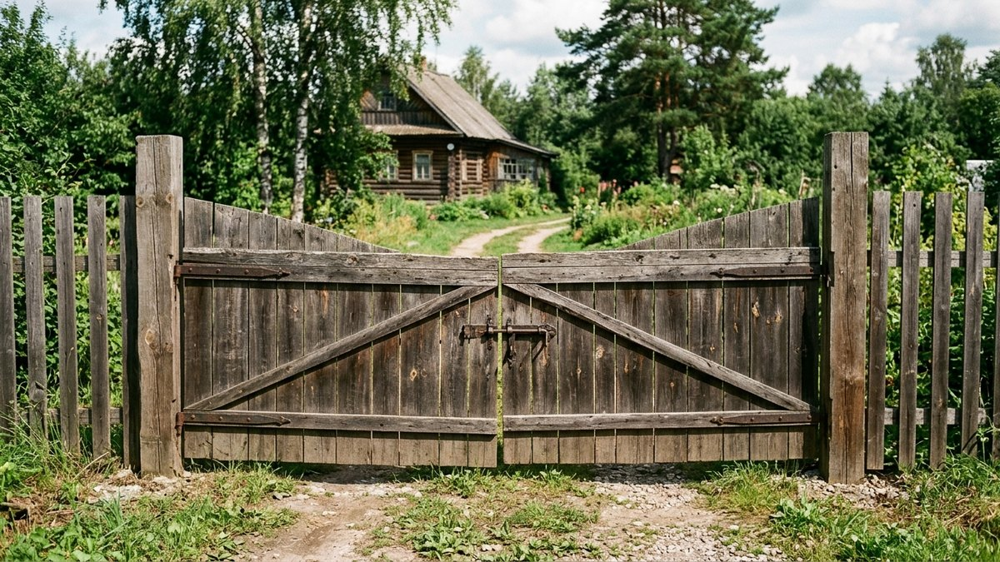
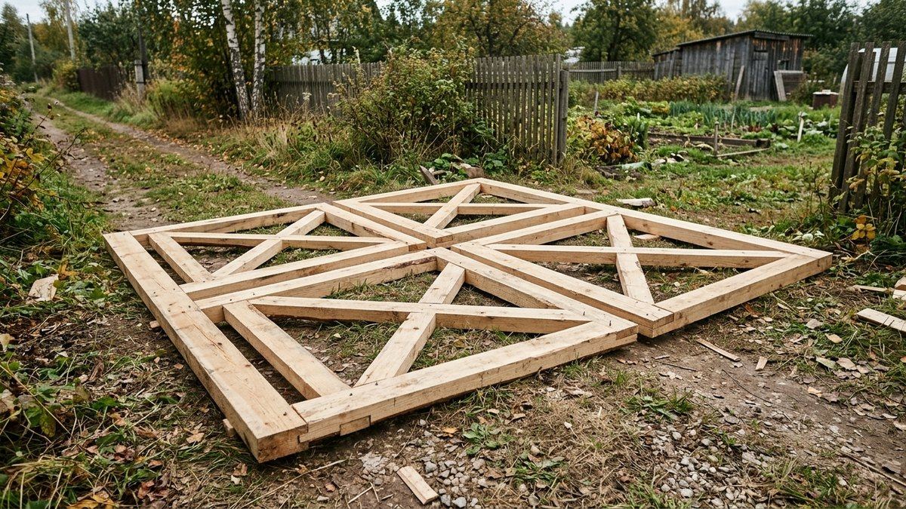
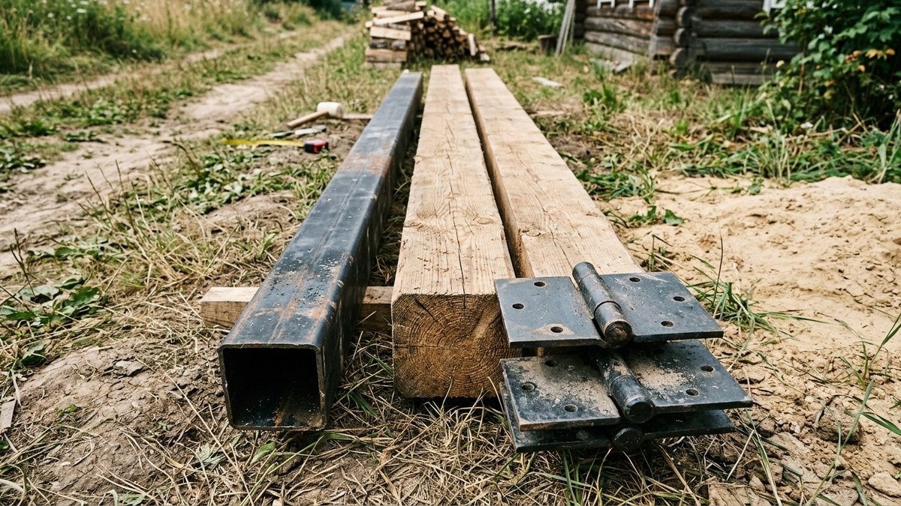
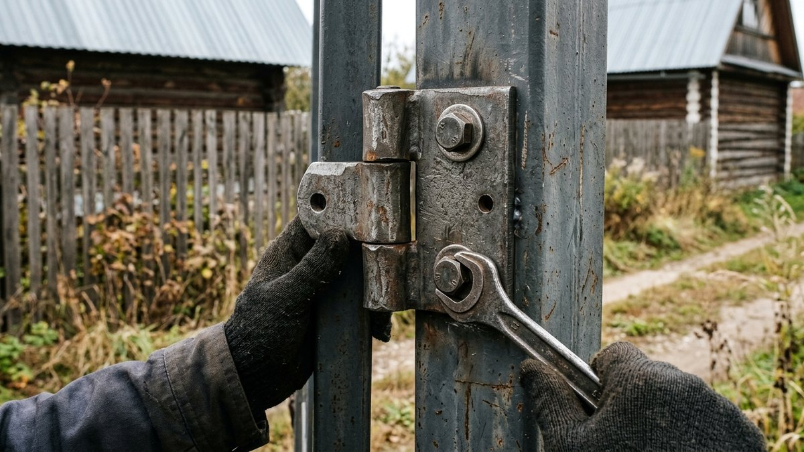
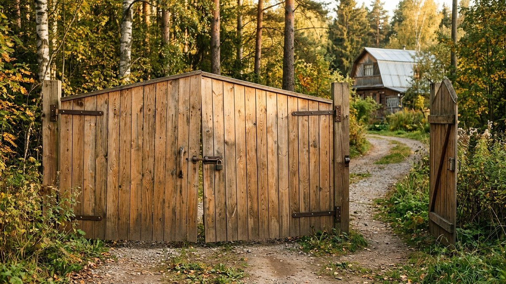
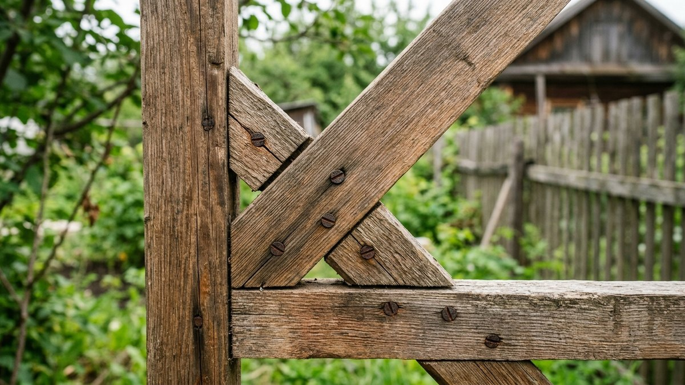

# Ворота для дачи своими руками: распашные из дерева

Ворота отличаются от калитки не только размером — у широкой створки для
машины нагрузка на петли и раму растёт не пропорционально, а быстрее:
вдвое шире — не вдвое, а в разы тяжелее провисает без усиления. Разберём,
как сделать распашные ворота для дачи своими руками: чертёж и расчёт
проёма под машину, опорные столбы, которые не поведёт под весом створок,
и монтаж без провеса на первый же сезон.

Если рядом нужна ещё и калитка для прохода — устройство рамы, петель и
защёлки под пешую створку разобрано отдельно, в статье [калитка своими
руками](https://mir-doma.pro/kalitka-svoimi-rukami/): у ворот и калитки
разная нагрузка, и решения для них тоже разные.

## Ширина проёма и выбор типа

Стандартная ширина проёма под легковой автомобиль — 3–3,5 м, под
микроавтобус или прицеп — от 4 м. Проём делят на две створки: одностворчатая
конструкция шире 2 м становится слишком тяжёлой для petель и требует уже
не деревянной, а стальной каркасной рамы.

- **Распашные** — две створки на петлях, открываются наружу или внутрь
  участка. Просты в изготовлении, не требуют направляющих на земле, но
  нужен свободный сектор для открывания — не подходят, если сразу за
  воротами начинается дорога с интенсивным движением.
- **Откатные** — одна створка едет вдоль забора по направляющей. Не
  требуют места для распахивания, но конструкция сложнее и дороже:
  нужен рельс или направляющая балка, ролики и более мощный опорный
  столб, воспринимающий вес створки на консоли.

Дальше разбираем именно распашные деревянные ворота — самый доступный по
инструменту и материалу вариант для дачи.

## Чертёж и материалы

| Элемент | Материал | Комментарий |
|---|---|---|
| Рама створки | Брус 70×70–100×70 мм | Толще, чем у калитки — вдвое больше вылет и вес |
| Диагональные раскосы | Тот же брус, что и рама | По 2 раскоса на створку — крест-накрест или сдвоенный уголок |
| Обшивка | Штакетник, доска или профлист | В стиле остального забора |
| Петли | Усиленные приварные или врезные, 3 шт. на створку | Рассчитаны на вес от 40–60 кг на створку |
| Опорные столбы | Труба 100×100 мм или брус 150×150 мм в бетоне | Заливка не менее 50 см в диаметре |
| Ограничитель | Штырь или скоба в открытом и закрытом положении | Фиксирует створку от парусности на ветру |

## Опорные столбы: без запаса здесь нельзя

Столб под воротами держит не разовую нагрузку, как у калитки, а нагрузку
от машины, задевшей створку при выезде, порывов ветра на большую площадь
полотна и многолетнего цикла открывания-закрывания:

1. **Сечение** — минимум 100×100 мм труба или 150×150 мм брус, при
   большом проёме (от 4 м) — толще или с дополнительным подкосом от
   столба в грунт.
2. **Глубина** — ниже точки промерзания, как у остальных столбов забора,
   но с бетонированием не менее 50 см в диаметре: чем шире створка, тем
   больше опрокидывающий момент на столб при открывании.
3. **Подкос** — металлическая или деревянная распорка от верхней части
   столба в грунт под углом, если проём широкий или грунт рыхлый: она
   принимает часть боковой нагрузки на себя, снимая её со столба.

## Изготовление и монтаж створок

1. **Соберите раму** каждой створки на ровной площадке — брус по
   размеру, углы на металлические уголки, крест-накрест раскосы враспор.
   Диагональ обязательна на каждой створке отдельно, а не одна на весь
   проём.
2. **Обшейте створки** штакетником или доской с одинаковым зазором на
   обеих половинах — разный шаг сразу заметен при закрытых воротах.
3. **Обработайте антисептиком** всю конструкцию, включая места под
   петлями и нижний край створки — он ближе всего к грязи и снегу с
   дороги.
4. **Навесьте на три петли** на створку — верхнюю, среднюю и нижнюю,
   выставив по уровню и с зазором 5–7 см от земли для проезда без задевания
   при пучении грунта.
5. **Установите ограничители** — штырь, уходящий в грунт или в паз в
   земле, фиксирующий каждую створку в открытом положении, и центральный
   запор, соединяющий створки в закрытом.

## Как избежать провеса створки

Провес — когда угол у защёлки со временем опускается ниже угла у петель —
главная проблема самодельных ворот. Три меры вместе снимают проблему:

- **Диагональный раскос на каждой створке** — без него рама рано или
  поздно превращается в параллелограмм под собственным весом.
- **Третья петля** на створку весом от 40 кг — распределяет нагрузку так,
  что средняя часть рамы не работает на скручивание в одиночку.
- **Ограничитель в закрытом положении**, который не даёт створке
  доворачиваться под своим весом дальше расчётной точки, — без него даже
  правильно собранная рама со временем "садится" на защёлку с перекосом.

## Частые ошибки

- **Одна диагональ на обе створки вместо раздельных раскосов.** Каждая
  створка — отдельная рама, и раскос ей нужен свой, а не общий на пару.
- **Столбы того же сечения, что и у забора.** Ворота нагружают опору
  сильнее любого другого узла забора — экономия на столбах здесь самая
  дорогая по последствиям.
- **Без подкоса на широком проёме.** От 4 м ширины проёма один только
  бетон вокруг столба уже не держит опрокидывающий момент без
  дополнительной распорки.
- **Нет ограничителя открытого положения.** Ветер бьёт незафиксированной
  створкой о столб или забор, разбивая петли и раму быстрее, чем от
  обычной эксплуатации.

## Частые вопросы

### Какой ширины делать проём ворот для машины

3–3,5 м для легкового автомобиля, от 4 м — для микроавтобуса, прицепа
или заезда крупной техники разово (доставка стройматериалов, техника
для земляных работ).

### Распашные или откатные ворота лучше для дачи

Распашные проще и дешевле в изготовлении своими руками, но нужен
свободный сектор для открывания. Откатные не занимают место при
открывании, но конструкция сложнее: нужны направляющая, ролики и более
мощный опорный столб.

### Сколько петель нужно на створку ворот

Три — верхняя, средняя, нижняя — для створки весом от 40 кг. Меньшее
число петель на тяжёлой створке — главная причина провеса и перекоса рамы
в течение первого года.

### Как сделать так, чтобы ворота не провисали

Диагональный раскос на каждой створке отдельно, три петли на тяжёлую
створку и усиленный опорный столб — те же три меры, что и для калитки,
только с бо́льшим запасом прочности из-за размера и веса створок.

### Нужен ли фундамент под столбы ворот

Полноценный ленточный фундамент не нужен, но бетонирование каждого
столба должно быть глубже и объёмнее, чем у рядовых столбов забора —
ниже точки промерзания и минимум 50 см в диаметре вокруг столба.

## Заключение

Распашные ворота для дачи — это калитка в увеличенном масштабе: та же
логика с раскосом, петлями и опорным столбом, но с кратно бо́льшим
запасом прочности из-за ширины и веса створок. Главные вложения — не в
обшивку, а в столбы и узел крепления петель: именно они держат ворота
без провеса десятилетиями.
