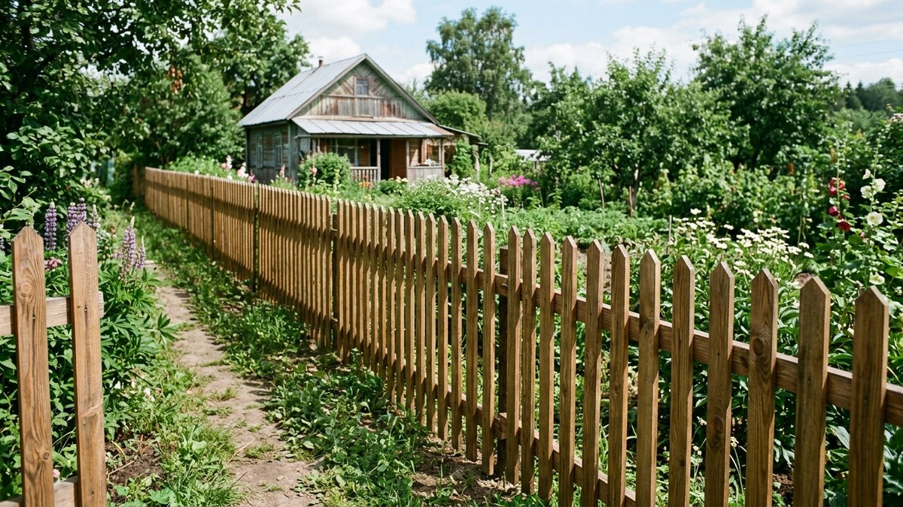
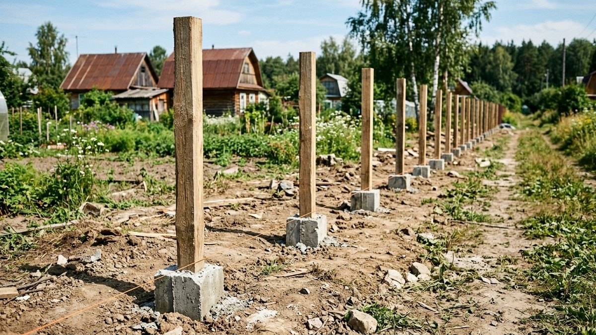
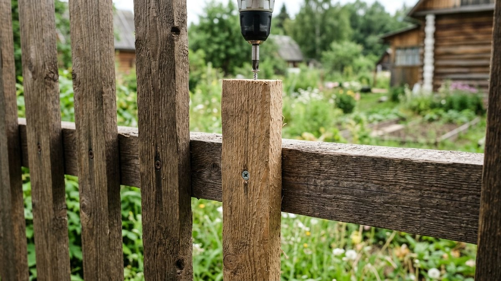
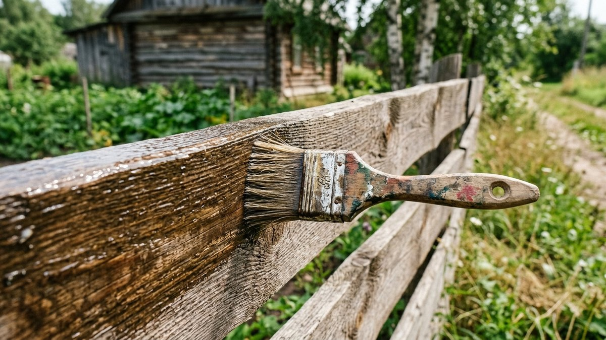
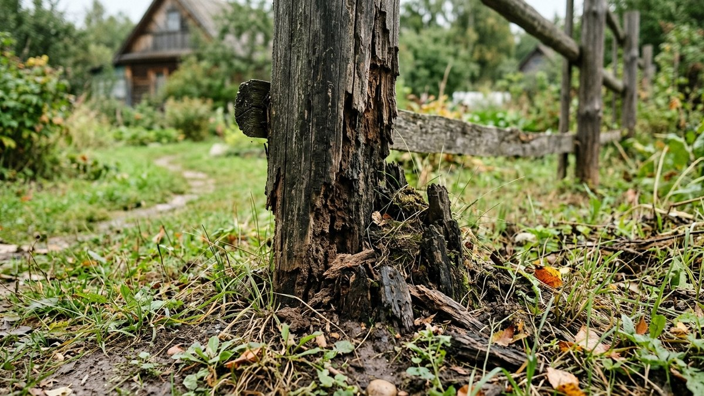
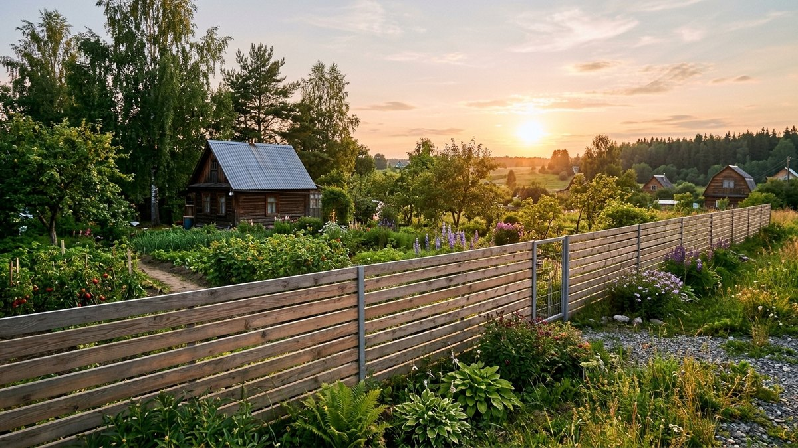

# Забор из дерева своими руками: штакетник пошагово

Деревянный забор — самый доступный по инструменту вариант: не нужна
сварка, весь монтаж держится на дрели, шуруповёрте и уровне. Но именно
дерево прощает меньше всего ошибок в подготовке: столб без гидроизоляции
сгниёт за три-четыре года, а штакетник без зазора на усадку через сезон
покоробит. Разберём, как построить забор из дерева своими руками — от
выбора типа штакетника и расчёта досок до монтажа столбов и полотна с
защитой от гниения.

Если ещё не решили, дерево ли вообще нужно — сравнение материалов забора
по цене, долговечности и приватности собрано в статье [какой забор
выбрать для дачи](https://mir-doma.pro/kakoy-zabor-vybrat-dlya-dachi/).
Здесь разбираем именно монтаж деревянного забора, когда выбор уже сделан.

## Виды деревянного штакетника

- **Вертикальный штакетник** — классика, доски крепятся вертикально к
  двум-трём горизонтальным лагам. Простой монтаж, хороший обзор для
  проветривания.
- **Горизонтальный штакетник** — доски идут вдоль забора, крепятся к
  вертикальным стойкам. Смотрится современнее, но требует точнее
  выставленных стоек — горизонтальная линия сразу выдаёт перекос.
- **Жалюзи (шахматка со скосом)** — доски крепятся под углом друг к
  другу, дают приватность при взгляде сбоку и проветривание при взгляде
  прямо. Расход доски выше на 20–30% из-за нахлёста.
- **Решётка (шахматка без скоса)** — доски крепятся с равным зазором в
  шахматном порядке с двух сторон лаг. Компромисс между глухим забором и
  открытым штакетником — просматривается под углом, но не насквозь.

## Расчёт материала

Для типового участка периметром 40 м и высотой забора 1,8 м:

1. **Столбы** — с шагом 2–2,5 м: на 40 м периметра нужно 16–20 столбов
   (брус 100×100 мм или металлическая труба с деревянной зашивкой).
2. **Лаги (прожилины)** — 2 ряда горизонтальных лаг на высоту до 1,5 м,
   3 ряда выше: брус 50×50 или 40×60 мм, суммарно 2–3 погонных метра
   лаги на метр забора.
3. **Штакетник** — при ширине доски 10 см и зазоре 3–5 см на метр забора
   уходит 7–8 досок высотой 1,8 м. На 40 м периметра — примерно
   280–320 досок.
4. **Крепёж** — саморезы по дереву 2 шт. на каждое крепление доски к
   лаге, у вертикального штакетника это 4 самореза на доску (по 2 лаги).

Точный расход уточняйте под свой периметр — калькулятор количества
плитки для дорожек считается похожим способом, через площадь и
запас, разбор в статье [расчёт тротуарной
плитки](https://mir-doma.pro/raschet-trotuarnoy-plitki/), если заодно
кладёте дорожку вдоль забора.

## Установка столбов

1. **Разметка** — колышки и шнур по периметру, диагонали для углов
   проверяют рулеткой на равенство.
2. **Ямы под столбы** — глубина ниже точки промерзания, обычно 80–120 см
   в средней полосе, диаметр на 15–20 см больше сечения столба.
3. **Гидроизоляция подземной части** — деревянный столб на этом участке
   обрабатывают битумной мастикой или оборачивают рубероидом: это самая
   уязвимая к гниению зона забора.
4. **Бетонирование** — песчано-гравийная подушка 10–15 см на дно ямы,
   столб выставляется по уровню и бетонируется, срез бетона делают с
   уклоном от столба для стока воды.
5. **Пауза на набор прочности** — минимум 5–7 дней до монтажа лаг, чтобы
   бетон не потрескался под нагрузкой.

## Монтаж лаг и штакетника

После набора прочности бетона:

1. **Крепление лаг** к столбам на металлические уголки и саморезы, по
   уровню — нижняя лага на 10–15 см от земли, чтобы штакетник не касался
   грунта и не гнил снизу.
2. **Монтаж штакетника** — крепление ведут от угла или от ворот, с
   шаблоном-рейкой нужной ширины между досками для равномерного зазора.
   Зазор 3–5 см обязателен даже для «глухого» забора — древесина меняет
   размер при влажности, без зазора доски начнут тереться и скручиваться.
3. **Верхний срез** — доски штакетника подрезают вровень по натянутому
   шнуру уже после монтажа, а не заранее по отдельности — так линия
   верха выходит ровной даже при небольшом перепаде высоты участка.

## Защита от гниения

Дерево на заборе стоит без крыши и без вентиляции с обеих сторон, как у
дома, — обработка тут не разовая процедура, а обязательный элемент
конструкции:

- **Антисептик глубокого проникновения** для всех деталей до монтажа —
  особенно торцов досок и подземной части столбов, эти места впитывают
  влагу быстрее всего.
- **Повторная обработка открытых поверхностей** через 2–3 года — защитный
  слой вымывается дождём и выгорает на солнце быстрее, чем кажется.
- **Лессирующий состав или краска** поверх антисептика — не обязательно,
  но продлевает срок службы и защищает от УФ, который разрушает
  структуру дерева даже без прямого контакта с водой.

## Частые ошибки

- **Столб без гидроизоляции подземной части.** Именно этот участок гниёт
  первым — бетон вокруг столба удерживает влагу, а не отводит её.
- **Штакетник без зазора на усадку.** Плотно сбитые доски коробит и
  перекручивает при первом же сезоне перепада влажности.
- **Монтаж лаг без уклона стока у бетонирования столбов.** Вода
  скапливается у основания столба и медленно точит защитный слой даже
  через обработанную поверхность.
- **Экономия на антисептике за счёт количества слоёв.** Один слой
  антисептика — это в 2–3 раза меньший срок защиты, чем два-три слоя по
  инструкции производителя.

## Частые вопросы

### Сколько служит деревянный забор без обработки

Необработанный забор из хвойных пород начинает гнить у земли уже через
2–3 сезона. С правильной гидроизоляцией столбов и антисептиком по всей
конструкции срок службы вырастает до 15–20 лет.

### Какой зазор делать между досками штакетника

3–5 см — этого достаточно для вентиляции и запаса на разбухание доски
от влаги. Меньший зазор увеличивает риск, что доски начнут тереться и
скручиваться при перепадах влажности.

### Нужен ли фундамент под деревянный забор

Полноценный ленточный фундамент не нужен — забор лёгкий. Достаточно
бетонирования каждого столба в отдельной яме ниже глубины промерзания.

### Какое дерево лучше для забора: сосна или лиственница

Сосна дешевле и доступнее, лиственница дороже, но заметно устойчивее к
влаге и гниению без дополнительной обработки — особенно оправдана для
нижней, самой влажной части забора и для столбов.

### Как часто нужно обновлять пропитку деревянного забора

Раз в 2–3 года для открытых, не защищённых от осадков поверхностей —
защитный слой антисептика вымывается дождём и разрушается солнцем
быстрее, чем можно ожидать по виду древесины.

Калитку и ворота в статью о полотне забора включать не стали намеренно —
это узлы с собственной нагрузкой и своими ошибками монтажа, которые
проще разобрать отдельно. Устройство рамы, петель и защёлки — в статье
[калитка своими руками](https://mir-doma.pro/kalitka-svoimi-rukami/), для
широкого проезда — [ворота для дачи своими
руками](https://mir-doma.pro/vorota-dlya-dachi-svoimi-rukami/).

## Заключение

Деревянный забор — это конструкция, где 80% долговечности решается на
этапе столбов: гидроизоляция подземной части и правильное бетонирование
дают забору 15–20 лет службы вместо 3–4. Дальше — зазор на усадку в
штакетнике и регулярная пропитка, а не разовая обработка при монтаже.
