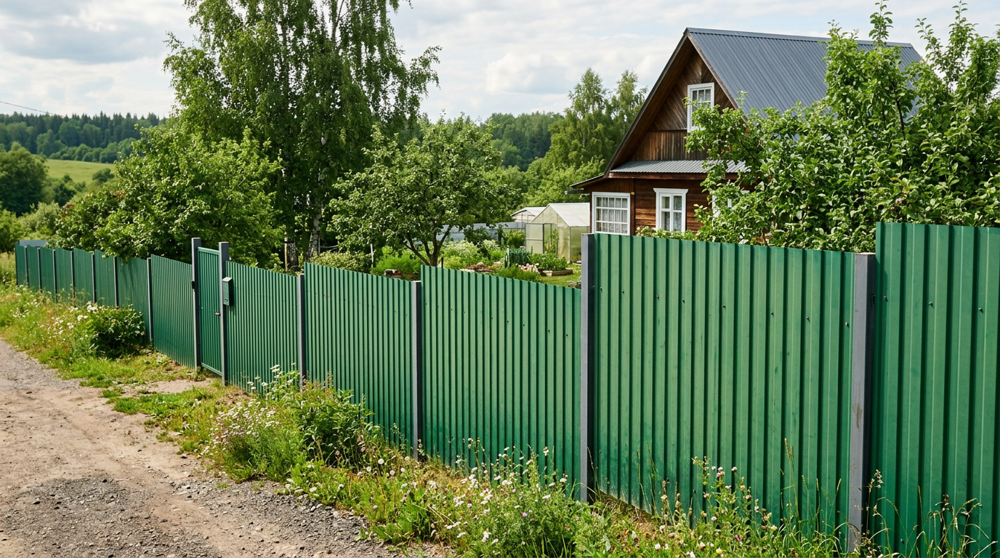
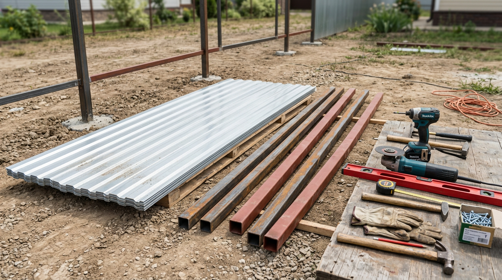
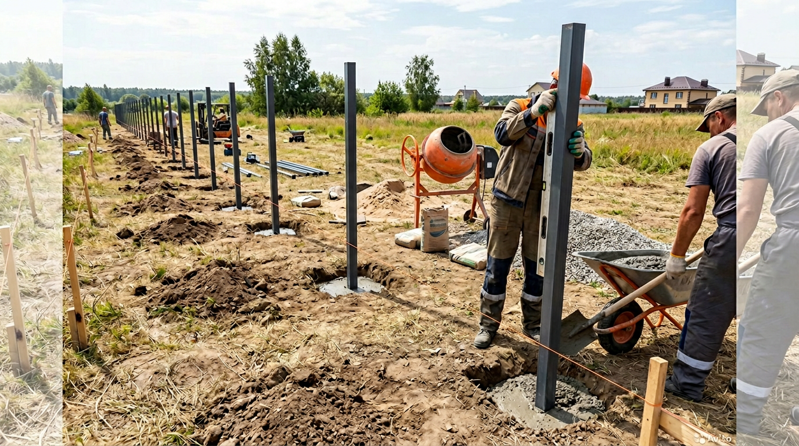
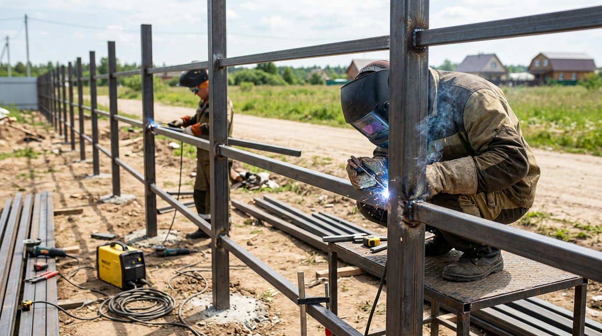
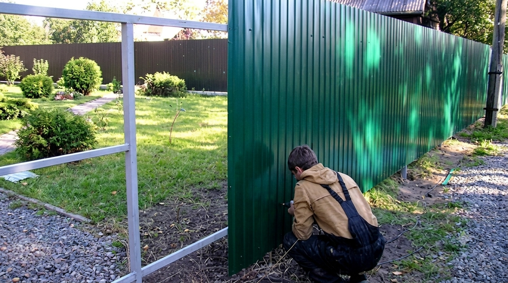
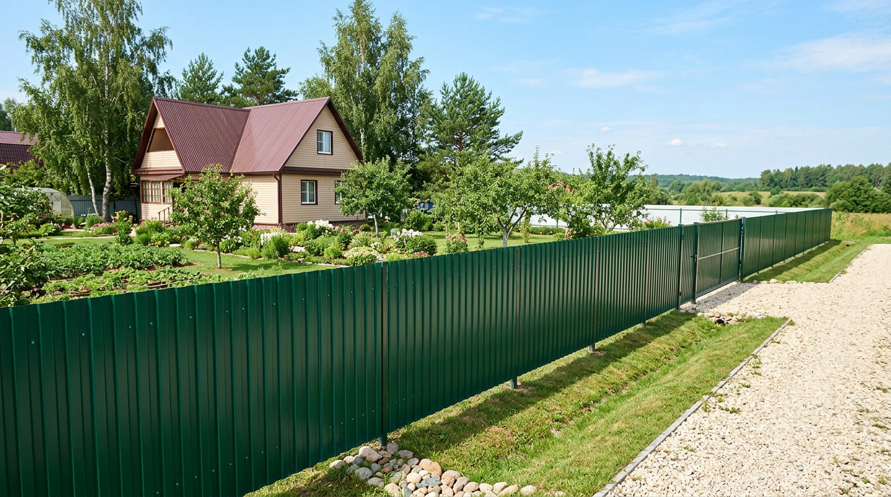

Забор из профнастила — один из самых популярных вариантов ограждения для дачи и частного дома, и не случайно: он недорогой, прочный, ставится быстро и служит десятилетиями без всякого ухода. А главное — его вполне реально смонтировать своими руками, без бригады строителей. В этой статье разберём, как сделать забор из профнастила своими руками: как выбрать материал, рассчитать количество, установить столбы, закрепить лаги и листы, а также каких ошибок избегать, чтобы забор стоял ровно и долго.

## 🏗️ Чем хорош забор из профнастила

Профнастил (профлист) — это стальной лист с волнистым профилем, оцинкованный или с цветным полимерным покрытием. У забора из него масса достоинств:

- **Невысокая цена** — один из самых бюджетных капитальных заборов.
- **Долговечность** — оцинкованный лист с полимерным покрытием служит 20 лет и дольше.
- **Быстрый монтаж** — поставить такой забор можно за пару выходных.
- **Не требует ухода** — не нужно красить и подновлять, как деревянный.
- **Глухой и непродуваемый** — защищает участок от пыли, ветра, шума и посторонних глаз.
- **Большой выбор цветов** — полимерное покрытие бывает любого оттенка.

Есть и минусы: сплошной забор даёт тень и сильно нагревается на солнце, а из-за «парусности» (ветровой нагрузки на сплошную поверхность) ему нужны крепкие, хорошо забетонированные столбы. Но при правильном монтаже эти нюансы легко учесть. Если глухой забор вам не нужен, профнастил можно ставить с просветом между листами или комбинировать с кирпичными столбами и цоколем — получится солиднее, хотя и дороже.

## 📐 Выбор профнастила и расчёт материалов

Сначала определимся с материалом и количеством.

### Какой профнастил выбрать

Для забора используют **стеновой профнастил марки С** — например, С8, С10, С20 или С21 (цифра — высота волны в миллиметрах). Чем выше волна, тем жёстче лист. Оптимальная толщина металла — 0,45–0,5 мм. Лучше брать лист с **полимерным покрытием**: он не только красивее, но и служит заметно дольше оцинкованного. Стандартная высота забора — 1,8–2 метра. Покрытие бывает односторонним (цветным с лицевой стороны) и двусторонним — последнее выглядит аккуратно и со стороны участка, но стоит дороже. Также обращайте внимание на тип полимера: обычный полиэстер дешевле, а покрытия вроде пурала служат дольше и лучше держат цвет на солнце.

### Расчёт материалов

Для расчёта измерьте периметр будущего забора. Вам понадобятся:

- **Столбы** — профильная труба 60×60 мм, с шагом 2–2,5 метра. Разделите периметр на шаг — получите количество столбов.
- **Лаги (поперечины)** — профильная труба 40×20 или 40×40 мм, обычно 2 ряда при высоте до 2 метров.
- **Профлист** — по ширине листа (с учётом нахлёста в одну волну).
- **Крепёж** — кровельные саморезы с прокладкой или заклёпки в цвет листа.
- **Бетон** (цемент, песок, щебень) для бетонирования столбов.

К рассчитанному количеству добавьте небольшой запас на подрезку и нахлёст. Полезная (рабочая) ширина листа меньше полной как раз на величину нахлёста — это учитывают при расчёте числа листов. Профлист продают и стандартной длины, и под заказ по вашим размерам, что удобно: тогда не придётся резать листы по высоте.

## 🧰 Инструменты для работы

Из инструментов понадобятся: бур или лопата для ям под столбы, сварочный аппарат (или болты для крепления лаг без сварки), шуруповёрт, ножницы по металлу или просечные ножницы (болгаркой профлист резать нежелательно — абразивный круг выжигает цинк и полимер, и кромка быстро ржавеет), уровень, рулетка, шнур и колышки для разметки, ёмкость для бетона.

## 🕳️ Установка столбов

Столбы — основа забора, и от их правильной установки зависит всё. Это самый ответственный этап.

1. **Разметьте линию забора** шнуром по колышкам, отметьте места столбов с выбранным шагом (2–2,5 м).
2. **Пробурите ямы** под столбы глубиной не менее 1–1,2 метра — желательно ниже глубины промерзания грунта, чтобы столбы не выдавило пучением.
3. **Установите угловые столбы** первыми, выставив их строго вертикально по уровню, и натяните между ними шнур-ориентир.
4. **Выставьте промежуточные столбы** по шнуру, проверяя вертикаль уровнем со всех сторон.
5. **Забетонируйте столбы.** Засыпьте на дно ямы щебень для дренажа, залейте бетоном и ещё раз проверьте вертикаль.
6. **Дайте бетону застыть** несколько дней, прежде чем продолжать, — спешка здесь приводит к перекосам.

На верх столбов обязательно ставят заглушки: без них внутрь попадает вода, и труба ржавеет изнутри.

## 🔩 Монтаж лаг (поперечин)

Когда бетон застыл, к столбам крепят горизонтальные поперечины — лаги, к которым будут прикручиваться листы.

При высоте забора до 2 метров делают два ряда лаг: верхний — отступив 25–30 см от верха, нижний — на той же высоте от земли. Если забор выше 2 метров, добавляют третий ряд посередине. Лаги крепят к столбам **сваркой** или, если сварки нет, специальными кронштейнами (хомутами) на болтах. Все сварные швы и места реза обязательно зачищают и покрывают грунтовкой и краской по металлу — иначе с них начнётся ржавчина. После монтажа каркас из столбов и лаг должен образовать ровную жёсткую решётку. Лаги располагают с внутренней стороны столбов (со стороны участка) — так листы крепятся заподлицо, а с улицы забор выглядит ровным и аккуратным. Перед обшивкой ещё раз проверьте геометрию каркаса по уровню и диагоналям.

## 📄 Крепление листов профнастила

Финальный и самый эффектный этап — обшивка каркаса профлистом.

1. **Начинайте от угла или края.** Первый лист выставьте строго по уровню — от него зависит ровность всего забора.
2. **Крепите лист к лагам** кровельными саморезами с уплотнительной прокладкой (в цвет листа) или заклёпками. Саморезы вкручивают в прогиб волны, к каждой лаге.
3. **Укладывайте листы внахлёст** на одну волну — так стык получается плотным и незаметным.
4. **Проверяйте вертикаль** каждого листа уровнем по ходу работы, не накапливая перекос.
5. **Не перетягивайте саморезы** — иначе продавите прокладку и лист, появится вмятина и потечёт ржавчина.

По верхней кромке листов желательно установить П-образную планку: она закрывает острый край (это безопаснее) и придаёт забору завершённый аккуратный вид. Снизу листы не доводят до самой земли на 5–10 см — этот зазор защищает кромку от сырости и не даёт листам ржаветь от контакта с грунтом. Саморезы крепят примерно через одну волну, чтобы лист держался плотно и не дребезжал на ветру.

## 🎨 Финишные работы

После монтажа листов остаётся навести лоск и защитить металл:

- установите **заглушки** на все столбы, если не сделали этого раньше;
- закройте верх листов **П-планкой** для безопасности и красоты;
- **подкрасьте** все срезы, царапины и сварные швы краской в цвет — это защита от ржавчины;
- уберите защитную плёнку с листов (если была), не оставляя её надолго на солнце — на жаре она прикипает и потом снимается с трудом.

Особого ухода такой забор не требует: достаточно изредка мыть его водой из шланга от пыли и вовремя подкрашивать появившиеся царапины, чтобы металл не начал ржаветь.

Аккуратный профнастиловый забор хорошо смотрится в едином стиле с другими постройками — [беседкой](https://mir-doma.pro/besedka-svoimi-rukami/) и [садовыми дорожками](https://mir-doma.pro/sadovye-dorozhki-svoimi-rukami/), поэтому цвет покрытия стоит подбирать с учётом общего вида участка.

## 📅 Когда лучше ставить забор

Профнастиловый забор можно монтировать почти в любой тёплый сезон, но удобнее всего — с поздней весны до ранней осени, когда земля талая и сухая, а бетон нормально схватывается. В сильную жару бетон под столбами проливают водой, чтобы он не пересыхал и набирал прочность. Зимой и в заморозки работы лучше не вести: мёрзлый грунт тяжело бурить, а бетон на холоде не наберёт прочность. Если же столбы забетонированы с осени, обшить каркас листами можно и позже — главное, чтобы основание успело как следует застыть.

## 🛡️ Частые ошибки

Чтобы забор стоял ровно и долго, избегайте типичных промахов:

- **Мелкое заглубление столбов.** Если закопать столбы выше глубины промерзания, их выдавит пучением, и забор перекосит. Заглубляйте на 1–1,2 метра и глубже.
- **Слишком редкие столбы.** При большом шаге сплошной забор парусит на ветру и столбы гнёт. Не делайте шаг больше 2,5 метра.
- **Нет заглушек на столбах.** Внутрь затекает вода, и труба ржавеет изнутри.
- **Резка болгаркой.** Абразив выжигает покрытие, и кромка быстро ржавеет. Режьте ножницами по металлу.
- **Незащищённые швы и срезы.** Сварка и резы без покраски — первые очаги ржавчины.
- **Перетянутые саморезы.** Продавленная прокладка пропускает воду, появляются вмятины и потёки.

## ❓ Частые вопросы

### Нужен ли фундамент для забора из профнастила?

Для обычного забора сплошной фундамент не нужен — достаточно надёжно забетонировать столбы. Ленточный фундамент с цоколем делают, когда хотят более солидный вид, защиту от подкопа животных или ставят забор на склоне. Это дороже и трудозатратнее, но не обязательно.

### Какой профнастил выбрать для забора?

Для забора берут стеновой профнастил марки С (С8, С10, С20, С21) толщиной 0,45–0,5 мм. Предпочтительнее лист с полимерным покрытием — он долговечнее и красивее оцинкованного. Чем выше волна, тем жёстче лист.

### На какую глубину закапывать столбы для забора?

Столбы заглубляют не менее чем на 1–1,2 метра, а лучше ниже глубины промерзания грунта в вашем регионе. Это защищает забор от перекоса при морозном пучении почвы. Столбы обязательно бетонируют.

### Сколько лаг нужно для забора из профнастила?

При высоте забора до 2 метров достаточно двух рядов лаг — верхнего и нижнего. Для забора выше 2 метров добавляют третий ряд посередине, чтобы листы не «играли» на ветру.

### Можно ли поставить забор из профнастила без сварки?

Да. Лаги к столбам можно крепить специальными кронштейнами-хомутами на болтах, а листы — кровельными саморезами или заклёпками. Сварка делает каркас жёстче, но при аккуратном монтаже болтовое соединение тоже надёжно.

### Чем резать профнастил?

Ножницами по металлу, просечными электроножницами или дисковой пилой с твердосплавным диском. Болгаркой с абразивным кругом резать нельзя: она выжигает защитное покрытие, и кромка начинает ржаветь. Все срезы желательно подкрасить.

### Какой высоты делать забор из профнастила?

Стандартная высота — 1,8–2 метра: этого достаточно для защиты от посторонних глаз и ветра. Можно сделать выше, но тогда увеличивается парусность, и нужны более частые и мощные столбы и третий ряд лаг. Высоту глухого забора со стороны улицы иногда ограничивают местные правила, это стоит уточнить.

### Чем покрасить срезы и сварные швы на заборе?

Места реза, царапины и сварные швы зачищают и покрывают грунтовкой по металлу, а затем краской в цвет листа (удобны аэрозольные баллончики в тон покрытия). Это защищает оголённый металл от ржавчины, с которой иначе начинается разрушение листа.

### За сколько можно поставить забор из профнастила самому?

Забор средней длины двое человек обычно ставят за два-три выходных дня, не считая времени на застывание бетона под столбами (несколько дней). Самый долгий этап — установка и бетонирование столбов, а обшивка листами идёт быстро.

## Заключение

Забор из профнастила своими руками — посильный проект, который под силу даже без опыта в стройке. Главное — действовать по этапам: выбрать качественный профлист с полимерным покрытием, надёжно установить и забетонировать столбы, смонтировать ровный каркас из лаг и аккуратно закрепить листы. Уделите особое внимание двум вещам — глубине и бетонированию столбов и защите металла от ржавчины (заглушки, П-планка, покраска срезов). Именно эти мелочи определяют, простоит забор десятилетиями ровным и аккуратным или перекосится и поржавеет через пару лет. Сделанный по правилам, он надёжно оградит участок от пыли, ветра и посторонних глаз. А единый стиль с другими постройками сделает ваш двор по-настоящему ухоженным. Если глухой забор кажется скучным, его легко оживить: вдоль него высаживают вьющиеся растения или кустарники, вешают кашпо или используют декоративные накладки — и однотонная стена превращается в зелёную изгородь.

А какой забор стоит у вас на участке и из чего вы его делали? Делитесь опытом в комментариях и подписывайтесь, чтобы не пропустить новые статьи об обустройстве дачи.
