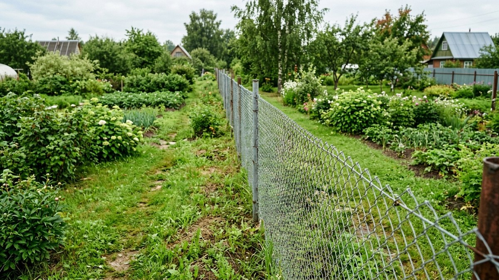
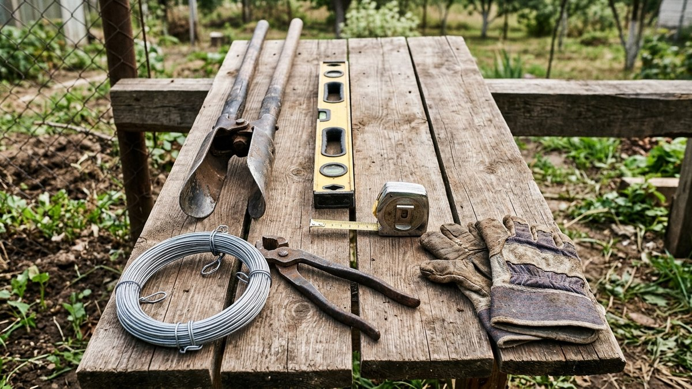
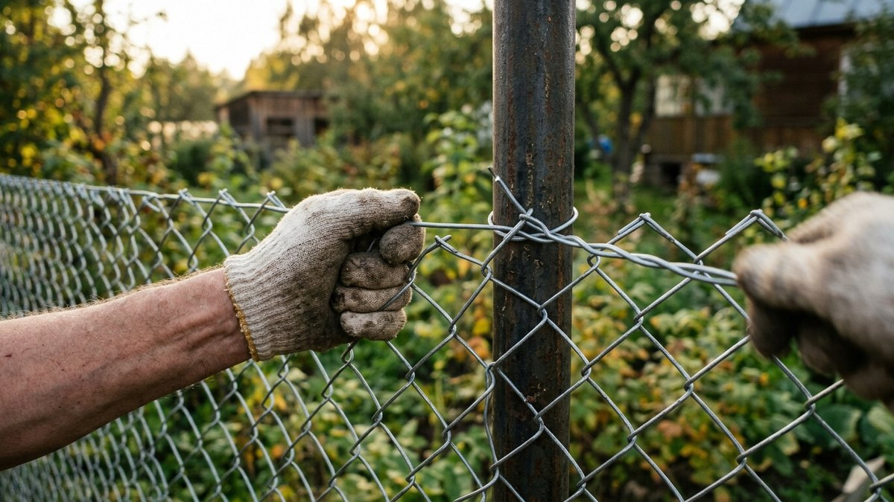
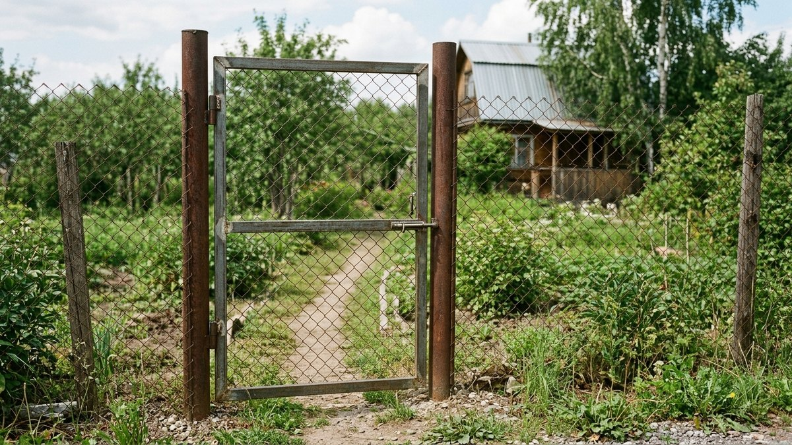
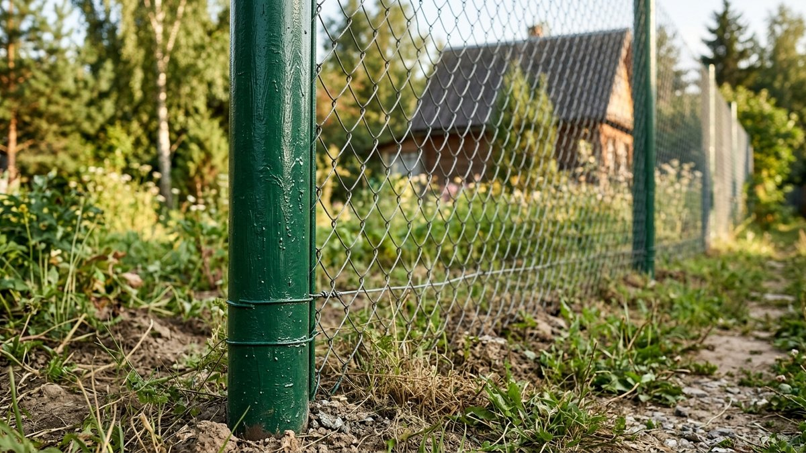
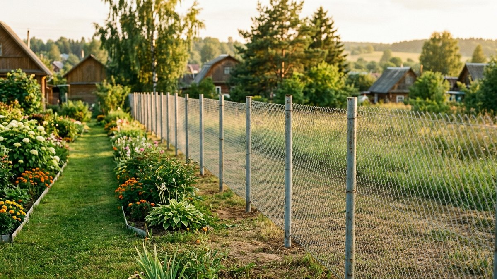

Забор из сетки рабица — самый дешёвый способ обозначить границу участка: сетка
пропускает свет, не затеняет грядки у межи и не требует фундамента. Минус
один — при небрежной натяжке полотно провисает уже через сезон, и забор
выглядит неряшливо. В статье — весь процесс от расчёта материалов до
натяжки полотна и установки калитки, так что переделывать не придётся.

*Забор из сетки рабица между дачными участками*

## Что понадобится: материалы и расчёт

На забор из рабицы длиной 20 м и высотой 1,5 м уходит:

- сетка рабица — рулон 10 м × 1,5 м, два рулона с запасом на нахлёст;
- столбы — металлическая труба 60×40 мм или профильная 50×50 мм, шаг 2,5–3 м;
- натяжная (крайняя) и промежуточные проволоки-катанки — по верху и низу полотна;
- крепёж: хомуты или проволока для крепления сетки к столбам, крючки для
  калитки и ворот;
- бетон для заливки столбов — М150 хватает для дачного забора без нагрузки
  ветром выше обычной.

Столбы считаются так: длина забора делится на шаг 2,5 м, плюс один столб.
Для 20 м это 9 столбов, включая угловые и опорные под калитку. Если участок
граничит с соседями, расстояние от забора до построек и посадок стоит свериться
заранее — нормы разобраны в статье [какое расстояние держать от дома до бани
и забора](https://mir-doma.pro/rasstoyanie-ot-doma-do-bani-zabora/), чтобы не
пришлось переносить забор после установки.

## Инструменты для работы

Ручной бур или лопата под столбы, уровень, рулетка, сварочный аппарат или
болгарка с дисками по металлу (если столбы металлические), плоскогубцы и
вязальная проволока для крепления сетки, шпагат и колышки для разметки линии
забора.

*Набор инструментов для установки забора своими руками*

## Разметка и установка столбов

1. Натяните шпагат между угловыми колышками по всей линии забора — это ваш
   ориентир по прямой.
2. Отметьте точки под столбы с шагом 2,5–3 м.
3. Пробурите или выкопайте ямы глубиной 80–100 см — ниже уровня промерзания
   грунта, иначе столб выдавит морозным пучением за одну зиму.
4. Установите столб по уровню, зафиксируйте распорками и залейте бетоном.
   Дайте бетону набрать прочность минимум 3–5 дней, прежде чем натягивать
   сетку — иначе столб может увести в сторону.

## Натяжка полотна сетки рабица

Это тот этап, от которого зависит, провиснет забор через сезон или простоит
десятилетия.

1. Протяните катанку (толстую проволоку) через верхний и нижний край будущего
   полотна между крайними столбами — она держит форму сетки и не даёт ей
   провисать посередине пролёта.
2. Раскатайте рулон сетки вдоль натянутой катанки, зацепите край за угловой
   столб.
3. Натягивайте сетку от одного края к другому с помощью лебёдки или монтажной
   лопатки — рабица должна звенеть, а не провисать. Крепите к промежуточным
   столбам через каждые 20–25 см проволокой или хомутами.
4. На стыке рулонов сшейте полотна отдельной проволокой, пропуская её по
   крайним ячейкам обоих кусков.

*Процесс натяжки сетки рабица на металлические столбы*

## Установка калитки и ворот

Под калитку и ворота ставят усиленные опорные столбы — трубу большего сечения
или с дополнительной подкосной опорой, поскольку створка создаёт боковую
нагрузку на петли. Калитку проще сварить из профильной трубы и обтянуть той же
сеткой, чтобы забор смотрелся однородно. Между столбом и створкой оставляют
зазор 1–1,5 см на разбухание металла от температуры.

*Калитка на опорных столбах в заборе из сетки рабица*

## Финишные работы

Металлические столбы и катанку красят от коррозии через 2–3 недели после
установки, когда бетон полностью схватился. Нижний край сетки, если он не
касается земли, можно закрыть бордюрной лентой — это заодно защищает грядки
от сорняков, наступающих с соседнего участка.

*Столбы забора после покраски и финишной обработки*

## Когда ставить забор из рабицы

Земляные работы под столбы удобнее проводить с апреля по июнь или в сентябре,
пока грунт не промёрз и не раскис от дождей. Зимой бурить ямы под столбы почти
невозможно — грунт держит бур намертво.

## Частые ошибки

- **Столбы без бетонирования, просто вбитые в грунт** — за 2–3 года забор
  начинает «гулять» и заваливаться под весом снега на сетке.
- **Сетка натянута без верхней катанки** — полотно провисает волной уже к
  концу первого лета.
- **Ямы под столбы мельче уровня промерзания** — весной столб выталкивает
  наружу, и линия забора идёт волнами.
- **Крепление сетки редкими точками** — на ветру рабица начинает хлопать и
  вытягивает крепёж.

*Забор из сетки рабица после завершения монтажа*

## Частые вопросы

### Сколько стоит забор из сетки рабица с установкой

Материалы на 20 погонных метров обойдутся в разы дешевле профнастила или
штакетника — сетка и столбы это самая бюджетная категория заборов, а если
ставить своими руками, в стоимость входят только материалы и бетон. Если
сравниваете с другими вариантами по деньгам, в статье [какой забор выбрать для
дачи](https://mir-doma.pro/kakoy-zabor-vybrat-dlya-dachi/) есть ориентиры
бюджета по всем типам.

### Как сделать забор из сетки рабица без сварки

Столбы можно не сваривать, а закрепить хомутами к готовым металлическим
трубам или вкопать деревянные опоры — сетку в этом случае крепят вязальной
проволокой или скобами, сварка нужна только для калитки и ворот.

### На какую глубину закапывать столбы для забора из рабицы

Минимум 80 см для средней полосы, глубже в регионах с сильным промерзанием
грунта — тот же принцип, что и для [забора из
профнастила](https://mir-doma.pro/zabor-iz-profnastila-svoimi-rukami/), только
нагрузка на столбы у рабицы меньше из-за парусности сетки.

### Нужен ли фундамент под забор из сетки рабица

Нет, ленточный фундамент не нужен — сетка не создаёт сплошной парусности и
не давит на грунт, как капитальные заборы. Достаточно точечного бетонирования
столбов.

### Чем закрыть забор из рабицы для приватности

Сетку часто дополняют вьющимися растениями или маскировочной лентой, но если
изначально нужна закрытая граница, лучше сразу присмотреться к [живой
изгороди](https://mir-doma.pro/zhivaya-izgorod/) или сплошному забору — рабица
для приватности не предназначена в принципе.

### Какой высоты делать забор из сетки рабица

Для границы между дачными участками обычно достаточно 1,5–1,8 м — этого хватает
как визуальный ориентир, при этом сетка не затеняет посадки у межи.
