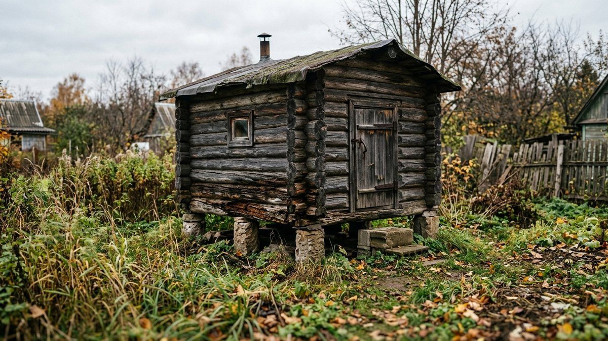
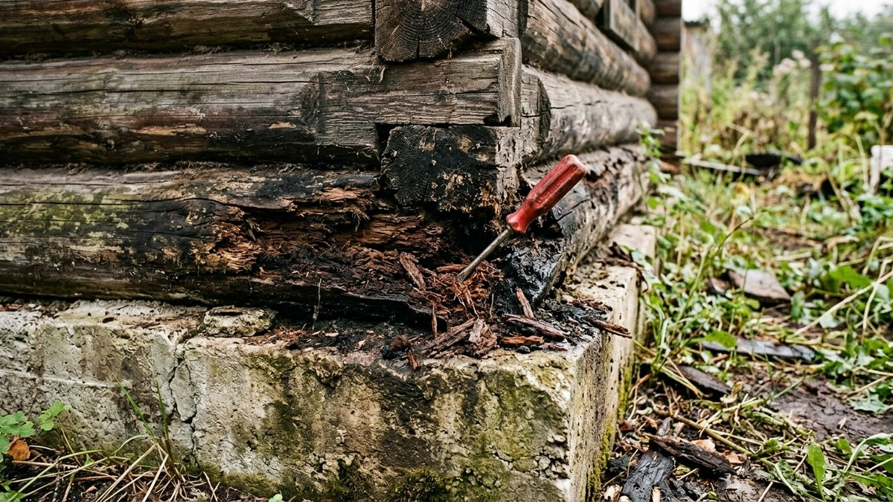
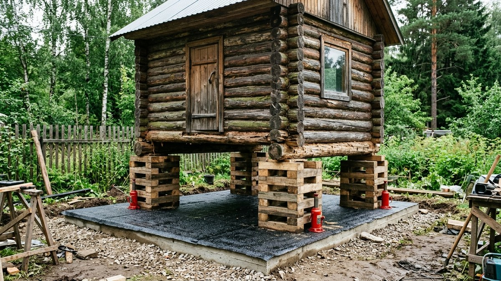
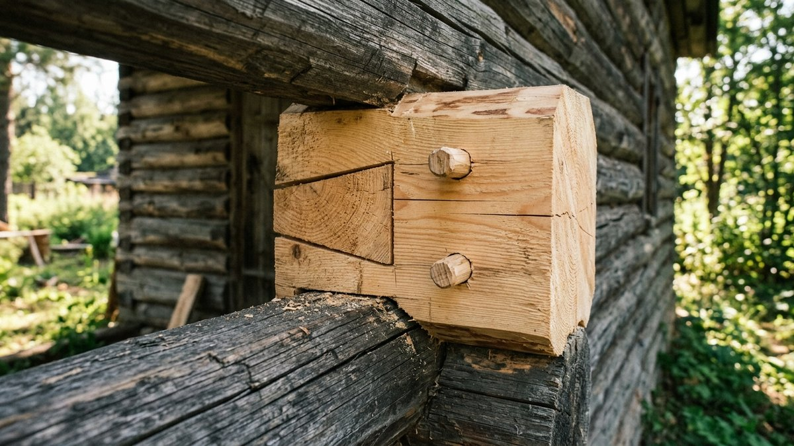
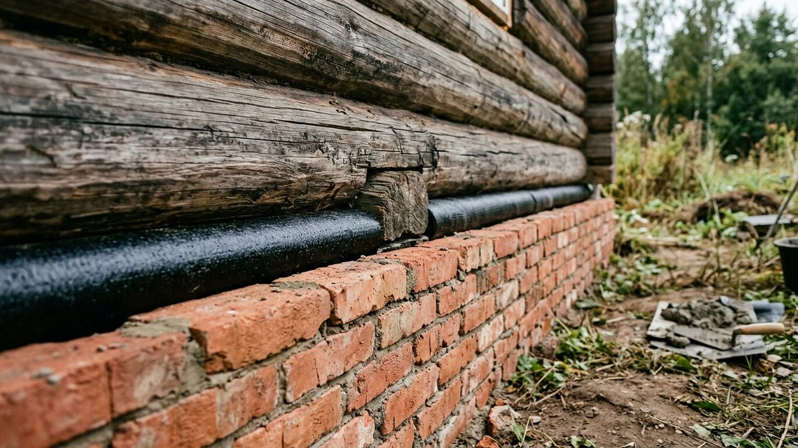
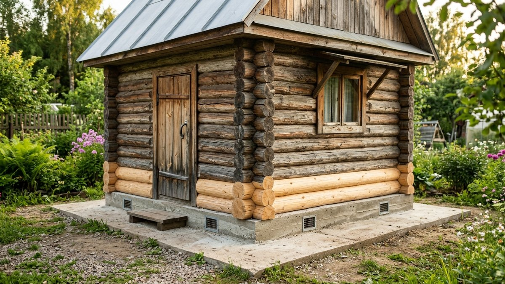

# Замена нижних венцов в бане своими руками: подъём, домкраты, новый венец

Нижние венцы в бане гниют раньше, чем в доме. Под полом мокро, рядом
слив, а цоколь часто низкий. Хорошая новость в том, что баня лёгкая:
сруб 3×4 м весит 3–5 тонн, его поднимают двумя-четырьмя бутылочными
домкратами вдвоём за выходные, без бригады. Ниже — как проверить, что
сгнило, почему венец сгнил именно здесь, сколько весит ваша баня,
какие домкраты нужны и как уложить новый венец, чтобы он прожил дольше
старого.

## Как понять, что венец пора менять

- **Шило или тонкая отвёртка входит в бревно на 2–3 см без усилия.**
  Здоровая древесина сопротивляется даже у поверхности.
- **Звук глухой.** Простучите венец молотком через каждые 30–40 см:
  гниль внутри отзывается глухо, здоровое бревно звенит.
- **Труха и чёрная плесень** снаружи под обшивкой или изнутри под
  полком.
- **Угол просел**, дверь стала цеплять, полы пошли с уклоном.

Если гниль только снаружи на 1–2 см, венец не меняют: зачищают до
здоровой древесины, сушат и обрабатывают антисептиком. Менять нужно,
когда гниль ушла в глубину на треть сечения и больше или когда бревно
крошится в углах. Если гниль поднялась выше второго-третьего венца,
сначала оцените, стоит ли баню спасать. Пороги, когда ремонт уже
дороже новой постройки, разобраны в статье [треснул фундамент и сгнили
венцы](https://mir-doma.pro/remont-fundamenta-i-venczov/). Она про жилой
дом, но границы те же.

## Почему гниёт именно баня

Если поменять венец и не убрать причину, новый сгниёт за 5–7 лет.
Найдите свою причину до подъёма:

- **Нет гидроизоляции между фундаментом и венцом.** Бревно тянет влагу
  из бетона, как фитиль. Самая частая причина.
- **Низкий цоколь.** Если от земли до венца меньше 30–40 см, дождь
  забрызгивает бревно, а зимой к нему наметает снег.
- **Слив из моечной уходит под баню.** Вода стоит под полом, влажность
  в подполье 100% круглый год. Как устроить слив и поддон, чтобы вода
  уходила из-под бани, разобрано в статье [проливной пол в
  бане](https://mir-doma.pro/prolivnoy-pol-v-bane-svoimi-rukami/).
- **Нет продухов** или их закрывают круглый год. Подполье не
  проветривается и не сохнет.
- **Отмостки нет**, и вода с крыши падает прямо под стену.

## Сколько весит баня и какие домкраты нужны

Баню поднимают не целиком, а по одной стене или по углам. Но
домкраты подбирают с запасом на всю массу: при подъёме одного угла
нагрузка перераспределяется неравномерно, и один домкрат может принять
на себя треть веса бани.

**Правило подбора:** суммарная грузоподъёмность всех домкратов — не
меньше двойной массы бани. Для сруба 3×4 м это обычно 4 бутылочных
домкрата по 5 тонн или 2 по 10 тонн. Реечный домкрат «хай-джек»
удобен для низкого подхвата, но держит меньше и опаснее при перекосе.

Печь в бане обычно стоит на отдельном фундаменте и не поднимается
вместе со срубом. Металлическую печь перед подъёмом отсоединяют от
дымохода, а кирпичную оставляют на месте и следят, чтобы сруб не
задел трубу и разделку.

## Калькулятор: масса бани, домкраты, новый венец

<!-- wp:html -->

  
Масса бани и подбор домкратов

  <label class="md-calc__label" for="mdVnA">Длина сруба, м</label>
  <input type="number" id="mdVnA" class="md-calc__input" min="2" step="0.1" value="4">
  <label class="md-calc__label" for="mdVnB">Ширина сруба, м</label>
  <input type="number" id="mdVnB" class="md-calc__input" min="2" step="0.1" value="3">
  <label class="md-calc__label" for="mdVnI">Внутренние стены (перерубы), м</label>
  <input type="number" id="mdVnI" class="md-calc__input" min="0" step="0.1" value="3">
  <label class="md-calc__label" for="mdVnH">Высота сруба, м</label>
  <input type="number" id="mdVnH" class="md-calc__input" min="1.5" step="0.1" value="2.2">
  <label class="md-calc__label" for="mdVnD">Диаметр бревна или ширина бруса, см</label>
  <input type="number" id="mdVnD" class="md-calc__input" min="10" step="1" value="20">
  <label class="md-calc__label" for="mdVnT">Стены</label>
  <select id="mdVnT" class="md-calc__input">
    <option value="log" selected>Бревно</option>
    <option value="beam">Брус</option>
  </select>
  <label class="md-calc__label" for="mdVnR">Крыша</label>
  <select id="mdVnR" class="md-calc__input">
    <option value="60">Металл или профнастил</option>
    <option value="90" selected>Мягкая кровля</option>
    <option value="140">Шифер</option>
  </select>
  <label class="md-calc__label" for="mdVnN">Сколько нижних венцов меняете</label>
  <select id="mdVnN" class="md-calc__input">
    <option value="1" selected>Один</option>
    <option value="2">Два</option>
  </select>
  
Заполните поля

<!-- /wp:html -->

Масса считается для сухой сосны или ели. Сырой сруб после многих лет
без проветривания может весить на 20–30% больше, поэтому запас по
домкратам в два раза не лишний.

## Что подготовить

- **Домкраты** по расчёту и **стальные пластины** 10–15 мм под их
  пяты. Под домкрат на грунте кладут шпалу или обрезок бруса 15×15 см.
- **Брус 100×150 или 150×150 мм на клети**: страховочные опоры под
  каждым поднимаемым углом.
- **Новый венец** — лиственница или осина. Лиственница прочнее и
  дольше сопротивляется гнили. Осина дешевле и тоже не боится влаги.
  Сосна в нижнем венце бани служит меньше всего.
- **Антисептик** глубокого проникновения для наземных деревянных
  конструкций, по возможности — трудновымываемый.
- **Гидроизоляция**: два слоя рулонного материала на битумной основе
  или обмазка с рулонным слоем сверху.
- **Нагели** (деревянные или металлические штыри) — скрепить новый
  венец со вторым.
- **Джут** или **пакля** для межвенцового шва.

## Пошагово: подъём и замена

1. **Освободите стены.** Снимите наличники, нижнюю обшивку и плинтусы
   изнутри, отсоедините печь от дымохода, если она металлическая.
   Вынесите полки и лавки.
2. **Разберите пол** у стены, которую поднимаете, если лаги опираются на
   нижний венец. Лаги на отдельных столбиках можно оставить.
3. **Подведите домкраты.** Под бревно второго венца, в 30–50 см от
   угла, с обеих сторон стены. Если подхватить за бревно неудобно,
   врежьте под второй венец поперечный брус-рычаг.
4. **Поднимайте медленно**, по 1–2 см за ход, по очереди на всех
   домкратах одной стены. Следите за углами: если пошла трещина в
   замке или заскрипела крыша, остановитесь и подложите клети.
5. **Ставьте клети** под каждый поднятый угол по мере подъёма. Под
   баней, которую держат только домкраты, работать нельзя.
6. **Выпилите сгнившее бревно.** Распилите его на 2–3 части и выбейте.
   Замки в углах освобождаются, когда стена поднята на 2–3 см выше
   высоты венца.
7. **Зачистите опору и второй венец** снизу до здоровой древесины,
   обработайте антисептиком.
8. **Уложите гидроизоляцию** на фундамент в два слоя, с выпуском на
   3–5 см с обеих сторон.
9. **Подгоните новый венец** по замкам старых соседних венцов. Его
   нижнюю плоскость стешите на 3–5 см, чтобы он лёг на фундамент
   устойчиво, а не качался на круглом боку.
10. **Обработайте новый венец** антисептиком дважды со всех сторон,
    особенно торцы.
11. **Уложите джут** поверх нового венца и опускайте стену так же
    медленно, по 1–2 см.
12. **Вставьте нагели** через новый и второй венцы, с шагом 1–1,5 м.

Так меняют одну стену, потом следующую. Всю баню разом поднимать не
нужно: две противоположные стены поднимают и меняют по очереди, а
торцевые венцы, которые лежат выше в перевязке, — после них.

## Если венец сгнил частично

Когда гниль занимает 1–1,5 м в углу или под дверью, менять весь венец
не обязательно. Сгнивший участок вырезают и вставляют вставку той же
толщины. Вставку крепят к оставшейся части венца замком «в полдерева»
и нагелями. Угловой замок восстанавливают целиком, иначе угол начнёт
продувать.

После ремонта швы над новым венцом конопатят заново: при подъёме
старая пакля расходится. Как сделать это без щелей и сколько уйдёт
джута, разобрано в статье [чем заделать щели в деревянном
доме](https://mir-doma.pro/chem-zadelat-shcheli-v-derevyannom-dome/).

## Венец из кирпича или бетона: подъём цоколя

Если цоколь низкий, нижний венец можно не восстанавливать деревом, а
заменить кирпичной кладкой или бетонным поясом той же высоты. Тогда
сруб поднимается над землёй, а самое уязвимое место из бани
исчезает. Под первый деревянный венец всё равно кладут гидроизоляцию.

Такой способ хорош, когда фундамент крепкий, а баня стоит в сырой
низине. Если сам фундамент разрушен, начинать нужно с него. Как сделать
надёжный фундамент под баню и какой тип выбрать под грунт, разобрано в
статье [фундамент под баню своими
руками](https://mir-doma.pro/fundament-pod-banyu-svoimi-rukami/).

## Чтобы новый венец прожил дольше

- **Отмостка** шириной 60–80 см с уклоном от стен.
- **Продухи** в цоколе: 2–4 штуки на противоположных стенах, открытые
  летом.
- **Вентиляция** в самой бане: без неё влага из моечной уходит в стены.
  Как сделать приток и вытяжку, разобрано в статье [вентиляция в бане
  своими руками](https://mir-doma.pro/ventilyaciya-v-bane-svoimi-rukami/).
- **Слив за пределы бани** — в септик, дренажный колодец или канаву, а
  не под пол.
- **Обшивка нижней части** снаружи с зазором для проветривания.
  Наглухо зашитый нижний венец без вентзазора гниёт быстрее открытого.

## Частые ошибки

- **Поднимают угол одним домкратом без клетей.** Домкрат уходит в
  грунт или срывается, и сруб падает.
- **Поднимают слишком высоко.** Замки в углах выходят из зацепления, и
  стена может сместиться. Поднимайте ровно на высоту венца плюс 2–3 см.
- **Новый венец из сосны** без антисептика. Через 5–7 лет всё
  повторится.
- **Без гидроизоляции**, потому что «старый же простоял». Он простоял
  до гнили именно из-за этого.
- **Не убрали причину**: слив под полом, низкий цоколь, закрытые
  продухи.

## Частые вопросы

### Как поменять нижний венец в бане своими руками

Поднимите стену бани домкратами по 1–2 см на ход, страхуя углы клетями
из бруса. Выпилите и выбейте сгнившее бревно, зачистите опору, уложите
гидроизоляцию, подгоните новый венец из лиственницы по замкам,
обработайте антисептиком, уложите джут и опустите стену.

### Какие домкраты нужны, чтобы поднять баню

Бутылочные гидравлические на 5–10 тонн. Суммарная грузоподъёмность — не
меньше двух масс бани. Для сруба 3×4 м обычно хватает четырёх домкратов
по 5 тонн.

### Из какого дерева делать нижний венец в бане

Из лиственницы: она плотная и долго не гниёт. Осина дешевле и тоже
хорошо переносит влагу. Сосну и ель на нижний венец бани не ставят.
Любую древесину обрабатывают антисептиком со всех сторон.

### Можно ли заменить нижний венец бани на кирпич

Да, если фундамент крепкий. Кирпичная кладка или бетонный пояс вместо
нижнего венца поднимают сруб над землёй и убирают самое гниющее место.
Под первый деревянный венец кладут гидроизоляцию в два слоя.

### На сколько поднимать баню при замене венца

Ровно на высоту венца плюс 2–3 см, чтобы бревно вышло из углового
замка. Выше поднимать опасно: углы выходят из зацепления, и стена может
сместиться.
