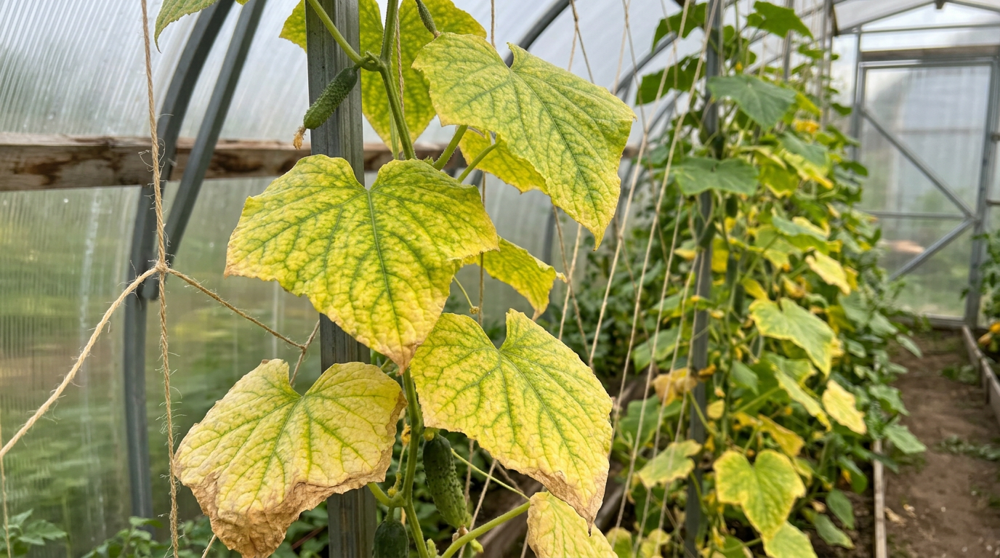
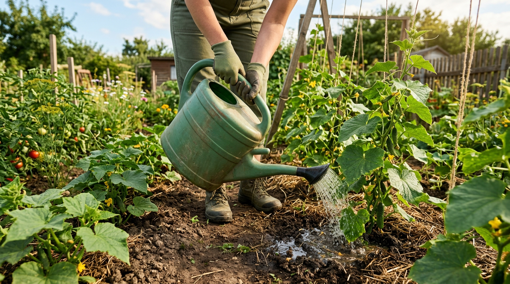
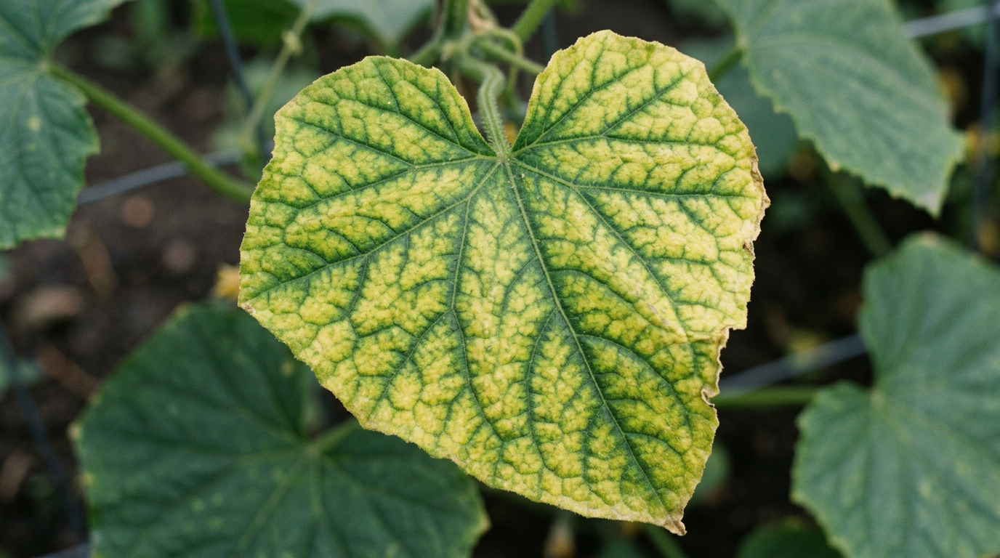
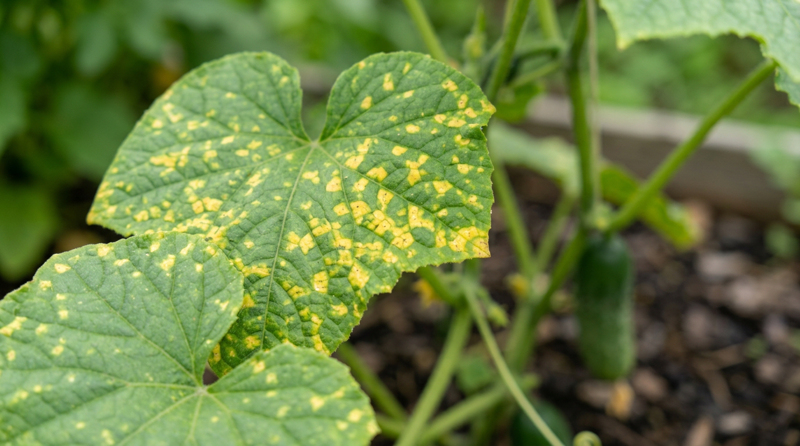
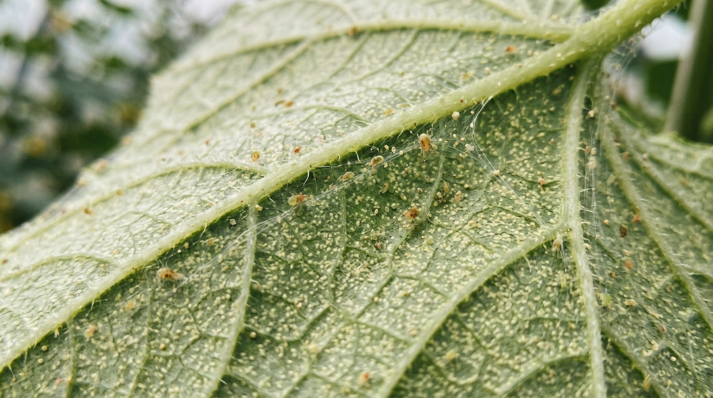
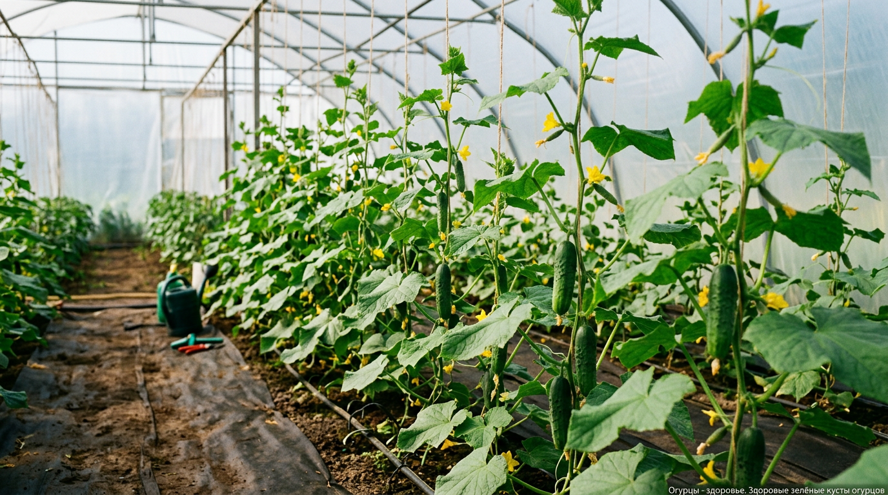

Пожелтение листьев у огурцов — одна из самых частых и тревожных проблем, с которой сталкивается каждый дачник. Желтеть могут нижние или верхние листья, края или вся пластина, и за этим стоят совершенно разные причины — от банальной ошибки в поливе до болезней и вредителей. Чтобы спасти урожай, важно правильно определить причину и быстро принять меры. В этой статье разберём, почему желтеют листья у огурцов и что делать в каждом случае: как влияют полив, холод, нехватка питания, болезни и вредители, и как не допустить проблемы в будущем.

## 🟡 Почему желтеют листья у огурцов: главные причины

Огурцы — теплолюбивая и довольно капризная культура, чувствительная к любым отклонениям в уходе. Пожелтение листьев — это сигнал, что растению что-то не нравится. Основные причины можно разделить на несколько групп:

- **Ошибки полива** — недостаток или избыток влаги, холодная вода.
- **Холод и перепады температур** — огурцы плохо переносят похолодание.
- **Нехватка питания** — дефицит азота, магния, калия и других элементов.
- **Болезни** — пероноспороз, мучнистая роса, корневые гнили.
- **Вредители** — паутинный клещ, тля, белокрылка.
- **Солнечные ожоги и естественное старение** нижних листьев.

Разберём каждую причину подробно — и сразу что с ней делать. А чтобы быстро сориентироваться, держите таблицу-подсказку: по характеру пожелтения часто можно сразу понять, в чём дело.

| Как желтеет лист | Вероятная причина |
|------------------|-------------------|
| Нижние старые листья, бледные и мелкие | Нехватка азота или старение |
| Жёлтая ткань между зелёными жилками | Нехватка магния |
| Жёлтая кайма по краям листа | Нехватка калия или нерегулярный полив |
| Жёлтые пятна сверху + серый налёт снизу | Пероноспороз |
| Мелкие жёлтые точки и паутинка снизу | Паутинный клещ |
| Жёлто-белые пятна после полива на солнце | Солнечный ожог |
| Желтеет и вянет весь куст | Корневая гниль или холод |

## 💧 Неправильный полив

Полив — причина пожелтения номер один, ведь у огурцов поверхностная корневая система, чувствительная к влаге.

При **недостатке воды** листья теряют тургор, желтеют и подсыхают по краям, особенно в жару. При **избытке влаги** корни задыхаются и начинают подгнивать, из-за чего листья тоже желтеют и вянут — картина похожа на засуху, хотя причина обратная. Отдельная проблема — **полив холодной водой**: для теплолюбивых огурцов это стресс, от которого листья желтеют, а корни могут заболеть.

**Что делать:** поливайте огурцы регулярно, тёплой отстоянной водой (22–25 °C), строго под корень, не допуская ни пересушки, ни заболачивания. В жару полив частый, в прохладную погоду — реже. Почву полезно мульчировать, чтобы влага держалась дольше и не было резких колебаний. Поливают огурцы утром или вечером, но не днём по жаре. Хороший ориентир: верхний слой почвы должен быть постоянно слегка влажным, но не превращаться в болото. Если листья вянут к полудню, а к вечеру восстанавливаются — это нормальная реакция на жару, а не нехватка воды.

## 🌡️ Холод и перепады температур

Огурцы родом из тропиков, поэтому холод для них губителен. Если температура опускается ниже 12–15 °C, корни перестают усваивать питание, и листья желтеют, даже когда с поливом и подкормками всё в порядке. Особенно часто это случается в начале лета, при холодных ночах, или в необогреваемой теплице.

**Что делать:** в похолодание укрывайте огурцы агроволокном (спанбондом) на дугах, в теплице закрывайте форточки на ночь. В холодную погоду сократите полив — в холодной почве корни всё равно плохо пьют воду. Грядки с огурцами полезно делать тёплыми, на основе перепревающей органики, которая греет корни снизу. Если ночи холодные, отложите вечерний полив на утро: огурцы, стоящие во влажной холодной земле всю ночь, желтеют особенно охотно. После возвратных холодов растениям помогает восстановиться внекорневая подкормка с микроэлементами.

## 🍽️ Нехватка питания

Огурцы — обжоры, и в период активного роста и плодоношения им часто не хватает питания. Дефицит разных элементов проявляется по-разному, и по характеру пожелтения можно понять, чего недостаёт.

- **Азот.** Бледнеют и желтеют нижние, старые листья; новые мельчают, плети слабеют, плоды заостряются к концу.
- **Магний.** Желтеет ткань между жилками, сами жилки остаются зелёными (мраморность), чаще на нижних листьях.
- **Калий.** По краям листьев появляется жёлтая кайма — «краевой ожог», плоды наливаются плохо.
- **Железо.** Желтеют молодые верхние листья, начиная с краёв, жилки остаются зелёными.

**Что делать:** подкормите огурцы по выявленному дефициту. При нехватке азота поможет травяной настой или комплексное удобрение, при дефиците магния — внекорневая подкормка раствором с магнием, при нехватке калия — зольный настой или сульфат калия. Подробно о том, чем и как кормить овощи летом, читайте в статье о [летних подкормках](https://mir-doma.pro/letnie-podkormki-ovoshchey/). Огурцы любят частые умеренные подкормки, чередуя органику и минералку. Важно не перепутать дефицит с переизбытком: при перекорме азотом листья, наоборот, становятся тёмными и крупными, а плодов мало. Поэтому подкармливают умеренно и всегда по влажной почве, чтобы не обжечь чувствительные корни.

## 🦠 Болезни

Пожелтение нередко оказывается первым признаком болезни, и здесь важно не упустить время.

- **Пероноспороз (ложная мучнистая роса).** На листьях появляются жёлтые угловатые пятна сверху и серо-фиолетовый налёт снизу. Самая частая причина пожелтения во второй половине лета, особенно в сырую прохладную погоду — подробнее о [пероноспорозе огурцов](https://mir-doma.pro/peronosporoz-ogurtsov/).
- **Мучнистая роса.** Белый мучнистый налёт на листьях, которые потом желтеют и засыхают. Подробно о том, как распознать и вылечить [мучнистую росу на огурцах](https://mir-doma.pro/muchnistaya-rosa-na-ogurtsah/), — в отдельной статье.
- **Корневые и прикорневые гнили.** Растение желтеет и увядает целиком, у основания стебля темнеет — часто из-за холодного полива и переувлажнения.
- **Фузариозное увядание.** Листья желтеют и поникают, несмотря на полив, — поражена проводящая система.

**Что делать:** при первых признаках уберите поражённые листья, наладьте проветривание и сократите влажность. Грибковые болезни лечат биопрепаратами (Фитоспорин, Триходерма) на ранней стадии или фунгицидами при сильном поражении. Полив только тёплой водой под корень и хорошее проветривание теплицы — главная мера против большинства болезней.

Грибковые болезни особенно любят сырость, духоту и перепады температур, поэтому в [теплице](https://mir-doma.pro/teplitsa-iz-polikarbonata-svoimi-rukami/) важно регулярно проветривать посадки и не допускать конденсата. Поражённые листья не оставляют на грядке и не кладут в компост — их уничтожают, чтобы не разносить споры.

## 🐛 Вредители

Некоторые вредители тоже вызывают пожелтение, высасывая из листьев соки.

- **Паутинный клещ.** Самый частый виновник: на листьях появляются мелкие жёлтые точки-уколы, затем лист желтеет целиком, а снизу видна тонкая паутинка. Активизируется в жару и сухость.
- **Тля.** Селится колониями на нижней стороне листьев и верхушках, листья желтеют, скручиваются и деформируются. Подробно о борьбе — в статье о том, [как избавиться от тли](https://mir-doma.pro/kak-izbavitsya-ot-tli/).
- **Белокрылка.** Мелкие белые мошки взлетают при касании куста; листья желтеют и покрываются липким налётом.

**Что делать:** осмотрите нижнюю сторону листьев. Против паутинного клеща повышают влажность (он не любит сырость), опрыскивают кусты водой и обрабатывают акарицидами или настоями чеснока и луковой шелухи. Химические инсектициды против клеща бесполезны — он не насекомое, нужны именно акарициды. Против тли и белокрылки применяют народные средства, биопрепараты или инсектициды. Чем раньше замечен вредитель, тем легче с ним справиться.

## ☀️ Солнечные ожоги и старение

Не всякое пожелтение опасно. Если на листьях появились жёлто-белые пятна после полива в солнечный день — это солнечный ожог: капли воды сработали как линзы. Поэтому огурцы не поливают по листьям в жару. А пожелтение самых нижних, старых листьев в конце сезона — естественный процесс: растение само сбрасывает отработавшую листву, и тревожиться тут не о чем. Такие листья можно аккуратно удалить для лучшего проветривания. Главное — отличать естественное старение единичных нижних листьев от массового пожелтения: если желтеет много листьев сразу или процесс идёт снизу вверх, это уже не норма, а сигнал искать причину.

## 🏠 Огурцы в теплице и открытом грунте

Причины пожелтения немного различаются в зависимости от того, где растут огурцы. В **теплице** чаще виноваты духота, высокая влажность и перепады температур: днём жара, ночью прохлада. Здесь на первый план выходят болезни и паутинный клещ, который обожает сухой жаркий воздух теплицы. Главные меры — регулярное проветривание, притенение в пик жары и контроль влажности.

В **открытом грунте** огурцы сильнее страдают от холода, ветра и резких перепадов погоды, а питание быстрее вымывается дождями. Здесь важнее защита от похолоданий (укрытие агроволокном) и регулярные подкормки после дождей. В обоих случаях базовый уход одинаков: тёплый полив под корень, умеренные подкормки и своевременный осмотр кустов.

## ✅ Что делать: краткий алгоритм

Чтобы не растеряться, действуйте по порядку:

1. **Осмотрите растение.** Где желтеют листья — снизу, сверху, по краям? Есть ли налёт, пятна, паутина, вредители?
2. **Проверьте полив.** Земля пересушена или переувлажнена? Не поливаете ли холодной водой?
3. **Оцените погоду.** Не было ли холодных ночей или перепадов температур?
4. **Определите дефицит.** По характеру пожелтения поймите, какого элемента не хватает, и подкормите.
5. **Проверьте на болезни и вредителей.** При обнаружении — обработайте биопрепаратами или соответствующими средствами.
6. **Уберите поражённые листья** и наладьте уход, чтобы проблема не пошла дальше.

В большинстве случаев пожелтение удаётся остановить, если вовремя найти и устранить причину. Не пытайтесь лечить «всё сразу» — например, заливать водой и одновременно усиленно подкармливать: так легко навредить ещё больше. Сначала точно определите главную причину, устраните её, а уже потом, при необходимости, добавляйте остальные меры.

## 🌿 Народные средства при пожелтении

Пока вы разбираетесь с причиной, поддержать огурцы помогут проверенные народные средства — безопасные и доступные:

- **Зольный настой.** Стакан золы на 10 л воды, настоять сутки, полить под корень — восполняет калий и микроэлементы, особенно при краевом пожелтении.
- **Молочно-йодный раствор.** Литр молока и 30 капель йода на 10 л воды — опрыскивание укрепляет листья и сдерживает грибковые болезни.
- **Настой луковой шелухи.** Горсть шелухи на ведро тёплой воды, настоять — мягкая подкормка и профилактика болезней, листья зеленеют.
- **Содовый раствор.** Ложка соды на 10 л воды против мучнистой росы на ранней стадии.
- **Настой чеснока.** Помогает и от паутинного клеща, и от грибков при опрыскивании по листу.

Народные средства хороши как поддержка и профилактика, но при серьёзном поражении болезнью или вредителем не заменят биопрепаратов и обработок.

## 🛡️ Профилактика пожелтения

Предупредить проблему проще, чем лечить. Большинство случаев пожелтения — это следствие нарушений в уходе, а значит, их можно не допустить. Несколько простых правил сохранят листья зелёными весь сезон:

- Поливайте только тёплой водой под корень, регулярно и без переувлажнения.
- Притеняйте и укрывайте огурцы в жару и в похолодание.
- Регулярно и умеренно подкармливайте, чередуя органику и минералку.
- Проветривайте теплицу, не допуская духоты и высокой влажности.
- Не загущайте посадки — это улучшает проветривание и снижает риск болезней.
- Осматривайте кусты, особенно нижнюю сторону листьев, чтобы вовремя заметить вредителей.
- Мульчируйте грядки, чтобы стабилизировать влажность и температуру почвы.

## ❓ Частые вопросы

### Почему желтеют нижние листья у огурцов?

Чаще всего это нехватка азота, естественное старение нижних листьев или начало корневой гнили от холодного полива. Если желтеют только самые старые нижние листья в конце сезона — это норма; если процесс идёт активно и поднимается выше — ищите причину в питании или поливе.

### Почему желтеют края листьев у огурцов?

Жёлтая кайма по краям листа — типичный признак нехватки калия или нерегулярного полива. Подкормите растение зольным настоем или сульфатом калия и наладьте равномерный полив тёплой водой.

### Почему желтеют завязи огурцов и опадают?

Завязи желтеют и опадают из-за нехватки питания, перегрузки куста, плохого опыления или холода. Помогают подкормка калием и бором, нормирование завязей и проветривание теплицы для лучшего опыления.

### Чем обработать огурцы, если желтеют листья?

Сначала нужно определить причину. При болезнях применяют биопрепараты (Фитоспорин, Триходерму) или фунгициды, при вредителях — соответствующие средства. Если же дело в питании или поливе, обработка не нужна — нужно наладить уход.

### Желтеют листья огурцов в теплице — что делать?

В теплице частые причины — духота, перепады температур и высокая влажность, провоцирующая болезни. Наладьте проветривание, поливайте тёплой водой под корень, не загущайте посадки и следите за подкормками. Хорошее проветривание — главная мера профилактики.

### Почему желтеют и сохнут листья огурцов в июле?

В июле частые причины — жара и пересушка, паутинный клещ, который активизируется в сухость, нехватка калия в разгар плодоношения и начало пероноспороза. Наладьте полив тёплой водой, осмотрите листья снизу на вредителей и подкормите калием.

### Помогает ли йод и зелёнка от пожелтения огурцов?

Молочно-йодный раствор действительно помогает: он подкармливает листья и сдерживает грибковые болезни, поэтому его часто применяют при первых признаках пожелтения. Но это поддерживающее средство — если причина в холоде, поливе или вредителе, сначала устраняют её.

### Нужно ли обрывать пожелтевшие листья у огурцов?

Сильно пожелтевшие и засохшие листья лучше удалить — они уже не работают, а только затеняют куст и могут стать рассадником болезней. Делают это в сухую погоду, обрывая или срезая лист у основания. А вот листья, которые только начали желтеть, сразу убирать не стоит — сначала устраните причину.

### Почему желтеют листья у рассады огурцов?

У рассады листья чаще всего желтеют из-за нехватки света, тесного горшка, холода на подоконнике или нехватки азота. Обеспечьте рассаде тепло, хорошее освещение, достаточный объём грунта и аккуратную подкормку — и листья восстановятся.

### Можно ли спасти огурцы, если листья уже пожелтели?

Чаще всего да, если вовремя найти причину. Пожелтевшие листья уже не позеленеют, но растение выпустит новые здоровые, если устранить проблему — наладить полив, подкормить или обработать от болезни. Сильно поражённые листья лучше удалить.

## Заключение

Пожелтение листьев у огурцов — не приговор, а сигнал, который важно правильно прочитать. Чаще всего виноваты ошибки полива, холод или нехватка питания, реже — болезни и вредители. Осмотрите растение, определите причину по характеру пожелтения и действуйте: наладьте полив тёплой водой, укройте от холода, подкормите по дефициту или обработайте от болезней. А регулярный грамотный уход и профилактика помогут сохранить кусты здоровыми и зелёными до конца сезона — и подарят щедрый урожай хрустящих огурцов. Помните главное правило огурцов: тепло, тёплая вода под корень, умеренные подкормки и хорошее проветривание — и желтеть листьям будет просто не от чего.

А с каким пожелтением сталкивались вы и что помогло? Делитесь опытом в комментариях и подписывайтесь, чтобы не пропустить новые статьи об уходе за огородом.
