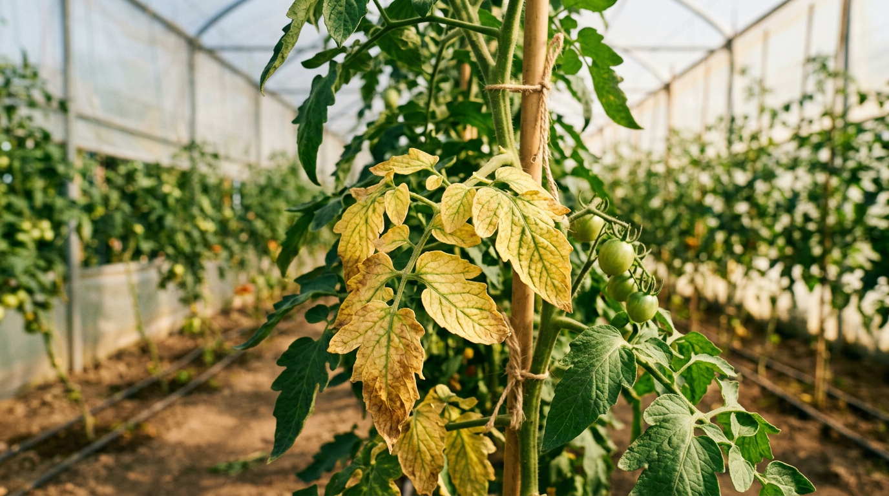
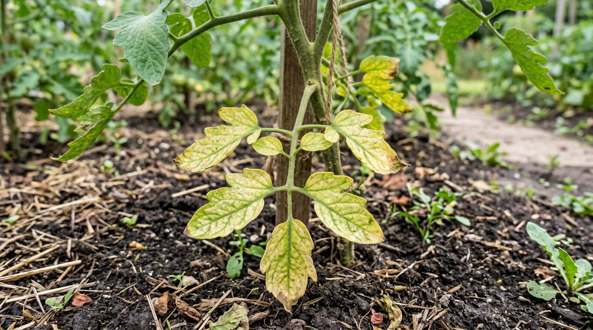
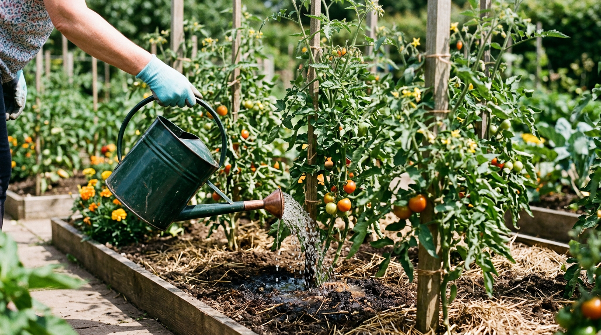
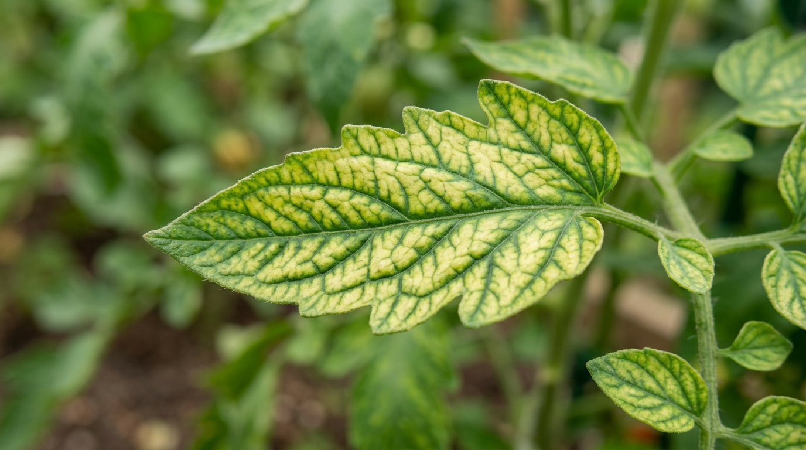
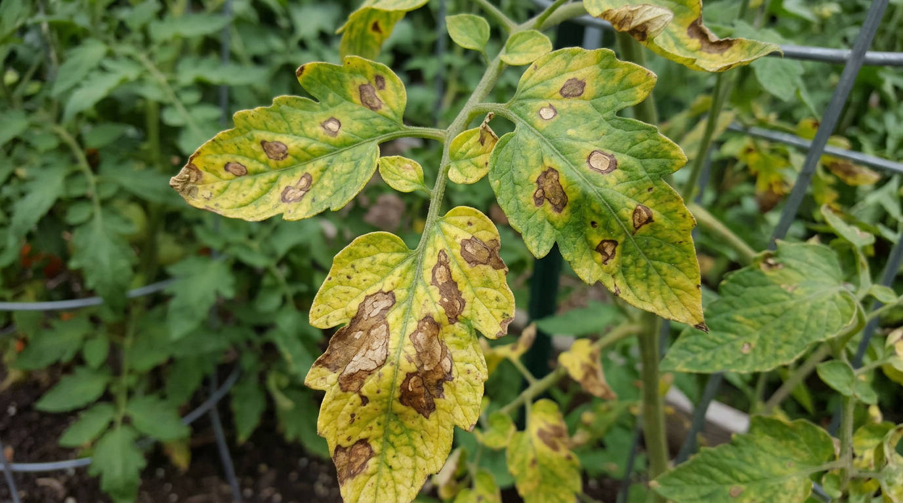
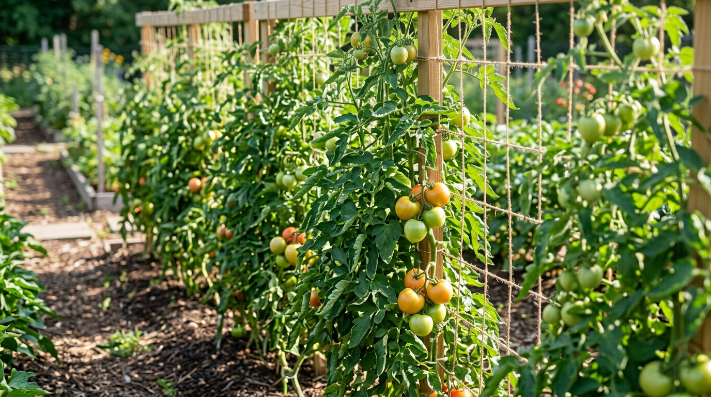

Пожелтение листьев у помидоров пугает каждого огородника: вроде бы куст рос здоровым, а тут листья теряют цвет и сохнут. Причин у этого много — от естественного старения нижних листьев до ошибок полива, нехватки питания, болезней и вредителей. И чтобы не потерять урожай, важно правильно понять, что именно происходит с растением. В этой статье разберём, почему желтеют листья у помидоров и что делать в каждом случае: как влияют полив, питание, холод, болезни и вредители, и как не допустить проблемы.

## 🟡 Почему желтеют листья у помидоров: главные причины

Пожелтение листьев — это всегда сигнал, что растению чего-то не хватает или что-то ему мешает. У томатов основные причины такие:

- **Естественное старение** нижних листьев — самый частый и безобидный случай.
- **Ошибки полива** — неравномерный, избыточный или недостаточный.
- **Нехватка питания** — дефицит азота, магния, калия, железа.
- **Холод и стресс** — после высадки рассады или при похолодании.
- **Болезни** — фитофтора, бурая пятнистость, увядания.
- **Вредители** — белокрылка, тля, паутинный клещ.

Чтобы быстро сориентироваться, держите таблицу-подсказку: по характеру пожелтения часто можно сразу понять причину.

| Как желтеет лист | Вероятная причина |
|------------------|-------------------|
| Единичные нижние листья | Естественное старение |
| Нижние листья бледные, мелкие | Нехватка азота |
| Жёлтая ткань между зелёными жилками | Нехватка магния |
| Жёлтая кайма по краям листа | Нехватка калия |
| Хлороз верхних молодых листьев | Нехватка железа |
| Бурые пятна, лист желтеет и сохнет | Фитофтора или пятнистость |
| Желтеет и вянет одна сторона куста | Фузариозное увядание |

Разберём каждую причину подробнее — и сразу что с ней делать.

## 🍂 Естественное старение нижних листьев

Начнём с самого частого и неопасного. Если желтеют **единичные самые нижние листья**, а остальной куст здоров, — это нормальный процесс. По мере роста растение перенаправляет силы вверх, к плодам, и старые нижние листья отмирают. Особенно это заметно, когда куст уже плодоносит: всё питание идёт в наливающиеся плоды, а нижние листья, до которых почти не доходит свет, отмирают за ненадобностью.

**Что делать:** такие листья просто аккуратно удаляют — это улучшает проветривание и снижает риск болезней. Удаляют их в сухую погоду, обрывая или срезая у самого стебля. Тревожиться стоит, только если пожелтение становится массовым или поднимается выше, к молодым листьям.

## 💧 Ошибки полива

Томаты не любят крайностей, и неправильный полив — частая причина пожелтения.

При **недостатке воды** листья вянут и желтеют, особенно в жару. При **избытке влаги** корни задыхаются и подгнивают, и листья тоже желтеют — картина похожа на засуху, хотя причина обратная. Особенно вредны томатам **резкие перепады**: то пересушка, то обильный залив. Помидоры предпочитают редкий, но обильный полив под корень, а не частое поверхностное смачивание.

**Что делать:** поливайте помидоры тёплой водой строго под корень, реже, но обильно, чтобы влага доходила до глубоких корней. Между поливами верхний слой почвы должен слегка подсыхать. Мульчирование помогает удерживать влагу и избегать резких колебаний. В отличие от огурцов, томаты любят более сухой воздух, поэтому переувлажнения они не прощают. Поливают помидоры утром или вечером, примерно 2–3 раза в неделю в зависимости от погоды, а в теплице — реже, чем в открытом грунте. Признак правильного режима: листья к вечеру упругие, почва на глубине влажная, но не мокрая.

## 🍽️ Нехватка питания

В период активного роста и плодоношения томатам часто не хватает элементов, и дефицит каждого проявляется по-своему.

- **Азот.** Бледнеют и желтеют нижние листья, новые мельчают, куст слабый и тонкий.
- **Магний.** Желтеет ткань между жилками, сами жилки остаются зелёными (мраморность) — очень частая причина пожелтения у томатов, особенно на нижних листьях.
- **Калий.** По краям листьев появляется жёлтая, затем подсыхающая кайма; плоды наливаются неравномерно.
- **Железо.** Желтеют молодые верхние листья (хлороз), жилки при этом остаются зелёными.

**Что делать:** подкормите по выявленному дефициту. При нехватке магния хорошо помогает внекорневая подкормка раствором сульфата магния, при дефиците калия — зольный настой или сульфат калия, при нехватке азота — комплексная или органическая подкормка. Для томатов также важны кальций (его дефицит вызывает вершинную гниль плодов) и бор (улучшает завязь), поэтому в период плодоношения полезны комплексные подкормки с микроэлементами. Помните: летом азот томатам дают умеренно, иначе куст начнёт жировать — гнать ботву в ущерб плодам. Магниевый дефицит у томатов встречается особенно часто, поэтому при пожелтении между жилками в первую очередь подозревают именно нехватку магния, а не болезнь. Подробно о питании — в статье о [летних подкормках овощей](https://mir-doma.pro/letnie-podkormki-ovoshchey/).

## 🌡️ Холод и стресс

Помидоры теплолюбивы, и резкие похолодания для них стресс: при низкой температуре корни хуже усваивают питание, и листья желтеют. Часто нижние листья желтеют и **после высадки рассады** — это нормальная адаптация к новому месту, которая вскоре проходит. Стресс могут вызвать и пересадка, и резкие перепады дневных и ночных температур.

**Что делать:** в похолодание укрывайте растения агроволокном, в теплице закрывайте форточки на ночь. После высадки дайте кустам время прижиться и поддержите внекорневой подкормкой с микроэлементами. В холодную погоду сократите полив — в холодной почве корни всё равно плохо пьют воду. Если рассада желтеет сразу после высадки, не спешите подкармливать «на всякий случай»: дайте кустам 1–2 недели прижиться, и чаще всего цвет восстанавливается сам.

## 🦠 Болезни

Пожелтение часто оказывается первым признаком болезни, и здесь важно действовать быстро.

- **Фитофтороз.** На листьях появляются бурые расплывчатые пятна, ткань вокруг желтеет и засыхает; снизу бывает белёсый налёт. Самая опасная болезнь томатов, особенно во второй половине лета. Подробно — в статье о [фитофторе на помидорах](https://mir-doma.pro/fitoftora-na-pomidorah/).
- **Бурая пятнистость (кладоспориоз).** Жёлтые пятна сверху листа и оливково-бурый налёт снизу; частая проблема в теплицах при высокой влажности.
- **Фузариозное и вертициллёзное увядание.** Листья желтеют и поникают, нередко с одной стороны куста; поражена проводящая система, и растение увядает, несмотря на полив.
- **Мозаика.** Листья покрываются жёлто-зелёным мозаичным рисунком, деформируются — это вирусное заболевание.

**Что делать:** при первых признаках уберите поражённые листья, наладьте проветривание и снизьте влажность. Грибковые болезни на ранней стадии лечат биопрепаратами (Фитоспорин), при сильном поражении — фунгицидами. Вирусные болезни не лечатся, поражённые растения удаляют. Главная защита — полив под корень тёплой водой, проветривание и профилактические обработки.

Большинство грибковых болезней томатов развиваются в сырости и тепле, поэтому в теплице критично важны проветривание и контроль влажности. Поражённые листья не оставляют на грядке и не кладут в компост — их уничтожают, чтобы не разносить споры. А загущённые непролазные кусты болеют чаще, поэтому грамотное формирование — это ещё и профилактика.

## 🐛 Вредители

Сосущие вредители высасывают из листьев соки, и те желтеют.

- **Белокрылка.** Мелкие белые мошки взлетают при касании куста, особенно в теплице; листья желтеют и покрываются липким налётом.
- **Тля.** Колонии на верхушках и нижней стороне листьев, которые желтеют и скручиваются. О борьбе — в статье о том, [как избавиться от тли](https://mir-doma.pro/kak-izbavitsya-ot-tli/).
- **Паутинный клещ.** Мелкие жёлтые точки на листьях и тонкая паутинка снизу; активизируется в жару и сухость.

**Что делать:** осмотрите нижнюю сторону листьев. При обнаружении вредителей применяйте народные средства и биопрепараты на ранней стадии или инсектициды (против клеща — акарициды) при сильном поражении. Чем раньше замечен вредитель, тем проще справиться. Белокрылка особенно досаждает в теплице, поэтому там полезно вешать жёлтые клеевые ловушки, на которые она слетается. Паутинный клещ, наоборот, боится влажности — регулярное проветривание и опрыскивание сдерживают его.

## ☀️ Солнечные ожоги

Жёлто-белые пятна, появившиеся после полива в солнечный день, — это солнечный ожог: капли воды сработали как линзы. Поэтому томаты не поливают по листьям днём, а только под корень. Такое пожелтение не опасно и не распространяется.

## 🏠 Помидоры в теплице и открытом грунте

Где растут томаты, влияет на причины пожелтения. В **теплице** на первый план выходят болезни (бурая пятнистость, фитофтора) и белокрылка: им способствуют духота, конденсат и перепады дневных и ночных температур. Главные меры — регулярное проветривание, контроль влажности и притенение в сильную жару.

В **открытом грунте** томаты чаще страдают от холода, ветра и резких перепадов погоды, а во второй половине лета — от фитофторы, которую провоцируют холодные росы и дожди. Здесь важнее защита от похолоданий и профилактические обработки. Базовый уход в обоих случаях одинаков: полив тёплой водой под корень, умеренные подкормки, формирование куста и своевременный осмотр.

## ✅ Что делать: краткий алгоритм

Чтобы не растеряться, действуйте по порядку:

1. **Осмотрите растение.** Где желтеют листья — снизу, сверху, по краям, между жилками? Есть ли пятна, налёт, вредители?
2. **Исключите норму.** Если желтеют единичные нижние листья, а куст здоров, — это старение, просто удалите их.
3. **Проверьте полив.** Нет ли пересушки, перелива или резких перепадов?
4. **Определите дефицит.** По характеру пожелтения поймите, какого элемента не хватает, и подкормите.
5. **Проверьте на болезни и вредителей** и обработайте при необходимости.
6. **Уберите поражённые листья** и наладьте уход.

Не пытайтесь лечить «всё сразу»: сначала определите главную причину, устраните её, а потом при необходимости добавляйте остальные меры. Частая ошибка — при любом пожелтении сразу заливать кусты водой и усиленно подкармливать. Если причина в переувлажнении или болезни, такими действиями можно только усугубить проблему.

Понаблюдайте за растением день-два после принятых мер: если новые листья растут здоровыми, значит, причину вы определили верно.

## 🌿 Народные средства при пожелтении

Поддержать томаты, пока вы устраняете причину, помогут проверенные народные средства:

- **Зольный настой.** Стакан золы на 10 л воды, настоять сутки, полить под корень — восполняет калий, особенно при краевом пожелтении.
- **Раствор сульфата магния.** Опрыскивание по листу при магниевом хлорозе (мраморном пожелтении) быстро возвращает листьям зелень.
- **Молочно-йодный раствор.** Литр молока и 15–20 капель йода на 10 л воды — укрепляет листья и сдерживает грибковые болезни.
- **Настой чеснока.** Опрыскивание помогает от грибков и сдерживает вредителей.

Народные средства хороши как поддержка и профилактика, но при сильном поражении болезнью не заменят биопрепаратов и фунгицидов.

## 🛡️ Профилактика пожелтения

Предупредить проблему проще, чем лечить. Несколько правил сохранят листья зелёными весь сезон:

- Поливайте тёплой водой под корень, редко, но обильно, без резких перепадов.
- Регулярно и умеренно подкармливайте, не злоупотребляя азотом летом.
- [Пасынкуйте и формируйте кусты](https://mir-doma.pro/pasynkovanie-pomidorov/), удаляйте нижние листья — это улучшает проветривание.
- Проветривайте теплицу, не допуская духоты и высокой влажности.
- Не загущайте посадки и мульчируйте почву.
- Проводите профилактические обработки от фитофторы во второй половине лета.
- Поддерживайте баланс питания: не перекармливайте азотом и не забывайте про магний и калий.
- Чередуйте культуры по грядкам (севооборот) — это снижает накопление болезней в почве.

Кстати, если у вас в огороде желтеют не только томаты, загляните в статью о том, [почему желтеют листья у огурцов](https://mir-doma.pro/zhelteyut-listya-u-ogurtsov/) — причины во многом схожи, но есть и важные различия.

## ❓ Частые вопросы

### Почему желтеют нижние листья у помидоров?

Чаще всего это естественное старение, нехватка азота или магния, а также адаптация после высадки рассады. Если желтеют единичные старые нижние листья — это норма; если процесс активный и поднимается выше, ищите причину в питании или поливе.

### Почему желтеют листья у помидоров в теплице?

В теплице частые причины — духота, высокая влажность и перепады температур, провоцирующие болезни (бурую пятнистость, фитофтору), а также белокрылка. Наладьте проветривание, поливайте тёплой водой под корень и не загущайте посадки.

### Что означает пожелтение между жилками листа?

Это типичный признак нехватки магния — очень частая причина пожелтения у томатов. Жилки остаются зелёными, а ткань между ними желтеет. Помогает внекорневая подкормка раствором сульфата магния.

### Чем подкормить помидоры, если желтеют листья?

Зависит от причины: при магниевом хлорозе — сульфат магния по листу, при краевом пожелтении — калий (зола, сульфат калия), при бледности нижних листьев — умеренная азотная или комплексная подкормка. Всегда подкармливают по влажной почве.

### Желтеют листья у рассады помидоров — что делать?

У рассады листья желтеют из-за нехватки света, тесной ёмкости, холода на подоконнике или дефицита азота и магния. Обеспечьте хорошее освещение, тепло, достаточный объём грунта и аккуратную подкормку.

### Помидоры желтеют после высадки в грунт — это нормально?

Да, лёгкое пожелтение нижних листьев после высадки рассады — обычная реакция на пересадку и смену условий. Растению нужно время прижиться. Если через 1–2 недели куст тронулся в рост, а молодые листья здоровы — всё в порядке.

### Можно ли вернуть зелёный цвет пожелтевшим листьям?

Уже пожелтевшие листья обычно не зеленеют — исключение составляет магниевый хлороз, при котором листья после внекорневой подкормки сульфатом магния могут частично восстановить цвет. В остальных случаях задача — не вылечить старые листья, а не дать желтеть новым, устранив причину.

### Как отличить нехватку питания от болезни?

При дефиците питания пожелтение равномерное и симметричное, без пятен и налёта, и связано с конкретным элементом (между жилками — магний, по краю — калий). При болезни появляются пятна, налёт, лист буреет и сохнет, поражение распространяется. Если есть пятна или налёт — это, скорее всего, болезнь.

### Опасно ли, если у помидоров желтеют листья?

Не всегда. Пожелтение единичных нижних листьев и лёгкая адаптация после высадки — норма. Опасно массовое пожелтение, особенно с пятнами или налётом, — это признак болезни или серьёзного дефицита, и здесь нужно быстро найти и устранить причину.

## Заключение

Пожелтение листьев у помидоров — это сигнал, который важно правильно прочитать. Чаще всего виноваты естественное старение нижних листьев, ошибки полива или нехватка магния и других элементов, реже — болезни и вредители. Осмотрите растение, определите причину по характеру пожелтения и действуйте: наладьте полив тёплой водой под корень, подкормите по дефициту, удалите старые листья или обработайте от болезней. А регулярный уход, проветривание и профилактика помогут сохранить кусты здоровыми до конца сезона — и подарят щедрый урожай спелых помидоров. И не забывайте: единичные пожелтевшие нижние листья — это норма, а не повод для паники. Паниковать стоит лишь тогда, когда желтеют молодые листья или появляются пятна.

А с каким пожелтением томатов сталкивались вы и что помогло? Делитесь опытом в комментариях и подписывайтесь, чтобы не пропустить новые статьи об уходе за огородом.
