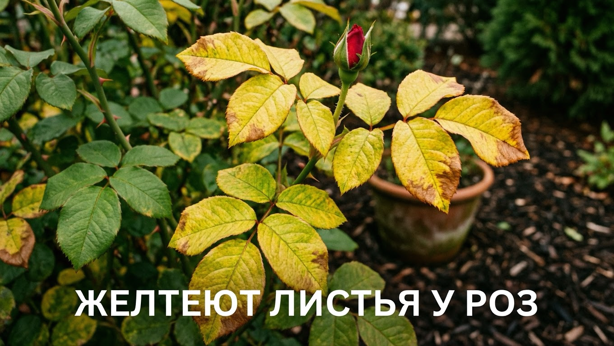
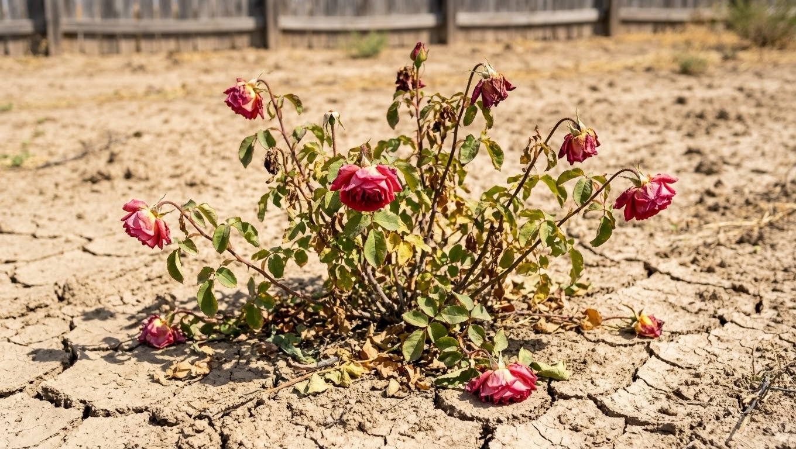
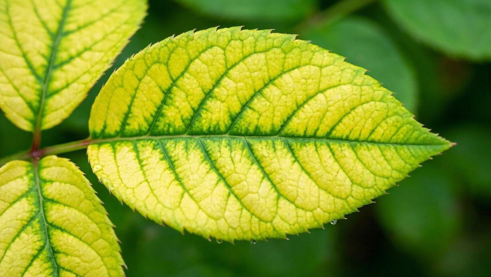
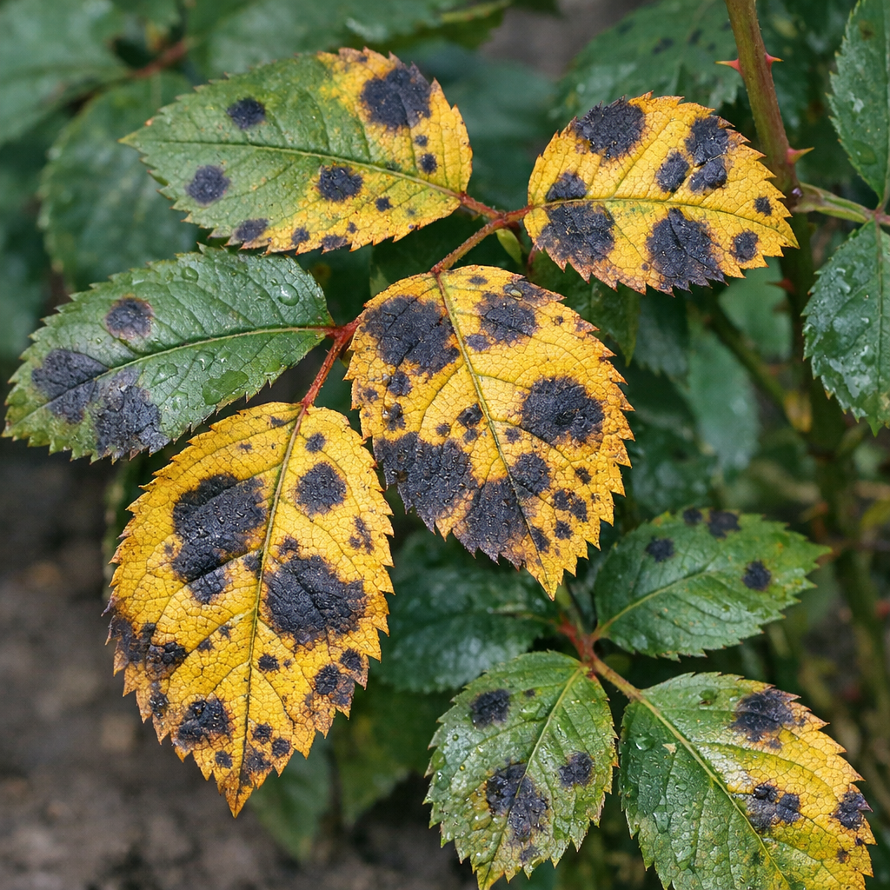
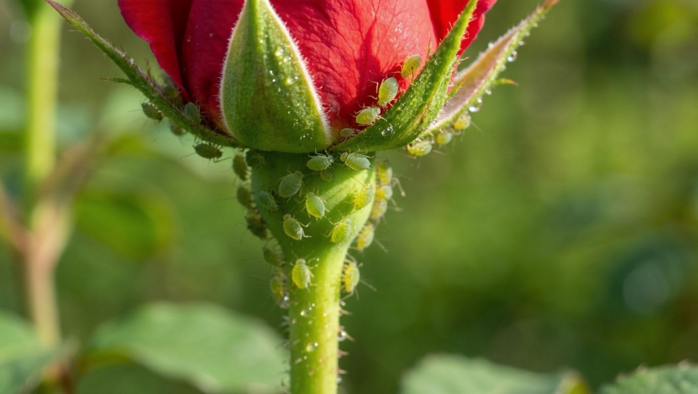
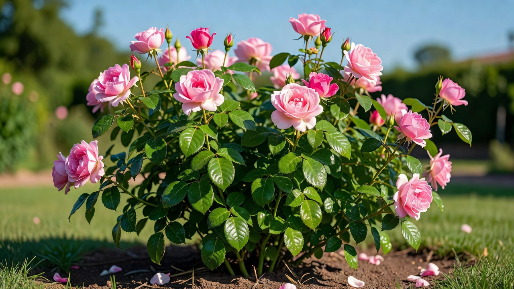

Пожелтевшая листва на розе всегда настораживает: только что куст был пышным и зелёным — и вдруг листья желтеют и осыпаются. Причин у этого несколько, от банальной ошибки в поливе до болезней и вредителей, и лечение в каждом случае своё. Разберём, почему желтеют листья у роз и что делать, чтобы вернуть кусту здоровую зелёную листву и обильное цветение.

## 🌹 Желтеют листья у роз — норма или проблема

Сначала оцените масштаб. **Единичные нижние листья**, которые желтеют и опадают ближе к осени или по мере старения куста, — это норма: растение сбрасывает отработавшую листву. А вот если **желтизна идёт массово**, охватывает молодые листья или сопровождается пятнами и опадением — это уже сигнал, что розе чего-то не хватает или она заболела. Дальше разберём причины по порядку.

## 💧 Ошибки полива

Полив — причина номер один. Опасны обе крайности:

- **Недостаток влаги.** В жару пересохшая земля не даёт корням питания, листья желтеют, вянут и сохнут по краям.
- **Переувлажнение.** Ещё чаще виноват перелив: в сырой почве корни задыхаются и подгнивают, лист желтеет равномерно и опадает. Особенно страдают розы на тяжёлых глинистых почвах и в низинах.

Розу поливают обильно, но не часто — редкий глубокий полив под корень лучше частого поверхностного. Между поливами верхний слой должен подсыхать.

## 🍽️ Нехватка питания и хлороз

Если полив в норме, дело часто в питании:

- **Нехватка азота** — листья бледнеют и желтеют равномерно, начиная с нижних, куст слабо растёт.
- **Хлороз (нехватка железа или магния)** — очень характерная картина: лист желтеет **между жилками, а сами жилки остаются зелёными**. Часто возникает на щелочных почвах, где железо есть, но недоступно корням.

Розам нужна регулярная подкормка в течение сезона. При хлорозе помогают препараты железа в доступной форме (хелат железа) и подкисление почвы. Общие принципы питания растений разбирали в статье про [летние подкормки](https://mir-doma.pro/letnie-podkormki-ovoshchey/) — для роз важен полный комплекс с микроэлементами.

## ☀️ Стресс: жара, солнце, пересадка

Иногда пожелтение — это реакция на стресс. В сильную жару и на самом солнцепёке роза может частично сбрасывать листья, экономя влагу. После пересадки куст тоже нередко желтит листву, пока приживаются корни. В этих случаях специального лечения не нужно: наладьте полив, при экстремальной жаре слегка притените куст и дайте ему прийти в себя.

## 🦠 Болезни

Если на желтеющих листьях есть пятна или налёт — это болезнь:

- **Чёрная пятнистость** — самая частая: на листьях тёмные пятна, вокруг них лист желтеет и опадает. Болезнь быстро оголяет куст.
- **Мучнистая роса** — белый мучнистый налёт, листья деформируются и желтеют.
- **Инфекционный хлороз** — пожелтение из-за вирусной или грибковой инфекции.

Больные листья обрывают и уничтожают, куст обрабатывают фунгицидами (медьсодержащими или специальными препаратами от пятнистости), а осенью проводят профилактическую обработку и уборку опавшей листвы, в которой зимует инфекция.

## 🐛 Вредители

Сокососущие вредители тоже вызывают пожелтение — они высасывают из листьев соки:

- **Тля** облепляет бутоны и молодые побеги, листья желтеют, скручиваются и деформируются. Как с ней бороться, подробно разобрали в статье [как избавиться от тли](https://mir-doma.pro/kak-izbavitsya-ot-tli/).
- **Паутинный клещ** — при жаре и сухости на нижней стороне листа появляется тонкая паутина, лист желтеет, покрывается мелкими светлыми точками и опадает.

Против вредителей помогают инсектициды и акарициды, а также регулярный осмотр куста — чем раньше замечено, тем проще справиться.

## 🎯 Что делать: диагностика по шагам

Чтобы не лечить наугад, действуйте по порядку:

1. **Оцените полив.** Проверьте, не пересохла и не переувлажнена ли почва, отрегулируйте режим.
2. **Осмотрите листья.** Желтизна между зелёными жилками — хлороз, нужна подкормка железом. Равномерная бледность — не хватает азота.
3. **Ищите пятна и налёт** — это болезнь, обрывайте поражённое и обрабатывайте фунгицидом.
4. **Проверьте изнанку листа и бутоны** — паутина или насекомые означают вредителей.
5. **Учтите погоду** — в жару и после пересадки дайте кусту время.

## 📋 Таблица: симптом и причина

| Как выглядит | Вероятная причина |
|---|---|
| Желтеют и опадают единичные нижние листья | Естественное старение — норма |
| Равномерная бледная желтизна, слабый рост | Нехватка азота |
| Желтизна между зелёными жилками | Хлороз (железо, магний) |
| Жёлтые листья с тёмными пятнами | Чёрная пятнистость |
| Белый налёт, деформация | Мучнистая роса |
| Желтизна + паутина, точки, липкость | Вредители (клещ, тля) |
| Массовое пожелтение после полива | Перелив, загнивание корней |

## 🛡️ Как не допустить пожелтения листьев

Здоровую розу проще сохранить, чем лечить пожелтевшую. Профилактика проста:

- **Правильный полив** — редкий, но глубокий, под корень, с подсыханием верхнего слоя между поливами. Мульча в приствольном круге удерживает влагу и бережёт корни от перегрева.
- **Регулярные подкормки** — сбалансированное питание с микроэлементами в течение сезона не даёт розе истощаться. На щелочных почвах профилактически вносят железо, чтобы не допустить хлороза.
- **Профилактические обработки** — весной и осенью куст опрыскивают от грибковых болезней, а опавшую листву убирают, ведь в ней зимует инфекция.
- **Осмотр на вредителей** — регулярно проверяйте бутоны и изнанку листьев: тлю и клеща проще остановить в самом начале.
- **Не загущайте посадки** — розам нужен свет и проветривание; в тесноте и сырости болезни развиваются быстрее.

При таком уходе роза стоит с плотной зелёной листвой и обильно цветёт весь сезон.

## ❓ Частые вопросы

**Почему желтеют и опадают листья у роз?**
Чаще всего из-за ошибок полива (особенно перелива), нехватки питания или болезней. Единичное пожелтение нижних листьев — норма, массовое — повод искать причину.

**Чем подкормить розы, если желтеют листья?**
Комплексным удобрением с микроэлементами. При хлорозе (желтизна между жилками) — препаратом железа в форме хелата. Азот помогает при общей бледности, но осенью его не вносят.

**Почему желтеют листья у розы в горшке?**
У комнатных и контейнерных роз причина обычно в переливе, тесном горшке или нехватке питания в ограниченном объёме почвы. Проверьте дренаж и режим полива.

**Что такое хлороз у роз и что делать?**
Это пожелтение листа между зелёными жилками из-за нехватки железа или магния, часто на щелочной почве. Помогают хелат железа и подкисление грунта.

**Желтеют нижние листья у розы — это нормально?**
Если желтеют и опадают единичные старые листья снизу — да, это естественный процесс. Тревожит только массовое пожелтение и поражение молодых листьев.

**Что делать, если у розы желтеют и сохнут листья одновременно?**
Сохнущие края обычно говорят о недостатке влаги или солнечном ожоге в жару. Наладьте глубокий полив под корень и при необходимости притените куст.

---

Пожелтение листьев у роз — это язык, которым куст сообщает о проблеме. Определите причину по характеру желтизны, наладьте полив и питание, при болезнях и вредителях обработайте куст — и роза быстро восстановит здоровую листву. А чем дополнить розы на клумбе, чтобы сад цвёл всё лето, — в подборке [многолетних цветов для дачи](https://mir-doma.pro/mnogoletnie-tsvety-dlya-dachi/).
