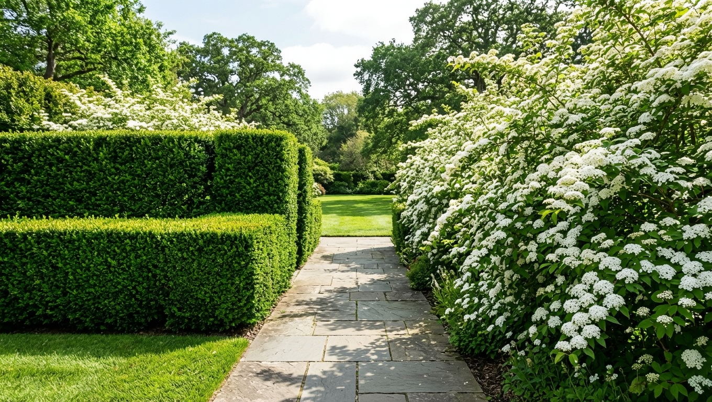
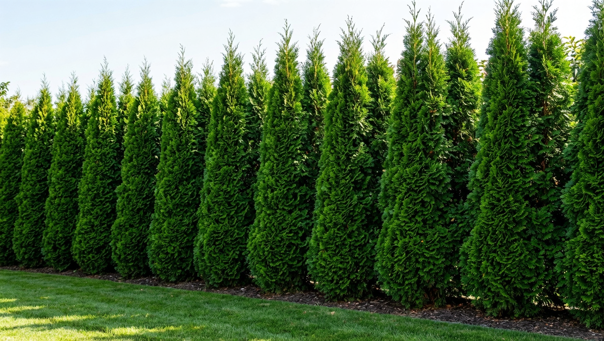
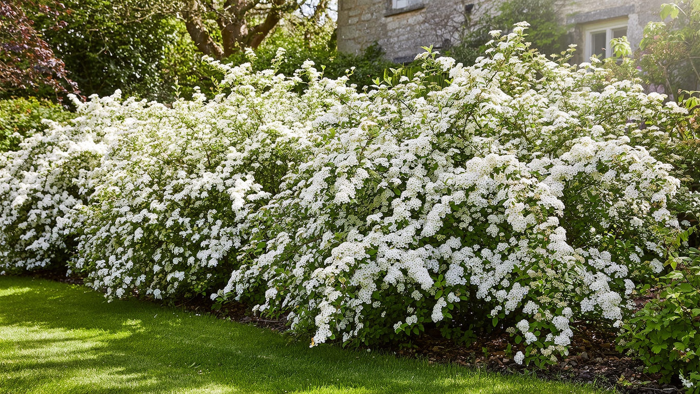
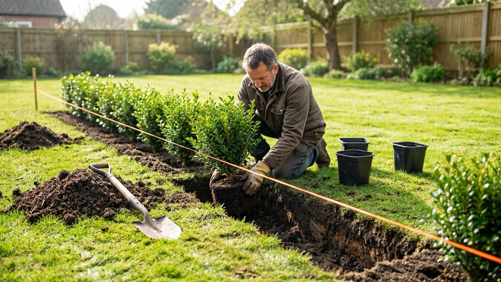
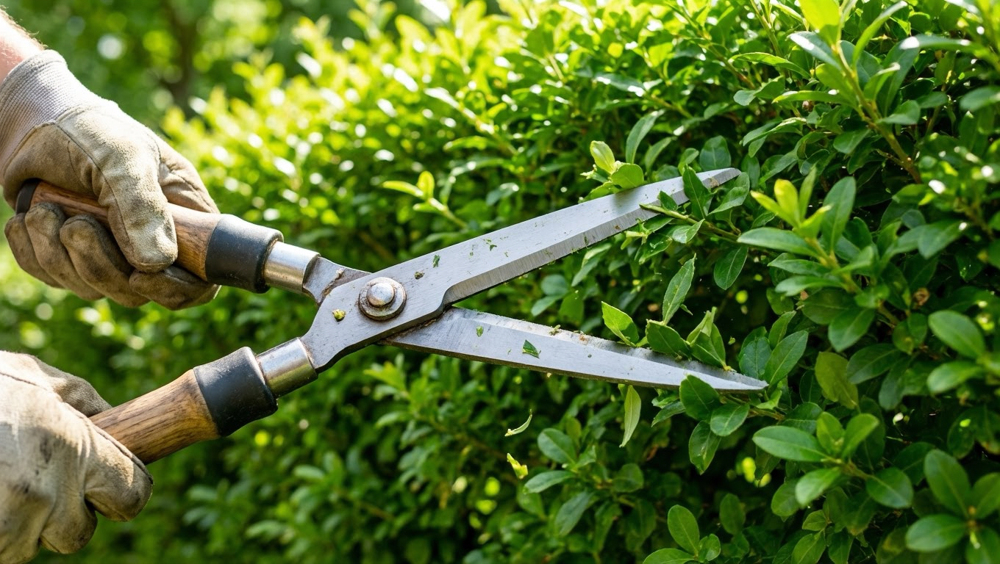

Живая изгородь — это зелёная ограда из растений, которая заменяет или дополняет обычный забор. Она защищает участок от пыли, ветра и посторонних глаз, гасит шум и делает сад по-настоящему уютным. Главный вопрос при её создании — что посадить, чтобы изгородь выросла плотной и быстро. Разберём лучшие быстрорастущие растения для живой изгороди, её виды, а также как правильно посадить и стричь зелёную ограду.

## 🌳 Чем хороша живая изгородь

У зелёной ограды масса плюсов перед глухим забором:

- защищает от пыли, ветра и уличного шума;
- закрывает участок от посторонних взглядов, создавая приватность;
- служит красивым фоном для сада и цветников;
- привлекает птиц и полезных насекомых;
- живёт десятилетиями и с годами становится только гуще.

Минус один — изгородь нужно ждать и за ней ухаживать. Поэтому и выбирают быстрорастущие растения, чтобы результат появился скорее. Как вписать изгородь в общий план участка — в статье про [планировку участка](https://mir-doma.pro/planirovka-uchastka-10-sotok/).

## 📏 Виды живых изгородей

Изгороди различают по нескольким признакам:

- **По высоте:** бордюры (до 0,5 м) для окантовки клумб и дорожек; средние (0,5–1,5 м) для зонирования; высокие (от 1,5 м) вместо забора.
- **По форме:** формованные (регулярно стригут, придавая чёткую геометрию) и свободнорастущие (растут естественно, их почти не стригут).
- **По листве:** вечнозелёные (хвойные) — красивы круглый год, но растут медленнее; листопадные — быстрее и часто цветут, но зимой стоят голыми.

Выбор зависит от задачи: для строгой ровной ограды берут формуемые растения, для цветущей и неприхотливой — свободнорастущие кустарники.

## 🌿 Быстрорастущие растения для изгороди

Вот проверенные растения, которые быстро дают плотную зелёную стену:

| Растение | Особенности |
|---|---|
| Туя западная | Вечнозелёная, хорошо стрижётся, плотная стена; растёт умеренно-быстро |
| Кизильник блестящий | Неприхотлив, отлично формуется, блестящая листва |
| Пузыреплодник | Очень быстрый, декоративная (пурпурная/жёлтая) листва |
| Дёрен | Быстрый, яркие побеги зимой, неприхотлив |
| Спирея | Быстрая, обильно цветёт, для свободной изгороди |
| Чубушник (садовый жасмин) | Высокий, душистое цветение |
| Барбарис | Колючий (защитный), красивая листва, формуется |
| Ива | Самый быстрый рост для высокой изгороди |
| Девичий виноград | Вьющийся, за сезон закрывает опору или сетку |

Для строгой формованной изгороди лучше всего подходят туя, кизильник и барбарис; для цветущей свободной — спирея, чубушник и пузыреплодник.

## 🌲 Хвойная или лиственная изгородь

Часто выбор сводится к тому, какую изгородь предпочесть — из хвойных или из лиственных растений:

- **Хвойные (туя, ель, можжевельник)** — вечнозелёные, красивы и зимой, дают плотную аккуратную стену. Но растут медленнее, стоят дороже, а некоторые виды плохо восстанавливаются после сильной обрезки.
- **Лиственные (кизильник, спирея, пузыреплодник, дёрен)** — растут заметно быстрее, дешевле, многие красиво цветут. Минус — на зиму сбрасывают листья, и изгородь стоит голой.

Универсального ответа нет: если важна зелень круглый год и строгий вид — берите хвойные; если нужен быстрый результат, цветение и экономия — лиственные. Иногда их комбинируют, но проще ухаживать за изгородью из одного вида.

## 🌱 Как посадить живую изгородь

Посадка определяет, будет ли изгородь ровной и плотной:

- **Сроки.** Листопадные кустарники сажают весной или осенью, хвойные — весной или в начале осени, саженцы в контейнерах — весь сезон. Осень — хорошее время: растения успевают укорениться до зимы.
- **Разметка.** Натягивают шнур по линии будущей изгороди — чтобы ряд был идеально ровным.
- **Траншея.** Вместо отдельных ям копают сплошную траншею шириной 40–50 см, заправляют её плодородной почвой.
- **Расстояние.** Зависит от растения и желаемой плотности: для низких — 30–40 см между кустами, для высоких — 50–80 см. Для очень плотной стены сажают в два ряда в шахматном порядке.
- **Посадка и полив.** Растения высаживают на одном уровне, обильно поливают и мульчируют.

## ✂️ Уход и стрижка

Уход зависит от типа изгороди:

- **Формованную** стригут регулярно (2–3 раза за сезон), придавая форму. Важное правило — стричь **на конус, чтобы низ был шире верха**: тогда нижние ветви получают свет и не оголяются.
- **Свободнорастущую** почти не стригут — только санитарно убирают сухие и лишние ветви. Принципы такой обрезки те же, что и для ягодных кустарников (см. [обрезку смородины](https://mir-doma.pro/obrezka-smorodiny/)).

Первые пару лет молодую изгородь слегка подрезают для загущения, а всем растениям нужны полив в засуху и подкормки для быстрого роста.

## 🎯 Что выбрать под задачу

- **Быстро закрыть участок** — ива, пузыреплодник, дёрен, девичий виноград на опоре.
- **Плотная стриженая стена** — туя, кизильник, барбарис.
- **Цветущая изгородь** — спирея, чубушник, сирень.
- **Красиво круглый год** — вечнозелёная туя.
- **Защита (колючая)** — барбарис, боярышник.
- **Без стрижки** — свободнорастущие спирея, чубушник, дёрен.

## ❌ Частые ошибки

- **Слишком большое расстояние между кустами** — изгородь долго остаётся редкой и не смыкается.
- **Стрижка «прямоугольником»** — низ оголяется без света; правильно стричь на конус.
- **Одно растение не под климат** — теплолюбивые виды вымерзают, выбирайте зимостойкие.
- **Забыли про полив и подкормку** — без ухода быстрого роста не будет.

## ❓ Частые вопросы

**Какие растения быстрее всего растут для живой изгороди?**
Из кустарников — пузыреплодник, дёрен, спирея и ива, из вьющихся — девичий виноград. Они за пару сезонов дают плотную зелёную стену.

**Когда сажать живую изгородь?**
Листопадные кустарники — весной или осенью, хвойные — весной или в начале осени. Осенняя посадка удобна: растения укореняются до зимы. Контейнерные саженцы сажают весь сезон.

**На каком расстоянии сажать растения в изгороди?**
Для низких изгородей — 30–40 см между кустами, для высоких — 50–80 см. Для очень плотной стены сажают в два ряда в шахматном порядке.

**Как быстро растёт туя для изгороди?**
Туя западная растёт умеренно — в среднем 15–30 см в год. Плотную стену из неё формируют за несколько лет, зато она вечнозелёная и хорошо стрижётся.

**Чем стричь живую изгородь?**
Небольшую — садовыми ножницами для кустов, длинную — электрическим или бензиновым кусторезом. Инструмент должен быть острым, чтобы срезы были аккуратными.

**Какая живая изгородь не требует стрижки?**
Свободнорастущая из спиреи, чубушника, дёрена или сирени — её только санитарно прореживают. Такая изгородь выглядит естественно и цветёт.

---

Живая изгородь превращает границу участка в украшение сада и служит десятилетиями. Подберите быстрорастущие растения под свою задачу, посадите их ровным рядом и обеспечьте уход — и через пару сезонов зелёная стена закроет участок. А дополнить её у входа можно аккуратной оградой — например, [забором из профнастила](https://mir-doma.pro/zabor-iz-profnastila-svoimi-rukami/).
