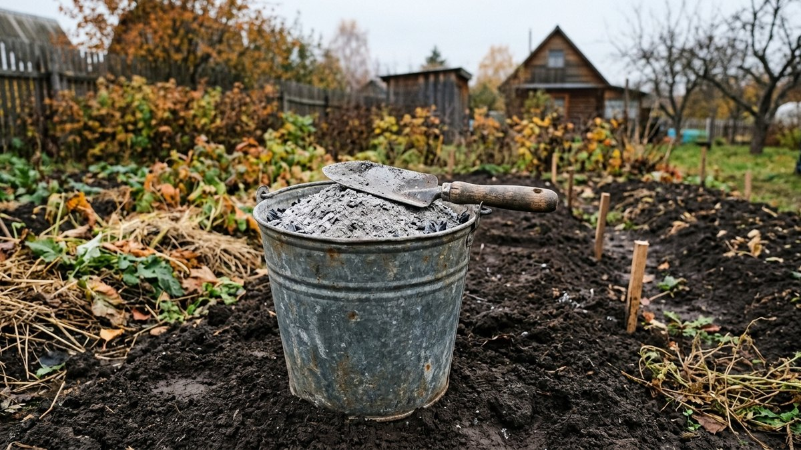
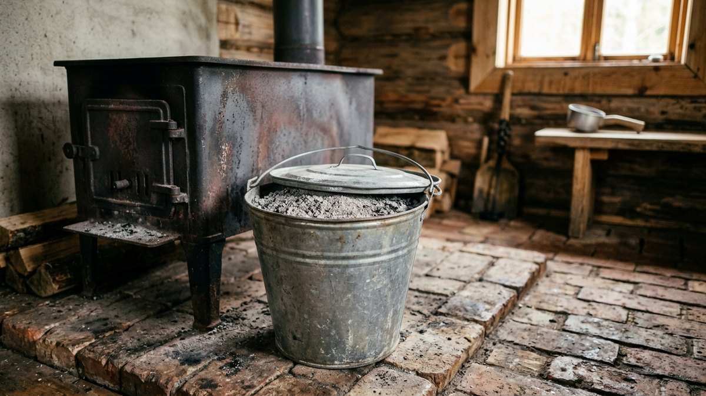
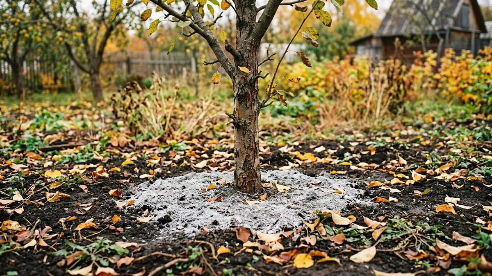
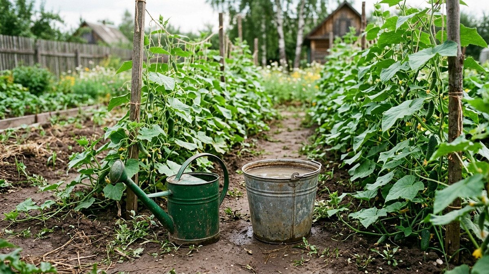
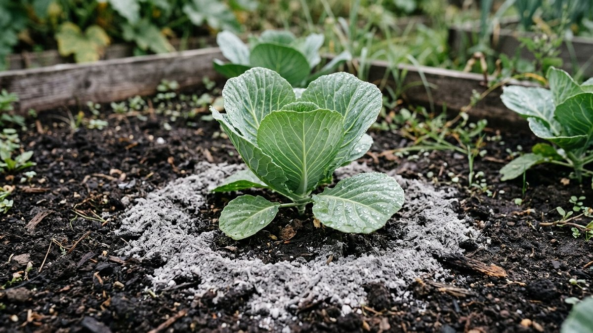

# Зола как удобрение: сколько вносить под каждую культуру, когда и с чем нельзя

Древесная зола — бесплатное удобрение, которое после бани и печи есть
почти на каждой даче. В ней много калия и кальция, есть фосфор и
микроэлементы, и при этом она раскисляет почву. Поэтому зола как
удобрение хороша не везде. Картофель, капуста и смородина отзываются
на неё урожаем, а голубике и гортензии она вредит. Ниже — дозы для
основных культур в граммах и стаканах, сроки внесения, рецепт настоя,
список того, с чем золу нельзя смешивать, и калькулятор. Он посчитает,
сколько золы понадобится на весь участок за сезон.

## Что в золе и чем она полезна

Состав зависит от того, что сгорело. Ориентиры для древесной золы:

| Элемент | Сколько в золе | Что даёт растению |
|---|---|---|
| Кальций (CaO) | 25–40% | Прочные клетки, защита от вершинной гнили, раскисление почвы |
| Калий (K₂O) | 5–12% | Сладость и лёжкость плодов, зимостойкость |
| Фосфор (P₂O₅) | 2–5% | Корни, цветение и завязь |
| Магний, бор, марганец | Следы | Микроэлементы для обмена веществ |

**Азота в золе нет**: он сгорает вместе с древесиной. Поэтому зола
не заменяет навоз или компост, а дополняет их.

Больше всего калия в золе лиственных пород, особенно берёзы, и в золе
соломы и подсолнечной лузги. В хвойной золе калия меньше, а фосфора и
кальция примерно столько же.

**Какую золу нельзя вносить:**

- **От угля и брикетов** с добавками. В ней мало калия, зато есть сера
  и тяжёлые металлы.
- **От крашеных, лакированных и пропитанных досок**, ДСП, фанеры. В
  дыму и золе остаются клей, свинец и антисептики.
- **От пластика, резины, глянцевой бумаги**, бытового мусора.
- **Залитую дождём.** Калий из золы легко вымывается водой: после
  нескольких дождей остаётся почти один кальций.

Золу из бани и печи, где жгут только чистые дрова, собирают в
металлическое ведро с крышкой. Храните её сухой, а в мешки и
пластиковую тару пересыпайте только полностью остывшей. Угли в золе
тлеют сутками.

## Кому зола нужна, а кому вредит

Зола подщелачивает почву. Для большинства овощей это плюс, для
растений кислых почв — прямой вред.

**Любят золу:**

- **Картофель** — калий повышает крахмалистость и лёжкость клубней.
- **Капуста, редис, репа** — кальций и калий; сухая зола по листьям
  отпугивает крестоцветную блоху.
- **Томаты, перец, баклажаны** — кальций защищает от [вершинной гнили
  томатов](https://mir-doma.pro/vershinnaya-gnil-tomatov/), калий
  улучшает вкус. Но если гниль уже появилась, одной золы мало: важнее
  ровный полив.
- **Огурцы, кабачки, тыквы** — калий во время плодоношения.
- **Лук и чеснок** — особенно при осенней посадке под зиму.
- **Смородина, крыжовник, клубника, виноград** — калий для сладости
  ягод и зимостойкости.
- **Яблоня, груша, вишня, слива** — по приствольному кругу.

**Не вносите золу:**

- **Под голубику, чернику, бруснику, клюкву, рододендроны, гортензии,
  азалии, вереск** — им нужна кислая почва (pH 4–5,5). Зола вызывает
  хлороз: листья желтеют между жилками.
- **На щелочных почвах** с pH выше 7 и на участках, где недавно
  вносили известь или доломитовую муку.
- **Под щавель и шпинат** в больших дозах: им ближе слабокислая почва.

Если не знаете кислотность, проверьте её до внесения. Это делают
полосками или по сорнякам: как определить pH и когда почве нужна не
зола, а настоящее известкование, разобрано в статье [известкование
почвы осенью](https://mir-doma.pro/izvestkovanie-pochvy-osenyu/).
Зола раскисляет слабо и подходит только для поддержания уровня pH.

## Сколько вносить: дозы по культурам

Удобная мерка — посуда с кухни:

- **1 столовая ложка** — около 6 г золы;
- **1 стакан 200 мл** — около 100 г;
- **литровая банка** — около 500 г;
- **ведро 10 л** — около 5 кг.

| Культура | Под перекопку | При посадке, в лунку | Подкормка за сезон |
|---|---|---|---|
| Картофель | 150–200 г/м² | 1–2 ст. л. | Перед окучиванием 1 стакан на 1 м² |
| Томаты, перец, баклажаны | 100–150 г/м² | 2–3 ст. л., перемешать с землёй | Настой 0,5 л под куст в начале плодоношения |
| Огурцы, кабачки, тыквы | 100–150 г/м² | 1 ст. л. | Настой 0,5 л под растение раз в 2–3 недели |
| Капуста, редис | 150–200 г/м² | 1–2 ст. л. | Опыление листьев от блохи |
| Морковь, свёкла | 100–150 г/м² | — | Настой в июле |
| Лук, чеснок | 100 г/м² | — | Настой в начале июня |
| Клубника | 100 г/м² | 1 ст. л. | 1 стакан на 1 м² после сбора ягод |
| Смородина, крыжовник | — | 1 стакан в яму | 1–2 стакана под куст осенью |
| Малина | — | — | 1 стакан на 1 м² весной |
| Яблоня, груша (взрослые) | — | 2–3 стакана в яму | 1–2 кг по приствольному кругу раз в 2–3 года |

**Предел для огорода — 200–300 г на 1 м² за сезон.** Если вносить
больше и каждый год, почва постепенно уходит в щелочь, и растения
перестают усваивать железо, марганец и фосфор. На тяжёлых глинистых
почвах дозу берут ближе к верхней границе, на песчаных — к нижней.

## Калькулятор: сколько золы нужно на сезон

Введите площадь грядок и число кустов и деревьев. Калькулятор посчитает
годовую норму по средним дозам из таблицы и переведёт её в вёдра и
стаканы. Пустые поля оставьте нулями.

<!-- wp:html -->

  
Калькулятор золы на сезон

  <label class="md-calc__label" for="mdZoK">Картофель, м²</label>
  <input type="number" id="mdZoK" class="md-calc__input" min="0" step="1" value="50">
  <label class="md-calc__label" for="mdZoT">Томаты, перец, баклажаны, кустов</label>
  <input type="number" id="mdZoT" class="md-calc__input" min="0" step="1" value="20">
  <label class="md-calc__label" for="mdZoO">Огурцы, кабачки, тыквы, м²</label>
  <input type="number" id="mdZoO" class="md-calc__input" min="0" step="1" value="6">
  <label class="md-calc__label" for="mdZoC">Капуста, корнеплоды, лук и чеснок, м²</label>
  <input type="number" id="mdZoC" class="md-calc__input" min="0" step="1" value="10">
  <label class="md-calc__label" for="mdZoS">Клубника и малина, м²</label>
  <input type="number" id="mdZoS" class="md-calc__input" min="0" step="1" value="8">
  <label class="md-calc__label" for="mdZoB">Кустов смородины и крыжовника</label>
  <input type="number" id="mdZoB" class="md-calc__input" min="0" step="1" value="4">
  <label class="md-calc__label" for="mdZoA">Взрослых плодовых деревьев (подкормка в этом году)</label>
  <input type="number" id="mdZoA" class="md-calc__input" min="0" step="1" value="2">
  
Заполните поля

<!-- /wp:html -->

## Когда вносить: осень или весна

- **На глинистых и суглинистых почвах — осенью** под перекопку. Зимой
  калий и кальций успевают распределиться в пахотном слое, и весной
  растения получают их сразу. Осенью же золу вносят под чеснок и лук
  при посадке под зиму: как готовят грядку и чем ещё заправляют её
  перед посадкой, разобрано в статье [чеснок под
  зиму](https://mir-doma.pro/chesnok-pod-zimu/).
- **На песчаных и супесчаных — весной**, перед посадкой. Талая вода
  вымывает калий из лёгкой почвы ещё до начала сезона.
- **Летом — подкормки** настоем или сухой золой под рыхление в начале
  плодоношения.

Сухую золу всегда заделывают в почву на 5–10 см. На поверхности её
сдувает ветром, и она образует корку. Под деревья и кусты её рассыпают
по приствольному кругу и прикрывают граблями. Подробнее о том, что ещё
вносят осенью под сад и огород и в каком порядке, — в статье [осенние
подкормки](https://mir-doma.pro/osennie-podkormki/).

## Настой золы для подкормки

Настой работает быстрее сухой золы: калий уже в растворе, и растения
получают его в тот же день.

1. **Насыпьте 1 стакан золы (100 г) в ведро** и залейте 10 л тёплой
   воды.
2. **Настаивайте сутки-двое**, периодически перемешивая.
3. **Перед поливом размешайте**: осадок тоже полезен.
4. **Поливайте под корень по влажной земле**: 0,5 л под томат или
   огурец, 1 л под куст смородины. Сначала полейте чистой водой, иначе
   щелочной раствор обожжёт корни.

Для опрыскивания по листу настой процеживают и на 10 л добавляют 30–40
г хозяйственного мыла для прилипания. Так обрабатывают капусту и
огурцы от тли и блохи в вечерние часы. Это подкормка и слабая защита
одновременно, но не замена средствам при сильном нашествии.

## С чем золу нельзя смешивать

Зола — щёлочь. При встрече с некоторыми удобрениями она либо
«сжигает» азот, либо запирает фосфор.

| Не смешивать с | Что происходит | Как правильно |
|---|---|---|
| Свежий навоз, помёт | Азот улетучивается аммиаком, теряется большая часть пользы навоза | Навоз осенью, золу весной, или наоборот; помётные подкормки чередовать с зольными через неделю |
| Мочевина, аммиачная селитра, сульфат аммония | То же: азот уходит в воздух | Разнести по времени минимум на неделю, лучше на 2–3 |
| Суперфосфат | Кальций переводит фосфор в труднодоступную форму | Вносить в разные сроки или в разные слои |
| Известь, доломитовая мука | Почва переизвесткуется | В год известкования золу не вносят |

**С компостом и перепревшим перегноем** золу смешивать можно. Пара
стаканов на кубометр компоста ускоряет созревание и сдвигает
кислотность ближе к нейтральной. Как ещё ускорить компост к весне,
описано в статье [как ускорить созревание компоста
осенью](https://mir-doma.pro/kak-uskorit-sozrevanie-komposta-osenyu/).

## Зола против вредителей: что работает

- **Слизни.** Полоса сухой золы вокруг грядки или куста работает, пока
  она сухая: после дождя или полива защиту нужно обновлять. Другие
  способы защиты собраны в статье [слизни на
  огороде](https://mir-doma.pro/slizni-na-ogorode/).
- **Крестоцветная блоха.** Опыление влажных утренних листьев капусты и
  редиса смесью золы с табачной пылью 1:1 отпугивает жуков на несколько
  дней.
- **Колорадский жук и тля.** Опыление золой по росе мешает личинкам,
  но при сильном заселении этого мало. Что ещё работает без химии и в
  каком сочетании, разобрано в статье [колорадский жук без
  химии](https://mir-doma.pro/koloradskiy-zhuk-bez-himii/).

Работайте с золой в перчатках и в очках, в безветренную погоду.
Щелочная пыль раздражает глаза и кожу.

## Частые ошибки

- **Зола прямо в лунку к корням рассады.** Щёлочь обжигает корни.
  Золу перемешивают с землёй в лунке и только потом сажают.
- **Зола вместе со свежим навозом** «чтобы за один раз». Половина
  азота улетает в воздух.
- **Зола под голубику и гортензию.** Хлороз через месяц, растение
  хиреет годами.
- **Зола из печки, где жгли всё подряд**, включая пакеты и крашеные
  доски. Тяжёлые металлы оседают в почве надолго.
- **Ведро золы на грядку каждый год.** Почва уходит в щелочь, и
  растения начинают страдать от нехватки железа и марганца.
- **Хранение под открытым небом.** После дождей калий вымывается, и
  остаётся почти одна известь.

## Частые вопросы

### Для каких растений зола как удобрение подходит

Для большинства овощей, ягодников и плодовых деревьев: картофеля,
капусты, томатов, огурцов, лука, чеснока, клубники, смородины,
яблони. Не подходит растениям кислых почв: голубике, чернике,
клюкве, рододендронам, гортензиям, а также щелочным почвам с pH выше 7.

### Как правильно применять золу как удобрение

Под перекопку осенью на глинистых почвах или весной на песчаных, по
100–200 г на 1 м², с заделкой в почву. При посадке — 1–3 столовые ложки
в лунку, перемешав с землёй. Летом — настоем 100 г на 10 л воды под
корень по влажной земле.

### Сколько золы вносить на 1 м²

Под перекопку — 100–200 г, то есть 1–2 стакана. За сезон на огороде не
больше 200–300 г на 1 м², иначе почва постепенно уходит в щелочь.

### Можно ли вносить золу осенью

Да, на глинистых и суглинистых почвах осень — лучшее время: к весне
калий и кальций распределятся в почве. На песчаных почвах с осени калий
вымоется талой водой, там золу вносят весной.

### Можно ли смешивать золу с навозом

Со свежим навозом и помётом — нет: азот улетучивается аммиаком. С
перепревшим перегноем и компостом — можно. Если нужно внести и то, и
другое, разнесите их по сезонам: навоз осенью, золу весной. Как
чередовать золу с настоем помёта летом — в статье про
[куриный помёт как удобрение](https://mir-doma.pro/kurinyy-pomet-kak-udobrenie/).

### Как сделать настой золы для подкормки

Стакан золы, около 100 г, на ведро тёплой воды. Настаивать сутки-двое,
перед поливом размешать. Поливать под корень по предварительно
увлажнённой земле, 0,5–1 л под растение.
