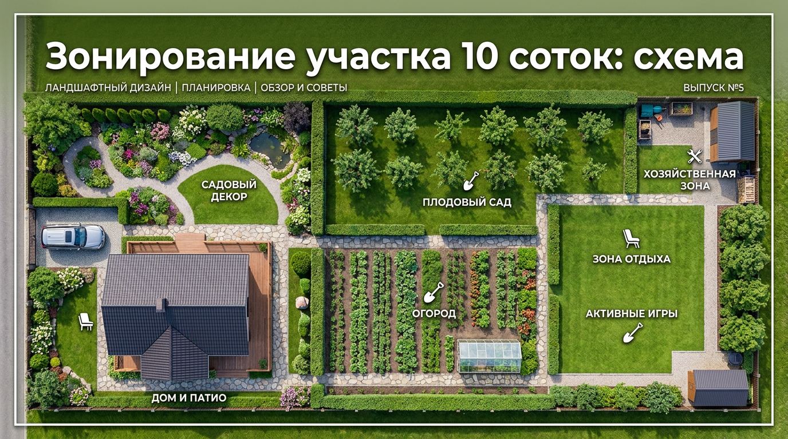
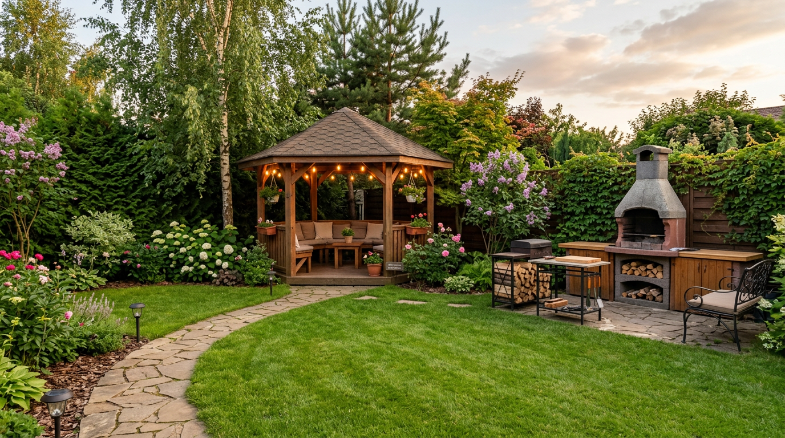
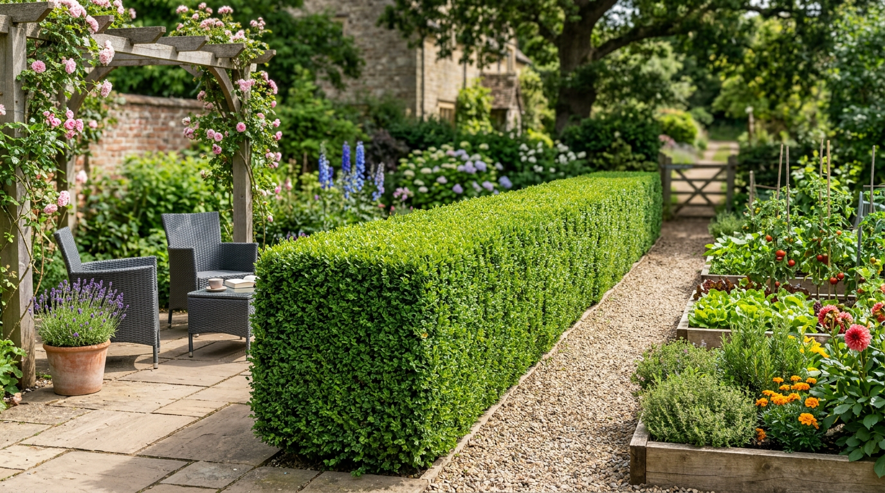
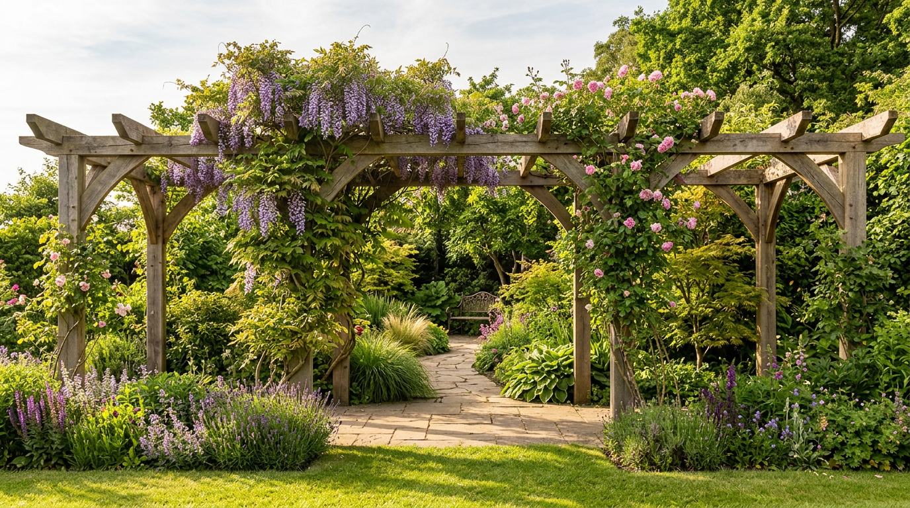
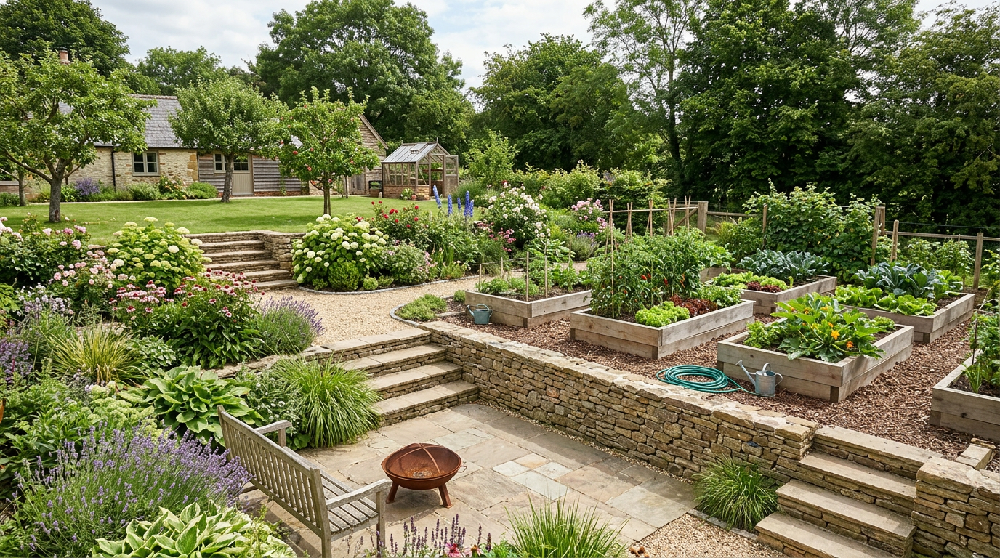
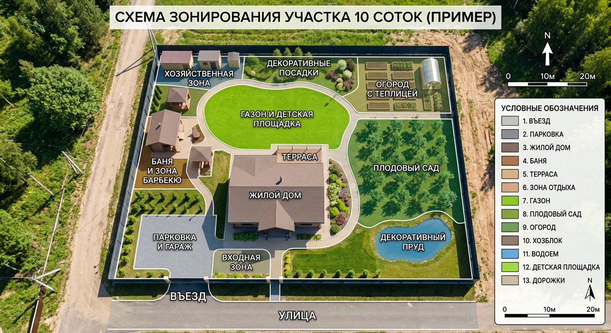

Зонирование — основа удобного и красивого участка. Когда земля разбита на продуманные функциональные зоны, на ней комфортно и работать, и отдыхать, а сам участок выглядит цельно и аккуратно. На 10 сотках места достаточно, чтобы выделить и зону отдыха, и сад с огородом, и хозяйственный уголок — главное, правильно их расположить и разделить. В этой статье разберём зонирование участка 10 соток: какие бывают схемы, чем разделяют зоны и как это выглядит на конкретных примерах.

Это статья из цикла о планировке. Общая логика разобрана в основной статье — [планировка участка 10 соток](https://mir-doma.pro/planirovka-uchastka-10-sotok/), а здесь сосредоточимся именно на схемах зонирования.

## 🧭 Что такое зонирование и зачем оно нужно

Зонирование — это деление участка на функциональные зоны, у каждой из которых своя задача. Благодаря ему пространство становится логичным: отдых не пересекается с грядками, хозяйственные постройки не портят вид, а каждый уголок используется по назначению.

На участке 10 соток обычно выделяют пять основных зон: **жилую** (дом, въезд, парковка), **зону отдыха** (беседка, газон, мангал), **садово-огородную** (грядки, теплица, сад), **хозяйственную** (сарай, компост) и **въездную**. Подробно состав зон разобран в основной статье, а здесь посмотрим, как их можно расположить и разделить.

## 📊 Схемы зонирования участка

Существует несколько базовых схем зонирования — выбор зависит от формы участка и ваших задач.

### Линейная (ленточная) схема

Зоны располагают параллельными полосами, одна за другой — от въезда вглубь участка. Это простое и удобное решение для прямоугольных и узких участков: дом у входа, за ним отдых, дальше сад и хозблок. Для вытянутых участков это почти безальтернативный вариант — подробнее в статье о [планировке узкого участка](https://mir-doma.pro/planirovka-uzkogo-uchastka-10-sotok/). Главное преимущество линейной схемы — простота и логичность: двигаясь от въезда вглубь, вы последовательно проходите все зоны.

### Диагональная схема

Зоны и дорожки располагают под углом к границам участка. Диагональ зрительно расширяет пространство и делает его интереснее, поэтому такая схема хороша для квадратных участков, которые иначе выглядят монотонно. Диагональные дорожки и грядки кажутся длиннее, а участок — больше, чем есть на самом деле.

### Центрическая схема

Зоны группируют вокруг центрального элемента — газона, площадки, водоёма или клумбы. Получается уютная композиция с акцентом в середине, от которого расходятся остальные зоны. Такая схема хорошо объединяет участок вокруг главного элемента и удобна, когда есть выразительный центр — например, красивый газон или пруд.

### Свободная (пейзажная) схема

Зоны разделяют плавными, извилистыми линиями без строгой геометрии. Такая схема создаёт естественный, природный вид и хорошо смотрится на участках с рельефом и в садах в пейзажном стиле. Плавные линии скрывают границы участка и делают сад загадочным — не всё видно сразу, хочется пройти и рассмотреть.

## 🌿 Чем разделяют зоны

Разделители зон не только обозначают границы, но и украшают участок. Граница между зонами вовсе не обязана быть глухим забором — есть много изящных приёмов:

- **Живые изгороди и кустарники** — мягко отделяют зоны и создают приватность.
- **Перголы, арки и шпалеры** с вьющимися растениями — красивый «вход» из одной зоны в другую.

- **Дорожки** — сами по себе задают границы и связывают зоны.
- **Цветники и миксбордеры** — нарядно разделяют пространство.
- **Разные уровни** — террасы, приподнятые грядки, ступени визуально делят участок.

- **Смена покрытия** — газон, плитка, гравий обозначают разные зоны.
- **Малые формы** — декоративные ширмы, экраны, невысокие заборчики.

Лучше всего работает сочетание приёмов: например, дорожка плюс цветник вдоль неё или пергола на входе в зону отдыха.

## 💡 Примеры зонирования 10 соток

Покажем три типовых сценария, от которых удобно отталкиваться:

1. **Семейный (баланс).** Дом и парковка у въезда, за домом — зона отдыха с беседкой и детской площадкой, в средней части — сад и огород, в дальнем углу — хозблок. Всё уравновешено, места хватает на всё.
2. **Для отдыха.** Дом у входа, просторная зона отдыха с газоном, мангалом и беседкой, декоративный сад и небольшие грядки, компактный хозблок. Упор на комфорт и красоту.
3. **Для огородника.** Дом и небольшая зона отдыха у дома, максимум площади под сад, огород и теплицу, удобный хозблок рядом с грядками. Упор на урожай.

Если на участке планируется много построек — баня, гараж, бассейн, — их зонирование подробно разобрано в [отдельной статье](https://mir-doma.pro/planirovka-uchastka-10-sotok-s-baney-garazhom/).

## 🛠️ Как составить схему зонирования

Чтобы зонирование получилось удачным, действуйте по порядку:

1. **Начертите план участка** в масштабе, отметьте стороны света, въезд и существующие объекты.
2. **Определите нужные зоны** и их примерный размер исходя из ваших приоритетов.
3. **Расставьте зоны** на плане: дом и въезд — у улицы, отдых — в тихом месте, грядки — на солнце, хозблок — в углу.
4. **Свяжите зоны дорожками** удобными маршрутами.
5. **Продумайте разделители** — где живая изгородь, где пергола, где смена покрытия.

Лучше нарисовать несколько вариантов и выбрать самый удобный, чем переделывать уже готовый участок. Удобно вырезать из бумаги фигурки зон в масштабе и двигать их по плану, подбирая лучшее расположение.

## 🛡️ Частые ошибки зонирования

- **Нет чёткого деления.** Без зон участок превращается в хаотичный набор грядок и построек.
- **Зоны не связаны дорожками.** Перемещаться неудобно, особенно в дождь.
- **Глухие заборы между зонами.** Они давят и дробят пространство — лучше лёгкие изгороди и перголы.
- **Не учли стороны света.** Огород в тени и зона отдыха на самом солнцепёке — частая ошибка.
- **Слишком много мелких зон.** Дробить 10 соток на десяток зон не стоит — они потеряются.

## ❓ Частые вопросы

### Как разбить участок 10 соток на зоны?

Выделите основные зоны — жилую, отдыха, садово-огородную и хозяйственную, — разместите их с учётом сторон света и въезда, свяжите дорожками и разделите живыми изгородями, перголами или сменой покрытия. Начинают с плана в масштабе, на котором расставляют зоны.

### Зачем нужно зонирование участка?

Зонирование делает участок удобным и красивым: каждая зона используется по назначению, отдых не пересекается с грядками, хозпостройки скрыты от глаз, а пространство выглядит логичным и цельным. Без зонирования участок превращается в хаотичный набор грядок и построек.

### Какие бывают схемы зонирования участка?

Основные схемы — линейная (зоны полосами, для прямоугольных и узких участков), диагональная (под углом, зрительно расширяет квадратные участки), центрическая (вокруг центрального элемента) и свободная (плавные линии, природный вид). Выбор зависит от формы участка и стиля.

### Чем разделить зоны на участке?

Зоны разделяют живыми изгородями и кустарниками, перголами и арками с вьющимися растениями, дорожками, цветниками, разными уровнями (террасами, приподнятыми грядками), сменой покрытия и декоративными ширмами. Лучше всего работает сочетание нескольких приёмов.

### Сколько зон нужно на участке 10 соток?

Обычно достаточно четырёх-пяти основных зон: жилой, отдыха, садово-огородной, хозяйственной и въездной. Дробить участок на большее число мелких зон не стоит — они потеряются и создадут ощущение тесноты.

### Нужен ли забор между зонами на участке?

Глухой забор между зонами не нужен и даже вреден — он дробит и зрительно уменьшает пространство. Зоны лучше разделять лёгкими приёмами: живыми изгородями, перголами, цветниками, дорожками и сменой покрытия. Они обозначают границы, но сохраняют ощущение простора.

### Как зонировать маленький или узкий участок?

Узкий и небольшой участок делят поперёк на последовательные зоны (линейная схема), используют извилистые дорожки и живые изгороди, чтобы он не выглядел коридором. Подробно этот случай разобран в статье о планировке узкого участка.

## Заключение

Зонирование участка 10 соток — это то, что превращает обычную землю в удобное и красивое пространство. Выберите подходящую схему — линейную для вытянутых участков, диагональную для квадратных, центрическую или свободную для творческих решений, — расставьте зоны с учётом сторон света, свяжите их дорожками и разделите живыми изгородями и перголами. Начните с плана на бумаге и нескольких вариантов — и ваш участок станет логичным, уютным и функциональным. Больше о планировке — в основной статье о [планировке участка 10 соток](https://mir-doma.pro/planirovka-uchastka-10-sotok/).

А как зонирован ваш участок? Делитесь схемами и идеями в комментариях и подписывайтесь, чтобы не пропустить новые статьи о планировке и обустройстве дачи.
